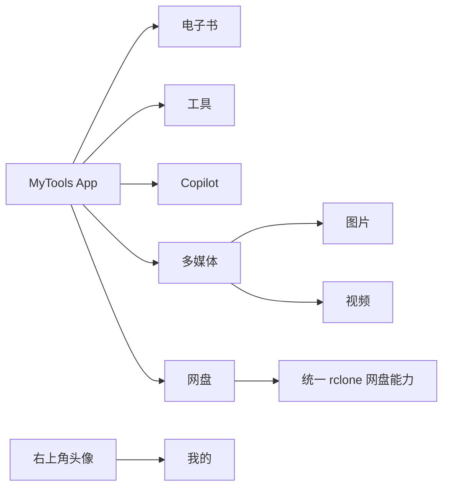
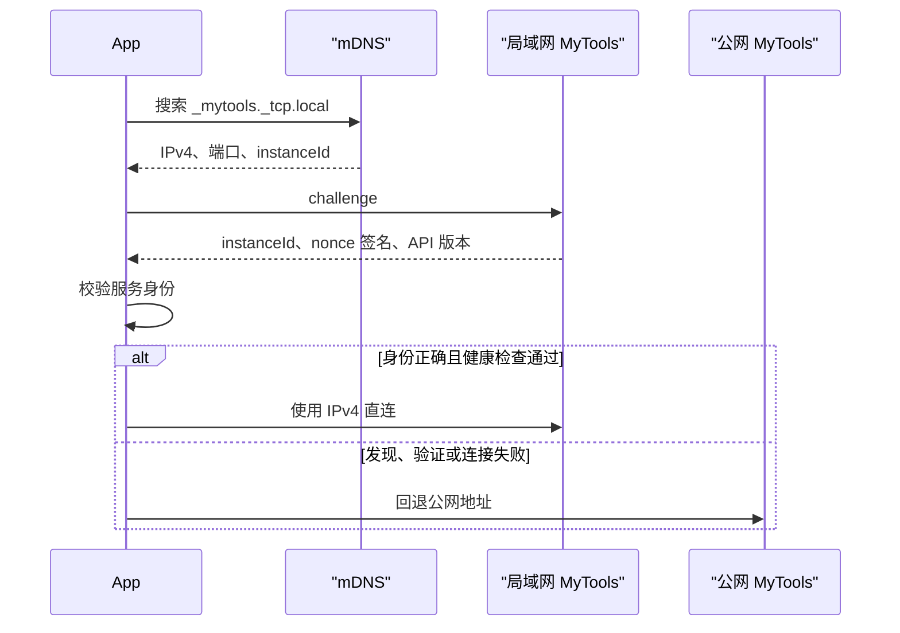
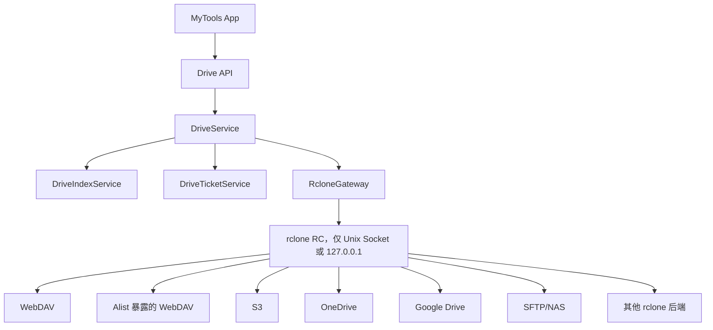
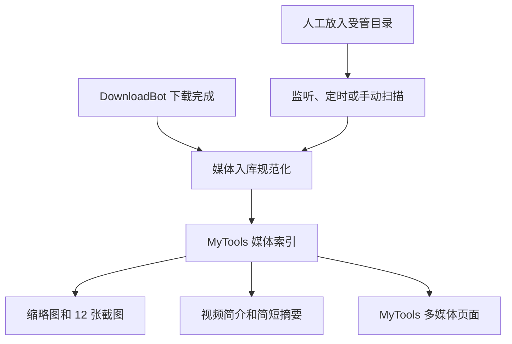
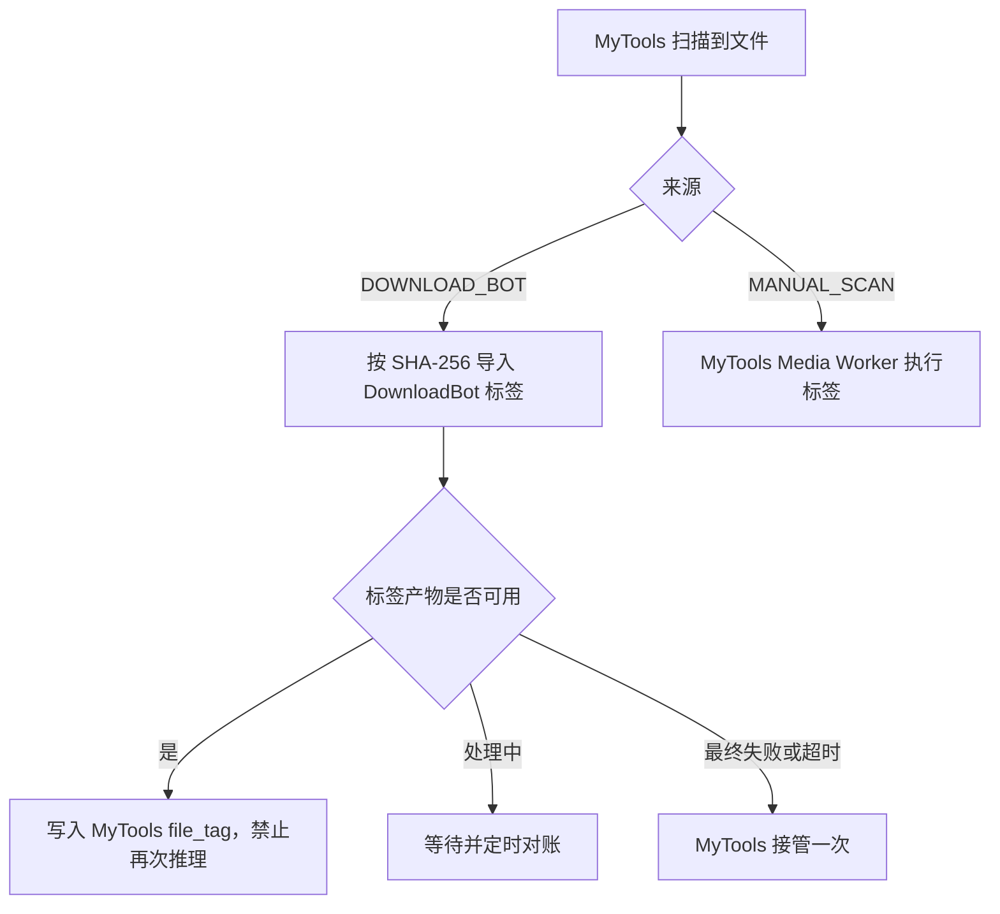
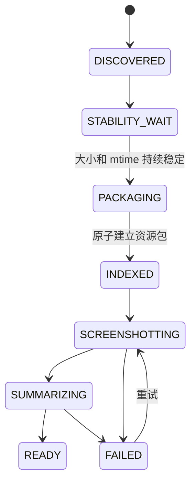
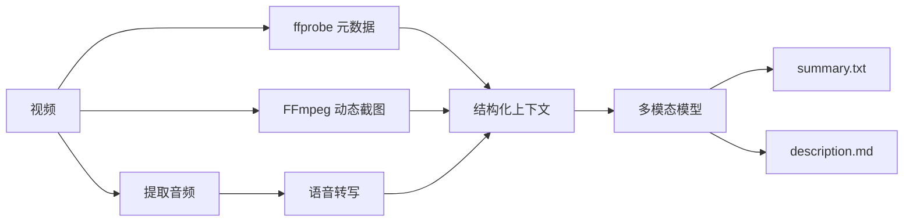
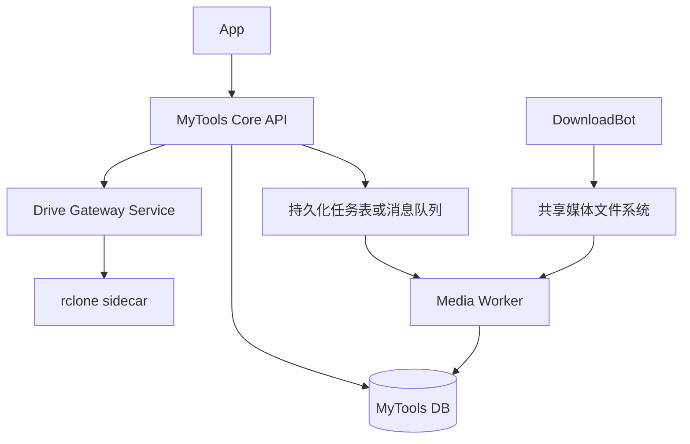
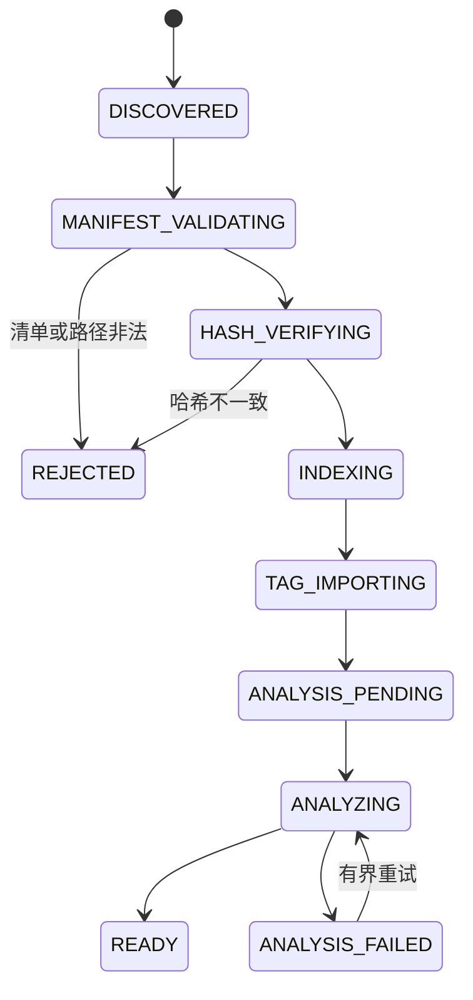

# MyTools App、统一网盘与 DownloadBot 媒体入库设计

> 实施状态（2026-08-16）：设计内的局域网直连、五栏导航与头像入口、统一 rclone 网盘、多媒体图片/视频双视图、视频详情、DownloadBot 标签复用、人工大视频资源包整理、动态截图和 AI 简介均已落地。数据库迁移、App/后端契约测试和 DownloadBot 107 项回归测试已通过；生产启用前仍需配置 rclone RC 账号、受管目录和 Ollama 模型，并执行数据库迁移。

## 1. 文档目标

本文档定义 MyTools App 的导航、局域网直连、统一网盘、多媒体展示，以及 DownloadBot 与人工目录扫描共同接入媒体库的整体方案。

本次设计遵循以下边界：

- App 底部“我的”替换为“网盘”，“我的”统一由右上角头像进入。
- rclone 是唯一远端存储接入引擎，不再保留独立的 Alist 和 WebDAV 业务实现。
- 网盘是通用文件管理入口，其中的视频点击后直接播放，不进入视频详情页。
- 视频详情页只属于“多媒体 -> 视频”。
- 多媒体的数据来源包括 DownloadBot 下载入库和人工向受管目录添加文件两种方式。
- 人工扫描、定时扫描和文件系统监听能力必须保留。
- 大视频必须整理为独立资源包目录，缩略图、截图、简介、摘要和元数据与视频放在同一目录中。

## 2. 总体信息架构



多媒体与网盘是两个不同的产品视图：

| 能力 | 网盘 | 多媒体 |
| --- | --- | --- |
| 目标 | 浏览和操作远端文件 | 浏览经过索引和分析的媒体内容 |
| 数据来源 | rclone remote | DownloadBot 入库和人工目录扫描 |
| 视频点击 | 直接播放 | 先进入视频详情页 |
| AI 简介 | 不展示 | 展示 |
| 12 张截图 | 不展示 | 展示 |
| 标签和目录聚合 | 不要求 | 必须支持 |

## 3. 局域网模式

MyTools 服务端通过 mDNS 广播 `_mytools._tcp.local`，App 在启动、登录成功、网络变化和回到前台时执行发现。



App 只有在业务请求实际通过局域网发送时，才在页面标题右侧显示局域网图标。标题建议为 21fp，图标为 14vp。禁止仅凭同一网段或 HTTP 200 响应向未知局域网服务发送 JWT。

## 4. 统一网盘设计

### 4.1 架构



App 和业务 API 不展示 Alist、WebDAV 或 rclone 等协议名称，只展示用户设置的网盘名称。现有 `AlistClient`、`WebdavClient` 和独立账号接口应迁移到 `RcloneGateway` 与统一 `DriveAccount`。

rclone RC 不得暴露到局域网或公网，不允许客户端提供任意 remote、路径连接串或 rclone 命令，禁止开放 `core/command`。

### 4.2 网盘页面

```text
网盘                                      [头像]

[ 选择网盘 ▼         ] [ 搜索文件          ]

根目录
128 个项目 · 386.4 GB                    [排序]

[文件夹] Photos                          >
         24 个项目 · 2026-08-15

[视频]   movie.mp4
         MP4 · 2.6 GB · 01:48:26
```

目录和文件默认按“文件夹优先、更新时间倒序、名称升序”排列。搜索由服务端元数据索引完成，禁止每次搜索递归访问远端网盘。

网盘内文件打开规则：

- 文件夹：进入子目录。
- 视频：直接进入播放器，不进入视频详情页。
- 图片：进入图片查看器。
- 音频：进入音频播放器。
- 网页：签发短期只读票据后交给系统浏览器。
- 文本及其他格式：下载到 App 临时沙箱后调用系统默认应用。

## 5. 多媒体页面

### 5.1 顶部结构

```text
多媒体              [ 图片 | 视频 ]        [头像]

[ 全部目录 ▼ ] [ 全部标签 ▼ ] [ 搜索媒体 ]
```

移除 Alist、WebDAV 等来源选择和“全部媒体”筛选框。代码和 API 内部将“图片”视图命名为 `gallery`，因为该视图可以包含图片以外的媒体文件。

目录筛选最多展示 Top 500，按目录内最新文件时间倒序。标签筛选最多展示 Top 500，按标签关联文件数量倒序。目录和标签计数必须由相同过滤条件下的数据库查询产生。

### 5.2 视频目录聚合页

视频页面按目录聚合，目录的更新时间取目录内可见文件的最大更新时间。每个目录展示最新的 Top 3 内容，图片和视频使用真实缩略图，其他文件使用格式图标，所有内容必须显示文件名。

```text
旅行视频                                      >
2026-08-15 更新 · 38 个文件

[缩略图]          [缩略图]          [文件图标]
海边日落.mp4       航拍片段.mov       行程说明.txt
```

视频目录内容页中，图片直接展示，网页交给浏览器，文本和其他文件调用系统默认应用，视频进入多媒体视频详情页。

### 5.3 视频详情页

视频详情页只服务于多媒体模块：

- 顶部左侧展示视频缩略图，右侧展示大小、格式、目录、时长、分辨率、编码和上次播放进度。
- 播放按钮进入播放器。
- 下方展示 200 至 500 字简介，超过约 6 行时折叠，可展开和收起。
- 再下方展示 12 张视频截图，每排 3 张，共 4 排。
- 简介标记为 AI 生成内容，并展示分析中、失败和可重试状态。

## 6. DownloadBot 接入边界

### 6.1 复用现有能力

DownloadBot 当前已经具备以下能力，应直接复用而不是在 MyTools 中重复实现：

- Telegram、QQ、OneBot、网页、X、magnet 和 PikPak 等下载入口。
- MySQL 持久化任务、租约、重试和断点续传。
- staging 流式下载、文件大小上限和原子移动。
- SHA-256 内容幂等、来源关联和标签任务。
- rclone PikPak 后端与稳定批次监听。
- 图片和视频的 FFmpeg 缩略图以及视觉模型标签。
- 大于 50MiB 的视频归类为 `big_media`。

DownloadBot 是下载生产者，不承担 App 查询、用户权限、媒体列表和播放 API。MyTools 是媒体目录、索引、分析状态和 App API 的权威服务。

### 6.2 两类数据来源



来源字段建议使用：

```text
DOWNLOAD_BOT
MANUAL_SCAN
```

同一文件可能先被人工扫描、后被 DownloadBot 数据库识别，或反向发生。必须以规范路径、SHA-256 和来源关联表去重，不能创建两个媒体实体。

### 6.3 协作协议

第一阶段推荐使用“共享文件系统 + 原子完成标记”：

1. DownloadBot 在 staging 中完成下载和校验。
2. DownloadBot 在临时资源包目录中写入视频及初始元数据。
3. 所有文件写完后执行同文件系统原子 rename，移动到 `big_media` 正式目录。
4. 最后写入 `.ready` 完成标记。
5. MyTools 监听到 `.ready` 后提交增量扫描任务。
6. MyTools 对资源包进行校验、索引和后续分析。

MyTools 必须同时保留手动扫描 API、定时补偿扫描和文件系统监听。WatchService 只用于降低延迟，不能替代定时扫描，因为文件系统事件可能丢失或溢出。

后续微服务化时可以将 `.ready` 替换为带幂等键的消息事件，但文件系统仍是大文件数据面，禁止通过消息队列传输视频字节。

### 6.4 标签能力复用

#### 6.4.1 现状结论

DownloadBot 与 MyTools 当前使用的是同一套模型基础设施：

| 配置 | DownloadBot | MyTools |
| --- | --- | --- |
| Provider | Ollama | Ollama |
| 地址 | `http://127.0.0.1:11434` | `http://127.0.0.1:11434` |
| 接口 | `/api/chat` | `/api/chat` |
| 模型 | `huihui_ai/qwen3-vl-abliterated:4b` | `huihui_ai/qwen3-vl-abliterated:4b` |
| 标签数量 | 3 至 6 个 | 3 至 6 个 |
| 标签语言 | 简体中文 | 简体中文 |
| 结果字段 | `name/type/confidence` | `tagName/tagType/confidence` |

两边的标签提示词和 Ollama 参数基本相同。主要输入差异是 DownloadBot 会自行从视频第 1 秒提取视觉帧，而 MyTools 优先使用已经生成的缩略图；文本采样策略也不完全相同。因此“模型相同”不代表每次结果完全相同，更不能以此为理由重复推理。

当前流程存在重复执行风险：DownloadBot 新建资产时创建 `tag_jobs`，MyTools 扫描同一物理文件时又将 `tagging_status` 初始化为待处理，随后 MyTools 的定时标签任务会再次请求同一个模型。

#### 6.4.2 唯一执行者规则

按资产来源确定标签执行者：



规则如下：

- `DOWNLOAD_BOT` 来源：DownloadBot 是标签任务唯一首选执行者，MyTools 只导入结果。
- `MANUAL_SCAN` 来源：MyTools Media Worker 是标签任务唯一执行者。
- 同一 SHA-256 已存在兼容标签结果时，任何来源都优先复用，不再次调用模型。
- DownloadBot 标签处于 `PENDING`、`RUNNING` 或 `RETRY` 时，MyTools 标记为 `EXTERNAL_PENDING`，不创建本地模型任务。
- DownloadBot 标签最终 `FAILED` 或超过配置的对账时限后，MyTools 可以接管一次；接管需要分布式幂等键，防止 DownloadBot 恢复后同时重试。
- 用户手动要求“重新打标签”属于显式覆盖，应生成新的 `taggingRevision`，不能覆盖原始自动标签审计记录。

#### 6.4.3 标签交换文件

大视频资源包新增 `tags.json`，普通 DownloadBot 文件可以使用同结构的同目录伴生文件，或通过内部 API 传递相同载荷：

```json
{
  "schemaVersion": 1,
  "status": "READY",
  "contentSha256": "...",
  "producer": "DOWNLOAD_BOT",
  "provider": "ollama",
  "model": "huihui_ai/qwen3-vl-abliterated:4b",
  "promptVersion": "media-tags-v1",
  "inputKind": "VIDEO_THUMBNAIL",
  "inputFingerprint": "sha256-of-thumbnail-or-normalized-input",
  "generatedAt": "2026-08-15T21:38:10+08:00",
  "tags": [
    {
      "name": "海边日落",
      "type": "topic",
      "confidence": 0.94
    }
  ]
}
```

导入必须校验：

- `contentSha256` 与扫描文件一致。
- `schemaVersion`、`status` 和标签字段合法。
- 标签名称、类型、数量和置信度符合 MyTools 边界。
- `producer/model/promptVersion/inputFingerprint` 被完整保存，便于后续判断是否需要升级重算。
- `tags.json` 使用临时文件加原子替换，MyTools 不读取半写入内容。

`metadata.json` 增加：

```json
{
  "tagStatus": "READY",
  "tagArtifact": "tags.json",
  "tagProducer": "DOWNLOAD_BOT",
  "tagModel": "huihui_ai/qwen3-vl-abliterated:4b",
  "tagPromptVersion": "media-tags-v1"
}
```

#### 6.4.4 MyTools 导入状态

MyTools 现有整数 `tagging_status` 不足以表达外部任务，建议改为枚举或增加来源字段：

```text
PENDING
EXTERNAL_PENDING
RUNNING
READY
FAILED
SKIPPED
STALE
```

并保存：

```text
tag_producer
tag_model
tag_prompt_version
tag_input_fingerprint
tag_generated_at
```

扫描 DownloadBot 文件时，顺序必须为：识别来源 -> 读取并校验标签产物 -> 写入 `file_tag` -> 设置 `READY`。只有确认没有可复用结果且不属于外部在途任务时，才允许进入 MyTools 标签队列。

#### 6.4.5 长期方案

完成 Media Worker 拆分后，推荐将标签推理也归入唯一的 Media Worker。DownloadBot 只提交 `asset discovered`，不再直接调用模型；人工扫描同样提交资产事件，由 Worker 按 SHA-256 和策略版本去重。这是最终最简单的单执行者模型。

迁移期间保留 DownloadBot 当前标签任务，但通过 `tags.json` 或内部 API 复用结果，先解决重复推理，再逐步迁移任务所有权。

## 7. 大视频资源包规范

### 7.1 触发条件

满足任一条件时使用独立资源包目录：

- MIME 为 `video/*` 且文件大小大于配置项 `big_video_threshold_bytes`，当前默认 50MiB。
- DownloadBot 下载任务明确标记为大视频。
- 人工扫描目录本身已经符合资源包结构。

阈值必须配置化，DownloadBot 与 MyTools 使用同一个配置值或由 MyTools 返回统一策略版本。

### 7.2 目录命名

原视频已经位于一个语义明确的独立目录时保留原目录名，只补齐伴生文件。

原视频没有独立目录时，新目录名格式为：

```text
yyyyMMdd_HHmmss_{简略描述}
```

示例：

```text
20260815_213045_海边日落航拍
```

命名规则：

- 时间使用入库时间，并明确使用服务器配置时区，生产默认 `Asia/Shanghai`。
- 简略描述目标为 6 至 20 个中文字符或等价长度。
- 过滤路径分隔符、控制字符、Windows 保留字符和首尾点空格。
- UTF-8 目录名总长度不超过 120 字节。
- 简略描述为空时使用 `未命名视频`。
- 同秒同名冲突时追加稳定摘要，如 `_a1b2c3d4`，不得使用不稳定递增编号。
- 已完成资源包不得仅因模型生成了更好的标题而自动改名，避免路径和播放记录失效。

简略描述生成优先级：

1. 消息显式标题或网页标题。
2. DownloadBot 已有专辑短标题。
3. 消息正文摘要。
4. 原始视频文件名净化结果。
5. 视频关键帧与转写生成的模型短标题。
6. `未命名视频`。

为了避免等待完整视频分析才落盘，首次入库可以使用前四级同步信息。后续模型摘要写入伴生文件，但默认不再改目录名。

### 7.3 目录内容

```text
big_media/
└── 20260815_213045_海边日落航拍/
    ├── source-video.mp4
    ├── thumbnail.jpg
    ├── summary.txt
    ├── description.md
    ├── metadata.json
    ├── tags.json
    ├── storyboard/
    │   ├── 01_00-05-12.jpg
    │   ├── 02_00-12-48.jpg
    │   ├── ...
    │   └── 12_01-38-20.jpg
    └── .ready
```

文件定义：

| 文件 | 内容 |
| --- | --- |
| 原视频 | 保留原始安全文件名；不为写摘要而修改文件字节 |
| `thumbnail.jpg` | 列表和详情页主缩略图 |
| `summary.txt` | 简短摘要，建议 30 至 80 个中文字符 |
| `description.md` | 200 至 500 字完整简介，可包含标题和分段 |
| `metadata.json` | 机器可读元数据、来源、哈希、分析状态和版本 |
| `tags.json` | 可跨 DownloadBot 和 MyTools 复用的版本化标签结果 |
| `storyboard/*.jpg` | 动态选取的约 12 张视频截图 |
| `.ready` | 资源包已经完成原子入库的标记，不表示 AI 分析已经完成 |

“提取简略文字到文件上”落实为 `summary.txt`，同时写入 `metadata.json.summary`。不建议把摘要写入视频文件名或直接修改视频容器元数据，因为这会影响字幕同名匹配、断点续传、内容哈希和跨平台兼容性。

### 7.4 metadata.json

```json
{
  "schemaVersion": 1,
  "packageId": "stable-uuid",
  "sourceType": "DOWNLOAD_BOT",
  "sourceAssetId": 123,
  "originalFileName": "original.mp4",
  "videoFile": "source-video.mp4",
  "sha256": "...",
  "sizeBytes": 123456789,
  "mimeType": "video/mp4",
  "durationMs": 5912000,
  "container": "mp4",
  "videoCodec": "h264",
  "audioCodec": "aac",
  "width": 1920,
  "height": 1080,
  "summary": "海边日落与航拍风景记录",
  "descriptionStatus": "READY",
  "pipelineVersion": "video-analysis-v1",
  "createdAt": "2026-08-15T21:30:45+08:00",
  "updatedAt": "2026-08-15T21:38:10+08:00"
}
```

写入采用临时文件加原子替换，App 和扫描器不得读取半写入 JSON。

### 7.5 多视频批次

一个下载批次包含多个大视频时：

- 如果 DownloadBot 已识别为专辑，保留专辑父目录。
- 每个大视频仍建立独立资源包子目录，确保每个视频有独立截图、简介和播放进度。
- 专辑父目录只保存集合级 `album.json`，不混用单个视频的 `summary.txt`。

```text
big_media/
└── 旅行合集--消息摘要/
    ├── 20260815_213045_海边日落/
    │   ├── video-a.mp4
    │   └── ...
    └── 20260815_213212_城市夜景/
        ├── video-b.mp4
        └── ...
```

## 8. 人工添加与扫描

人工添加必须继续支持以下方式：

- 管理页面手动触发扫描。
- 目录 WatchService 监听后去抖触发增量扫描。
- 每日或可配置周期的全量补偿扫描。
- 新建目录后递归注册监听。

扫描器规则：

1. 跳过 `.staging`、`.thumbnails`、隐藏目录和未完成临时文件。
2. 看到 `.ready` 的资源包直接按包解析。
3. 看到没有 `.ready` 但结构完整的人工资源包，校验稳定时间后生成 `.ready`。
4. 看到根目录下孤立的大视频，提交“资源包整理任务”。
5. 整理任务使用同文件系统原子移动，不能在扫描线程内同步执行 FFmpeg 或模型推理。
6. 已入库路径先按大小、mtime 和已知哈希判断，避免每天重新读取全部大文件。
7. 文件移动或重新出现时复用原媒体实体和播放记录。

人工孤立大视频的整理流程：



如果整理涉及移动用户人工文件，管理端必须提供 dry-run 预览。自动模式仅允许处理明确配置为 MyTools 托管的目录。

## 9. 视频分析流水线



截图算法将有效时长分为 12 个区间，每区间优先选择场景变化明显、清晰且与前一张不重复的画面，没有合格候选时退回区间中点。使用感知哈希去除黑屏和重复帧。

分析任务状态：

```text
DISCOVERED
PROBING
SCREENSHOTTING
TRANSCRIBING
SUMMARIZING
READY
FAILED
```

任务幂等键为 `sha256 + pipelineVersion`。文件内容或流水线版本变化时才重新分析。

## 10. 数据模型补充

`local_file` 建议增加或关联以下字段：

```text
source_type
source_ref
package_id
package_path
asset_role
analysis_status
analysis_version
```

`asset_role` 取值：

```text
PRIMARY_VIDEO
THUMBNAIL
STORYBOARD
SUMMARY
DESCRIPTION
METADATA
ATTACHMENT
```

建议独立表：

```text
media_package
- id
- package_key
- source_type
- source_ref
- directory_path
- primary_file_id
- display_name
- summary
- description
- analysis_status
- pipeline_version
- created_at
- updated_at

media_package_asset
- package_id
- local_file_id
- asset_role
- sequence_no
- timestamp_ms
```

DownloadBot 的 `asset_id` 作为 `source_ref` 保存，但 MyTools 不直接依赖 DownloadBot 数据库主键完成用户查询。跨服务关联应允许缺失并支持后续对账。

## 11. 单体与微服务边界

当前 MyTools 已同时承担认证、网盘、文件扫描、缩略图、标签、媒体流、阅读器和 Copilot。新增 rclone 与视频分析后，不建议继续把所有重计算任务塞入 Spring Boot 主进程。

推荐采用“模块化单体 API + 两个独立 Worker”的渐进方案：



职责建议：

| 组件 | 职责 |
| --- | --- |
| MyTools Core API | 用户权限、App API、媒体查询、播放票据、任务状态 |
| Drive Gateway Service | rclone remote 管理、列表、Range 流、缓存和限流 |
| Media Worker | 扫描、资源包整理、ffprobe、缩略图、截图、ASR、简介 |
| DownloadBot | 外部消息和链接下载、幂等落盘、来源信息 |

第一阶段不必立即引入 Kafka。当前实现先把 `analysisStatus`、`analysisAttempts` 和 `retryAfter` 原子持久化到资源包 `metadata.json`，以文件系统事实实现重启恢复；当 Worker 拆分为多实例或出现抢占需求时，再迁移到 MySQL 租约表与 `SELECT ... FOR UPDATE SKIP LOCKED`，待吞吐和跨机器扩展需要明确后再引入消息队列。

拆分原则：

- 大文件字节走文件系统或流式 HTTP，不走消息队列。
- 服务间只传 `packageId`、路径引用、哈希和任务状态。
- Core API 不直接执行 FFmpeg、ASR 或大模型推理。
- rclone 独立低权限运行，RC 不对 App 暴露。
- DownloadBot 与 MyTools 不共享可写业务表；通过资源包清单、事件或受控内部 API 协作。

## 12. API 补充

DownloadBot 或 Media Worker 可调用内部接口：

```http
POST /internal/v1/media/packages/discovered
POST /internal/v1/media/packages/{packageId}/analysis-status
POST /internal/v1/media/packages/{packageId}/complete
```

内部接口必须使用服务身份认证和幂等键，不能复用普通用户 JWT。

App 使用：

```http
GET  /api/app/v1/media/filters
GET  /api/app/v1/media/gallery
GET  /api/app/v1/videos/directories
GET  /api/app/v1/videos/directories/{directoryId}/items
GET  /api/app/v1/videos/{videoId}
GET  /api/app/v1/videos/{videoId}/storyboard/{sequence}
POST /api/app/v1/videos/{videoId}/play-ticket
```

## 13. 迁移方案

### 阶段一：建立规范，不移动历史数据

- 新增 `media_package` 和分析任务模型。
- 新增资源包解析器。
- DownloadBot 新下载的大视频使用新目录结构。
- MyTools 继续扫描历史 `media` 和 `big_media`。

### 阶段二：人工历史数据 dry-run

- 扫描孤立大视频。
- 输出目标目录、预计名称、冲突和磁盘空间报告。
- 不修改文件。

### 阶段三：受控迁移

- 暂停相关目录写入或对单文件加租约。
- 生成资源包临时目录。
- 校验大小和 SHA-256。
- 原子移动并更新 MyTools 索引。
- 保留可审计迁移记录。

### 阶段四：服务拆分

- 将 FFmpeg、截图和模型任务迁出 Core API。
- 将 rclone 网关迁出 Core API。
- 根据实际吞吐决定是否引入消息队列。

## 14. 验收标准

- DownloadBot 下载和人工添加两种来源都能进入同一多媒体列表。
- 人工手动扫描、目录监听和定时补偿扫描均保留并可独立启停。
- 大于阈值的孤立视频最终拥有独立资源包目录。
- 无原目录视频使用 `yyyyMMdd_HHmmss_{简略描述}` 命名。
- 每个完成分析的大视频目录包含主视频、`thumbnail.jpg`、`summary.txt`、`description.md`、`metadata.json` 和约 12 张截图。
- `summary.txt` 与 `metadata.json.summary` 一致。
- DownloadBot 已成功生成的兼容标签可以按 SHA-256 导入 MyTools，MyTools 不再次调用模型。
- 人工扫描文件由 MyTools 执行标签；每个内容哈希和标签策略版本最多存在一个活跃标签任务。
- DownloadBot 重试不会产生第二份视频或第二个媒体实体。
- 扫描器不会读取 staging、半写入清单或未稳定文件。
- 网盘视频点击直接播放，多媒体视频点击进入视频详情页。
- App 和业务接口不出现 Alist、WebDAV 或 rclone 等实现名称。
- Core API 不执行长时间 FFmpeg 或模型任务。
- rclone RC 仅允许内部低权限访问。

## 15. MyTools 详细模块设计

### 15.1 模块划分

建议在现有代码中先形成清晰模块边界，再决定是否拆进程：

```text
com.yuyutian.mytools.drive
├── controller
├── service
├── model
├── mapper
└── infrastructure/rclone

com.yuyutian.mytools.media
├── controller
├── service/catalog
├── service/importer
├── service/analysis
├── service/playback
├── model
├── mapper
└── job

com.yuyutian.mytools.connectivity
├── controller
├── service
└── config
```

现有 `localfile` 模块迁移策略：

- 文件路径、哈希和人工扫描能力迁移到 `media.service.importer`。
- 缩略图生成迁移到 Media Worker。
- `LocalMediaTicketService` 迁移到 `media.service.playback`。
- 旧 Controller 保留兼容入口，但内部委托新服务。
- 迁移完成前禁止复制一套新的扫描实现。

### 15.2 核心服务

```java
public interface MediaImportService {
    MediaImportResult importPackage(Path packagePath);
    MediaImportResult importManualFile(Long directoryId, Path filePath);
    ScanResult scanDirectory(Long directoryId, boolean fullScan);
}

public interface TagArtifactImportService {
    TagImportResult importIfCompatible(Long fileId, Path artifactPath);
    TagOwnership resolveOwnership(LocalFile file);
}

public interface VideoAnalysisService {
    VideoAnalysisTask submit(Long packageId, AnalysisPriority priority);
    VideoAnalysisStatus getStatus(Long packageId);
}

public interface DriveService {
    List<DriveAccountView> listDrives(Long userId);
    DrivePage listItems(Long userId, Long driveId, DriveListQuery query);
    DriveDirectorySummary summarize(Long userId, Long driveId, String itemId);
    DriveOpenTicket createOpenTicket(Long userId, Long driveId, String itemId);
}
```

### 15.3 包导入状态机



导入任务幂等键：

```text
packageId + manifest.schemaVersion
```

分析任务幂等键：

```text
contentSha256 + pipelineVersion
```

标签任务幂等键：

```text
contentSha256 + promptVersion + inputFingerprint
```

### 15.4 路径安全

资源包导入必须：

- 从配置的受管根目录解析真实路径。
- 拒绝绝对伴生文件路径、`..`、符号链接逃逸和控制字符。
- 校验主视频是普通文件且位于资源包内部。
- `.ready` 存在后仍要检查主视频大小和 mtime 已稳定。
- 限制清单大小、标签数量、截图数量和文本长度。
- 不信任 DownloadBot 写入的 MIME、文件名或描述文本。
- 禁止根据清单删除受管根目录之外的文件。

## 16. 数据库详细设计

### 16.1 media_package

```sql
CREATE TABLE media_package (
    id BIGINT NOT NULL PRIMARY KEY,
    package_key VARCHAR(64) NOT NULL,
    source_type VARCHAR(32) NOT NULL,
    source_ref VARCHAR(255),
    directory_path VARCHAR(1024) NOT NULL,
    primary_file_id BIGINT,
    display_name VARCHAR(255) NOT NULL,
    summary VARCHAR(500),
    description TEXT,
    import_status VARCHAR(32) NOT NULL,
    analysis_status VARCHAR(32) NOT NULL,
    pipeline_version VARCHAR(64),
    manifest_version INT NOT NULL,
    created_at DATETIME(6) NOT NULL,
    updated_at DATETIME(6) NOT NULL,
    UNIQUE KEY uq_media_package_key (package_key),
    UNIQUE KEY uq_media_package_path (directory_path(768))
);
```

实际迁移脚本需要按现有雪花 ID、字符集、审计字段和外键策略调整，不能直接复制示例执行。

### 16.2 media_package_asset

```sql
CREATE TABLE media_package_asset (
    id BIGINT NOT NULL PRIMARY KEY,
    package_id BIGINT NOT NULL,
    local_file_id BIGINT,
    asset_role VARCHAR(32) NOT NULL,
    relative_path VARCHAR(512) NOT NULL,
    sequence_no INT,
    timestamp_ms BIGINT,
    content_hash CHAR(64),
    created_at DATETIME(6) NOT NULL,
    UNIQUE KEY uq_package_asset_path (package_id, relative_path),
    UNIQUE KEY uq_package_asset_sequence (package_id, asset_role, sequence_no)
);
```

### 16.3 media_tag_artifact

```sql
CREATE TABLE media_tag_artifact (
    id BIGINT NOT NULL PRIMARY KEY,
    local_file_id BIGINT NOT NULL,
    content_hash CHAR(64) NOT NULL,
    producer VARCHAR(32) NOT NULL,
    provider VARCHAR(64) NOT NULL,
    model VARCHAR(255) NOT NULL,
    prompt_version VARCHAR(64) NOT NULL,
    input_kind VARCHAR(64) NOT NULL,
    input_fingerprint CHAR(64) NOT NULL,
    status VARCHAR(32) NOT NULL,
    generated_at DATETIME(6),
    created_at DATETIME(6) NOT NULL,
    updated_at DATETIME(6) NOT NULL,
    UNIQUE KEY uq_tag_artifact_policy
      (content_hash, prompt_version, input_fingerprint)
);
```

`file_tag` 继续作为当前有效标签的查询投影，`media_tag_artifact` 保存生成来源和策略审计。导入或重新生成标签时，在同一事务内替换 `file_tag` 投影并更新 artifact 状态。

### 16.4 drive_account 与索引

```text
drive_account
- id
- user_id
- display_name
- remote_key
- backend_type
- encrypted_config
- read_only
- enabled
- status
- last_checked_at

drive_item_index
- id
- drive_id
- remote_item_key
- parent_item_key
- normalized_path_hash
- display_name
- mime_type
- extension
- is_directory
- size_bytes
- modified_at
- etag
- indexed_at
- deleted
```

App 只获得 `driveId` 和不透明 `itemId`，不能获得 `remote_key`、rclone 配置或后端凭据。

## 17. API 详细响应设计

### 17.1 视频目录

```json
{
  "list": [
    {
      "directoryId": "opaque-id",
      "name": "旅行视频",
      "fileCount": 38,
      "totalSizeBytes": 19971597926,
      "latestModifiedAt": "2026-08-15T10:20:30Z",
      "topItems": [
        {
          "itemId": "opaque-id",
          "name": "海边日落.mp4",
          "kind": "VIDEO",
          "thumbnailTicket": "short-lived-ticket"
        }
      ]
    }
  ],
  "nextPageToken": null
}
```

`topItems` 最多 3 项。视频目录必须至少包含一个视频；Top 3 可以包含关联图片、文本和其他文件。

### 17.2 视频详情

```json
{
  "videoId": "opaque-id",
  "name": "海边日落.mp4",
  "sizeBytes": 2254857830,
  "format": "mp4",
  "videoCodec": "h264",
  "audioCodec": "aac",
  "durationMs": 6156000,
  "width": 1920,
  "height": 1080,
  "directoryName": "旅行视频",
  "summary": "海边日落与航拍风景记录",
  "description": "...",
  "descriptionStatus": "READY",
  "playback": {
    "positionMs": 1938000,
    "percentage": 0.3148
  },
  "thumbnailTicket": "short-lived-ticket",
  "storyboard": [
    {
      "sequence": 1,
      "timestampMs": 312000,
      "imageTicket": "short-lived-ticket"
    }
  ]
}
```

视频详情接口不返回真实文件路径。简介未完成时返回状态，不使用文件名拼接伪简介。

### 17.3 标签筛选

```json
{
  "directories": [
    {
      "id": "opaque-id",
      "name": "20260815_海边日落",
      "fileCount": 18,
      "latestModifiedAt": "2026-08-15T10:20:30Z"
    }
  ],
  "tags": [
    {
      "name": "海边日落",
      "fileCount": 236
    }
  ]
}
```

目录和标签分别最多返回 500 项，计数和排序必须在数据库完成。

## 18. 后台任务与并发

### 18.1 Worker 队列

首期使用 MySQL 持久化任务表：

```text
media_job
- id
- job_key
- job_type
- package_id
- status
- priority
- attempts
- available_at
- lease_until
- worker_id
- last_error_code
- created_at
- updated_at
```

Worker 通过事务和 `FOR UPDATE SKIP LOCKED` 领取任务。任务类型：

```text
IMPORT_PACKAGE
PACKAGE_MANUAL_VIDEO
IMPORT_TAG_ARTIFACT
GENERATE_THUMBNAIL
GENERATE_STORYBOARD
TRANSCRIBE_VIDEO
SUMMARIZE_VIDEO
RECONCILE_DOWNLOADBOT
REFRESH_DRIVE_INDEX
```

### 18.2 优先级

- 用户正在打开的视频详情：高优先级。
- 新 DownloadBot 资源包：普通优先级。
- 人工全量扫描和历史迁移：低优先级。
- 同一包的任务按依赖顺序运行，不能同时修改 `metadata.json`。

### 18.3 资源限制

- FFmpeg 并发、ASR 并发和模型并发分别配置。
- 每个任务设置超时、输出字节和临时空间上限。
- Core API 只提交和查询任务，不等待长任务完成。
- Worker 关闭时停止领取新任务，并允许当前原子步骤完成。

## 19. App 详细导航状态

主导航固定为：

```text
电子书 | 工具 | Copilot | 多媒体 | 网盘
```

头像打开独立账户页面，不修改当前主导航索引。关闭账户页后恢复原页面、筛选条件和滚动位置。

多媒体内部状态：

```text
mediaMode = GALLERY | VIDEO
selectedDirectoryId
selectedTags
searchKeyword
sort
pageToken
```

网盘内部状态按 `driveId` 隔离保存：

```text
currentItemId
breadcrumb
searchKeyword
sort
direction
pageToken
```

网盘视频路由直接进入通用播放器；多媒体视频路由进入视频详情页，详情页播放按钮再进入播放器。两者可以复用播放器内核，但必须使用不同的进入路由。

## 20. 实施任务拆分

### 20.1 MyTools Core

- 新建 drive、media、connectivity 模块边界。
- 新增数据库迁移与 Mapper。
- 实现资源包清单解析和路径安全校验。
- 实现 `tags.json` 导入、标签投影和唯一执行者状态。
- 实现视频目录、详情、截图和播放票据 API。
- 实现 rclone Gateway 与统一网盘 API。
- 为旧 Alist/WebDAV API 增加兼容委托和下线日志。

### 20.2 Media Worker

- 迁移人工扫描和 WatchService 提交逻辑。
- 实现孤立大视频资源包 dry-run 与整理任务。
- 实现 ffprobe、缩略图、12 张截图、ASR 和简介。
- 第一阶段实现清单状态持久化和指数退避；拆分后实现 MySQL 租约、优先级和资源限流。
- 实现 DownloadBot 资源包和标签结果对账。

### 20.3 App

- 调整底部导航和头像路由。
- 增加局域网 EndpointRouter 和状态图标。
- 新增网盘页面、搜索、排序、目录统计和直接播放。
- 重构多媒体图片筛选栏。
- 新增视频目录聚合、目录内容和视频详情页。
- 增加分析状态、失败重试和骨架屏。

### 20.4 测试

- 清单解析、路径逃逸和符号链接测试。
- DownloadBot 标签导入与重复模型调用阻断测试。
- 人工扫描标签执行者测试。
- 三个幂等键的并发测试。
- WatchService 丢事件后的全量扫描补偿测试。
- 视频目录 Top 3、Top 500 计数和排序测试。
- Range 播放、票据过期和跨用户越权测试。
- 局域网伪服务、网络切换和公网回退测试。
- rclone remote 越权、RC 隔离和缓存配额测试。

## 21. 决策记录

- DownloadBot 和人工扫描是两种生产者，但 MyTools 媒体索引是 App 查询权威。
- DownloadBot 下载资产在迁移期由 DownloadBot 首次打标签，MyTools 导入复用。
- 人工扫描资产由 MyTools Media Worker 打标签。
- 长期所有标签推理统一进入 Media Worker。
- 大视频资源包以 `.ready` 表示生产者发布完成；第一阶段以 `metadata.json.analysisStatus` 表示 MyTools 分析完成，拆分多实例 Worker 时迁移到数据库租约状态。
- 网盘视频直接播放，多媒体视频使用详情页。
- rclone 是唯一远端存储引擎，Alist 和 WebDAV 不再作为独立业务能力。

## 22. 2026-08-16 实施结果

- DownloadBot 已统一大视频资源包落盘路径，并通过临时文件原子发布 `metadata.json`、`tags.json` 和 `.ready`。
- DownloadBot 的 PikPak、消息附件和链接下载均通过同一存储入口；重复资产会安全清理未采用的资源包。
- MyTools 已实现资源包路径安全校验、标签产物导入和标签执行权对账：`READY` 直接复用，`PENDING/RUNNING` 不重复推理，`FAILED/SKIPPED` 才由 MyTools 接管。
- MyTools 已实现 ffprobe 元数据提取、按时长均匀生成 12 张截图、主缩略图、`summary.txt` 和 `description.md`。
- 媒体分析状态、尝试次数和退避时间写入 `metadata.json`；定时任务在重启后继续发现并恢复未完成资源包。
- 简介生成复用 MyTools 现有 Ollama 客户端和 DownloadBot 已有标签，不启动第二次标签任务。
- 人工加入 `LARGE_MEDIA` 受管目录的孤立大视频会通过同文件系统原子移动整理为 `yyyyMMdd_HHmmss_{简略描述}` 资源包；仅发生同名冲突时追加文件 ID。人工来源由 MyTools 负责标签，DownloadBot 资源包继续复用其已有标签。
- 已增加 `drive_account`、`drive_item_index`、`media_package`、`media_package_asset` 和 `media_tag_artifact` 迁移；App 查询不暴露 rclone remote、服务器绝对路径或 RC 凭据。
- rclone RC 网关只接受回环地址和白名单操作，网盘列表、模糊搜索、目录统计、排序、目录导航及短时播放票据已经接入 App；网盘视频直接进入通用播放器。

## 17. 2026-08-16 视频体验与成人内容过滤补充设计

- 图片模式恢复按目录分组展示；目录以目录内最新资源更新时间倒序，目录内文件同样按更新时间倒序。
- 视频目录首页和目录详情统一为三列固定宽度缩略图，不足三项时从左侧开始排列，不允许卡片拉伸铺满整行。
- 进入视频目录前记录多媒体页滚动偏移；返回时恢复偏移和已加载目录数据，不重新请求第一页。
- 视频详情先进入骨架页，再异步读取详情和并行缓存故事板；后端按文件 ID 单行定位视频，禁止为一次详情点击扫描整个媒体库和标签表。
- 播放器使用 HarmonyOS 原生 `Video`/系统媒体栈，原生控制条常驻可用，并提供播放暂停、进度拖动、前后十秒、横竖屏和全屏控制。视频页不注册图片浏览的纵向翻页手势，避免抢占播放器触控。
- 视频主缩略图和十二张故事板均执行黑场检测；采样图超过 96% 像素接近黑色时向后取样，最多重试三次。
- `local_file` 独立保存成人内容识别状态、结论和置信度。成人内容识别必须是区别于普通标签生成的单独模型调用；默认复用相同 Ollama 服务和视觉模型，避免重复部署模型，但不得复用标签调用的推理结果。
- App 设置增加全局“成人内容过滤”。开启后，各资源列表请求携带 `excludeAdult=true`，后端隐藏已经确认的 R18/成人向资源；待识别和识别失败资源保留展示，避免模型故障造成误隐藏。
- 成人内容任务支持图片/视频缩略图、文本采样和其他文件元数据，并使用独立状态重试。后续网盘远程资源只有在被下载或建立本地可分析缓存后才能进入同一分类流程，禁止为分类静默下载整个远程文件。
- 局域网连接使用 mDNS 候选、服务端下发 IPv4 白名单和一次性 HMAC challenge 三重约束；首个 JWT 业务请求成功后才显示标题右侧的小型局域网图标，失败自动回退公网。
- App 底部导航已调整为“电子书、工具、Copilot、多媒体、网盘”，“我的”由右上角头像打开；多媒体已提供图片/视频切换、目录和标签 Top 500、模糊搜索、视频目录 Top 3 与专属详情页。
- 当前视频分析 Worker 以 `media` 模块中的有界双线程后台任务运行。部署量增长后可按第 11 节将同一模块独立成进程，文件协议和 App API 无需变化。

### 22.1 生产配置清单

- 执行 `V2026_08_16__create_drive_tables.sql` 和 `V2026_08_17__create_media_catalog_audit_tables.sql`。
- 为每个用户写入启用的 `drive_account`，并配置仅监听 `127.0.0.1` 的 rclone RC 账号、密码和 remote。
- 确认 `LARGE_MEDIA` 与 `MULTIMEDIA` 的 `local_directory` 路径、扫描开关和文件系统写权限。
- 安装 `ffprobe`、`ffmpeg`，并使 `tagging.service.url`、`tagging.service.model` 与 DownloadBot 标签产物中的 provider/model 策略保持兼容。
- 在真机验证 mDNS 权限、IPv4 切换、蜂窝网络回退、Range 播放和系统默认应用打开行为。

### 22.2 已执行验证

- MyTools：`mvn test` 全量通过。
- HarmonyOS App：UI 设计策略、页面离开取消策略通过，`assembleHap --no-daemon` 构建成功且 ArkTS 无告警。
- DownloadBot：`.venv/bin/python -m pytest -q`，108 项通过。

### 22.3 虚拟机安装与全流程验收

- 2026-08-16 已将后端、签名 HAP、DownloadBot 资源包发布代码、rclone RC 服务和只读 HTTP Range 服务安装到虚拟机；相关 systemd 单元均为 `active`、`enabled`。
- rclone RC 与只读内容服务分别仅监听 `127.0.0.1:5572` 和 `127.0.0.1:5573`，从虚拟机局域网地址访问 RC 端口失败，凭据文件权限为 `0600`。
- 使用真实 IPv4 `192.168.1.7:23110` 完成 bootstrap、challenge 和 HMAC 校验；无效 probe 与未认证业务请求均返回 `401`。mDNS 已在该地址注册，但验收终端位于另一广播网段，因此真机同网段发现仍保留在上线检查项。
- PikPak 网盘实测通过根目录、`DownloadBot/processed` 子目录、模糊搜索、短期票据和 `bytes=0-1023` Range 读取；App 模拟器可进入网盘根目录和 DownloadBot 子目录。
- 多媒体实测通过目录与标签 Top 500、图库、视频目录 Top 3、详情、12 张截图、简介和本地 Range 播放。生成的 `thumbnail.jpg` 与 `storyboard/` 只作为详情附件，不重复进入图库。
- DownloadBot 使用生产阈值生成 `20260816_030054_DownloadBot_E2E_20260816` 大视频资源包；MyTools 自动发现、导入三项标签并完成视频分析，`file_tag` 与 `tags.json` 完全一致，`media_tag_artifact` 记录相同 producer、provider、model 和策略状态，没有再次执行 MyTools 标签推理。
- 生产安装补齐了阅读进度、标记、书架和书源同步四张既有迁移表；模拟器重新启动后首页、网盘和多媒体请求均无 HTTP 500 或应用崩溃。
- 资源包截图清单现统一写为 `storyboard/{file}`，读取端兼容旧版仅文件名格式；DownloadBot 目录时间显式使用 `Asia/Shanghai`，并以跨 UTC 日期测试覆盖。
- DownloadBot 的 QQ 官方网关、Telegram 和 PikPak watcher 正常启动；NapCat OneBot 容器虽运行，但 QQ 会话当前未登录并持续断开，需用户扫描 `/opt/napcat/cache/qrcode.png` 后另行复验。该外部会话不影响本次 MyTools 网盘、媒体和 DownloadBot 资源包链路验收。
