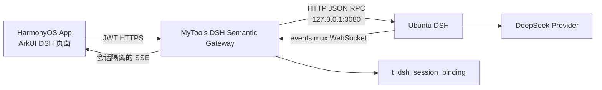

# MyTools DSH 全量替换设计

## 1. 结论

MyTools App 不再嵌入 MyCopilot Agent SDK、Rust 动态库或 NAPI 桥。App 使用 MyTools JWT 调用后端稳定语义接口，后端仅通过 Ubuntu 回环地址连接 DSH Web RPC。DSH 进程不直接暴露给 App，也不允许 MyTools 后端把任意 DSH RPC 方法代理给客户端。

## 2. 安全与所有权边界

- App 只能访问 `status`、会话列表、新建、历史、发送、取消、归档和授权回复。
- 后端固定 DSH 地址为回环主机，禁止重定向和非回环配置，防止 SSRF。
- 新会话工作目录固定为 `/home/pankang`，App 不能提交任意服务器路径。
- `t_dsh_session_binding` 绑定 MyTools `user_id` 与 DSH `session_id`；任何历史、提示、取消和授权请求都先校验所有权。
- DSH 历史投影只返回用户消息和助手可见文本，不返回插件系统提示或 reasoning。
- DSH 下行授权使用短期内存交互映射；App 只能回复属于自身会话且仍未过期的授权。
- 归档只取消 MyTools 用户可见性，不破坏 DSH 原始审计历史。

## 3. App 实现

App 新增 `features/dsh`：

- `DshApi.ets`：认证 API 调用和会话动作。
- `DshResponseNormalizer.ets`：会话标识、容量、角色、文本和整数边界校验。
- `DshModels.ets`：稳定 UI 数据模型。
- `DshConversationSnapshotPolicy.ets`：仅保存可选的本地会话预览，服务器历史为权威来源。

页面进入时先读取 DSH 状态和远程会话列表；没有会话时创建一个。发送消息后按短间隔读取过滤历史和会话运行状态，完成后用服务器历史覆盖本地预览。后端 SSE 已作为实时事件通道提供，后续可在不改变页面模型的情况下把轮询替换为增量刷新。

阅读器选中文本仍可提交给 DSH。文本附件由系统选择器授权，App 只发送名称、MIME 和正文，不传设备 URI。当前阶段不把原 MyTools Host 工具静默移植到 DSH；需要写入书签、远程删除或下载时，应通过后续 MCP/action broker 显式建模并逐次授权。

## 4. 后端接口

| 方法 | 路径 | 作用 |
| --- | --- | --- |
| GET | `/api/app/v1/dsh/status` | DSH 版本、模型和连接状态 |
| GET | `/api/app/v1/dsh/sessions` | 当前 MyTools 用户会话 |
| POST | `/api/app/v1/dsh/sessions` | 在固定工作区创建会话 |
| DELETE | `/api/app/v1/dsh/sessions/{id}` | 归档用户会话绑定 |
| GET | `/api/app/v1/dsh/sessions/{id}/history` | 读取过滤后的可见历史 |
| POST | `/api/app/v1/dsh/sessions/{id}/messages` | 排队发送文本提示 |
| POST | `/api/app/v1/dsh/sessions/{id}/cancel` | 取消当前轮次 |
| GET | `/api/app/v1/dsh/sessions/{id}/events` | 会话隔离 SSE |
| POST | `/api/app/v1/dsh/sessions/{id}/approvals/{rpcId}` | 回复单次授权 |

## 5. 部署与回滚

Ubuntu 使用 `dsh.service` 以 `pankang` 用户运行，只监听 `127.0.0.1:3080`。MyTools 后端依赖该服务但连接失败时不影响电子书、网盘和多媒体模块。数据库迁移只新增绑定表。

回滚顺序为：先回滚 App，再回滚后端；`t_dsh_session_binding` 可保留。旧 MyCopilot SDK 二进制、NAPI、ArkTS wrapper 和依赖锁已从 App 删除，不作为回滚通道重新引入。
