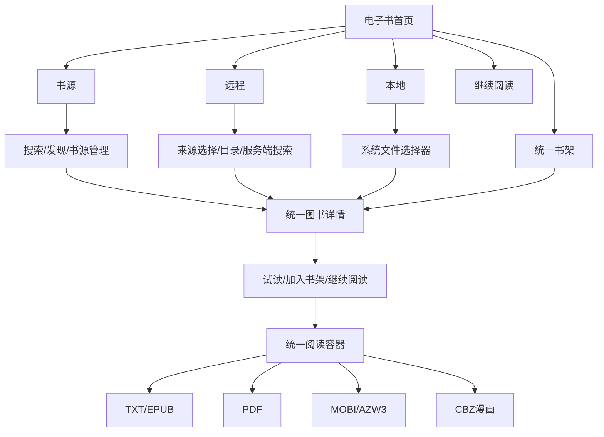

# MyTools 电子书功能与设计差异审计及优化计划

更新时间：2026-08-17

## 实施进度（2026-08-17）

- 阶段0、阶段1已完成：TXT正文顶部对齐、内部原文件名标记隔离、章节/页码/百分比文案和电子书成人过滤已经实现。
- 虚拟机已验证滑动、覆盖、滚动三种模式，翻章后正文仍从顶部开始；当前线上后端尚未升级时，App会回退到通用文件接口。
- 阶段2基础能力已落地：新增`ebook_metadata`迁移、`GET /api/ebooks`、`GET /api/ebooks/{fileId}`与管理员增量索引接口。
- MyTools电子书搜索已切换为400毫秒防抖的服务端查询；响应携带书名、作者、简介、分类、章节数、字数和索引状态，并继续兼容旧接口。
- 当前确定性解析器已完成UTF-8/GB18030 TXT的标题、章节、字数和语言提取；EPUB读取OPF标题、作者、语言、简介、书脊章节数并安全提取真实封面；PDF读取基础Info与页对象数量；MOBI/AZW3读取MOBI主标题和EXTH作者/更新标题。
- EPUB封面仅允许从压缩包内的manifest封面项读取，限制单项10 MB，拒绝DOCTYPE/外部实体和越界路径；封面通过认证接口下载到App缓存，不向客户端暴露服务端绝对路径。
- PDF与MOBI/AZW3当前仍明确标记为`PARTIAL`：PDF对象流、首页渲染、KF8章节/封面等能力后续使用成熟解析或转码工具补齐，不用不可靠猜测冒充完整元数据。
- 阶段2已部署到Ubuntu环境并完成全量索引：数据库与磁盘共174本电子书一一对应，173本为`READY`、1本为`FAILED`，已提取25张真实封面；数据库文件缺失数和封面文件缺失数均为0。
- 唯一失败文件为损坏的EPUB，ZIP中央目录不存在；任务已记录失败次数并按6小时退避重试，不阻塞其余图书。百分号编码的EPUB资源路径和包含非法字节的GB18030 TXT已通过解析器兼容处理并重新索引成功。
- HarmonyOS虚拟机已使用线上数据验证MyTools远程书库、服务端模糊搜索和真实详情页；`一代大侠`正确显示作者、EPUB格式、71章、9.8 MB和服务端封面。证据位于`app/build/ebook-p0-20260817/14-live-catalog.jpeg`、`15-live-search.jpeg`与`17-live-detail.jpeg`。
- 真实EPUB正文链路补测并修复两类兼容问题：图片扩展名与真实编码不一致时改为按文件头识别；章节允许不含内部子集和实体声明的标准XHTML DOCTYPE。`大明天下`已从远程搜索、详情、短期票据下载、解压解析进入阅读器，证据为`app/build/ebook-p0-20260817/24-daming-detail.jpeg`与`27-daming-final.jpeg`。
- 远程EPUB/CBZ已增加按`remote file id + file hash + format`命名的本地归档缓存：命中缓存前重新校验文件大小、文件头和ZIP结构，写入使用临时文件原子替换，最多保留8份归档；书架同步会保留服务端文件版本，文件内容变化后自动使用新缓存键。
- EPUB章节解析由每章主动让出事件循环调整为每16章一次。虚拟机实测《大明天下》首次下载、校验与解析由约50秒缩短至24秒，缓存命中为2秒；覆盖安装最新版后再次回归约5秒进入`1/3页`正文。证据位于`app/build/ebook-p0-20260817/29-cache-cold.json`、`31-cache-warm.json`与`latest/reader.jpeg`。
- `一代大侠`的混淆EPUB兼容已完成：新增电子书专用短期票据，后端仅在发现冒号、尾随点/空格、控制字符或Windows设备名时生成V4安全副本；副本按原文件哈希缓存，原子发布并自动清理旧格式版本，不修改源文件，也不放宽App的ZIP安全规则。
- 归一化会稳定改名并重写container、OPF、XHTML、CSS等文本资源中的原始及百分号编码引用；真实文件82个条目、78个manifest引用已验证为78/78可解析，`mimetype`保持首条、Stored且无extra field。虚拟机已进入《一代大侠》正文`1/2页`，证据为`app/build/ebook-p0-20260817/latest/norm-v4-fresh-success.jpeg`。
- 《一代大侠》首次走当前远程链路仍出现超过170秒的下载/解析等待，缓存完成后再次打开约2秒进入正文；因此兼容性已经闭环，但冷启动性能仍列为阶段4下一项，不以长期“正在打开图书”作为可交付结果。
- 回归结果：Maven共141项测试通过，电子书UI、阅读文本元数据、分页、远程响应规范化、远程取消及全局UI策略测试通过，HarmonyOS HAP构建通过并覆盖安装虚拟机；Ubuntu后端运行包SHA-256为`f2dbf6d09573b7d47f708e76f02c895fbb50dc9fb96aa6976d5b59756c850bc6`。

## 1. 结论

电子书模块已经具备完整的基础链路：书源导入与搜索、MyTools/WebDAV/OPDS远程书库、本地文件导入、书架与进度同步、图书详情、TXT/EPUB/PDF/MOBI/AZW3/CBZ阅读、目录、全文搜索、书签、批注、TTS和阅读设置。

当前主要问题不是缺少阅读内核，而是以下三类：

1. **P0运行态回归**：TXT正文在内容较少时垂直居中，没有从顶部排版；文件维护写入的`[Original filename]`内部标记被当作正文展示；全局成人内容过滤没有接入电子书目录。
2. **P1书库产品层不足**：远程页仍像文件列表，缺真实封面、作者、简介、章节数、字数、缓存状态和服务端全量搜索；详情页与设计稿的信息密度差距明显。
3. **P2质量与架构债务**：主要页面集中在单个`Index.ets`，电子书视觉策略测试仍使用旧的`Copilot`导航名称；真实运行只验证了TXT，不能代表EPUB、PDF、MOBI/AZW3和漫画。

建议继续采用当前Spring Boot模块化单体，不立即拆电子书微服务。电子书索引强依赖`local_file`、标签、成人分类和文件扫描事务，当前拆服务会增加重复扫描与数据一致性成本。前端应先把电子书页面、状态和数据访问从`Index.ets`拆成独立feature。

## 2. 本轮审计范围与证据

- 设计目标：`app/docs/UI_DESIGN_SPEC.md`、`app/docs/EBOOK_DESIGN_QA.md`及已确认的电子书首页、图书详情设计图。
- 当前实现：`app/entry/src/main/ets/pages/Index.ets`、`features/reader`、`RemoteMediaApi.ets`和后端`reader`、`localfile`模块。
- 运行环境：HarmonyOS虚拟机`127.0.0.1:5555`，当前安装版本，真实登录态与真实MyTools电子书目录。
- 本轮截图：`app/build/ebook-audit-20260817/`。
- 已验证流程：书源空态、远程书库、远程图书详情、TXT试读、阅读操作栏、阅读设置。
- 未验证：本地文件选择完成态、可用第三方书源、OPDS真实目录、EPUB/PDF/MOBI/AZW3/CBZ逐格式运行态、真机与大屏。

设计图中的旧底部导航`Copilot/我的`已经被当前产品决策替换为`DSH/网盘`，不作为电子书页面差异；电子书内容区、层级与交互仍作为有效目标。

## 3. 当前能力盘点

| 能力 | 当前状态 | 评价 |
| --- | --- | --- |
| 书源 | JSON导入、启停、发现、搜索、健康检查、安全凭据、候选切换 | 基础完整，兼容开源阅读规则的受控子集 |
| MyTools远程书库 | 独立EBOOK来源、目录分页、标签、短期票据、详情后试读/加入 | 链路可用，展示仍是文件模型 |
| WebDAV与OPDS | WebDAV来源浏览，OPDS Atom/JSON、凭据 | 可用但缺多OPDS管理与健康面板 |
| 本地导入 | 系统文件选择器主动导入，不扫描整机 | 设计一致 |
| 书架与同步 | 书架、进度、书签、批注、本地持久化及账号同步 | 能力完整，管理能力偏弱 |
| TXT阅读 | 章节、分页/滚动、搜索、TTS、主题和排版设置 | 本轮发现顶部排版与内部标记泄漏回归 |
| EPUB/PDF/漫画 | EPUB章节、PDFKit、CBZ/ZIP及漫画设置 | 代码存在，缺当前版本逐格式视觉验收 |
| MOBI/AZW3 | MOBI6与部分AZW3 | 部分兼容，不能承诺完整KF8 |
| 成人过滤 | 后端已有资源分类，设置页已有全局开关 | 电子书目录没有消费该过滤条件 |

## 4. 页面与设计差异

| 优先级 | 页面/流程 | 当前运行效果 | 目标效果 | 根因或约束 |
| --- | --- | --- | --- | --- |
| P0 | TXT正文 | 短内容显示在页面中部，大面积顶部空白 | 所有正文始终从阅读区顶部向下排版 | 分页页内的`Scroll/Column`没有显式顶部对齐约束 |
| P0 | TXT正文 | 首行显示`[Original filename] ...`和下载hash | 内部追溯信息不进入正文，只显示真实标题和内容 | 后端文件维护将原文件名写入首行，客户端解析未剥离该标记 |
| P0 | 成人过滤 | 电子书列表可展示明显成人向标题；全局开关只接入多媒体目录 | 开启过滤后，电子书首页、搜索、详情和书架统一隐藏已确认成人内容 | `/api/localfiles`列表缺`excludeAdult`条件，电子书请求也未传开关 |
| P0 | 阅读进度 | 顶部同时显示`31节`和`1/1 · 3%`，用户难判断是章节页还是全书页 | 显示“第1/31节 · 本节1/1页 · 全书3%” | 进度信息语义合并过度 |
| P1 | 远程书库 | 每项为文件图标、标题、格式、大小、3个标签和“详情” | 封面缩略图、书名、作者/状态、更新时间、缓存状态；行点击整体进入详情 | 后端只返回通用`LocalFile`，无电子书领域元数据 |
| P1 | 搜索 | MyTools目录只过滤已加载的当前40项 | 服务端模糊搜索当前来源/目录，支持书名、作者、标签，结果分页 | `LoadRemoteBookDirectory`未传`keyword`，客户端只过滤`remoteBookItems` |
| P1 | 图书详情 | 无封面、未知作者、通用简介；没有章节数、字数、分类/状态 | 对齐设计稿的封面、作者、状态、分类、章节、字数、真实简介、来源健康 | 远程候选只由文件名/大小/标签构造`Book` |
| P1 | 首页书架 | 空态合理；有书态代码具备四列书架和继续阅读，但缺当前真实数据验收 | 继续阅读卡优先，书架支持排序、分组、批量管理和缓存状态 | 缺有书运行证据及书架管理状态模型 |
| P1 | 加载状态 | 远程切换时三条相同加载行占据大量首屏空间 | 与最终列表同构的轻量骨架，保留旧内容并显示刷新状态 | 通用`NetworkLoadingRows`不适合电子书书库 |
| P2 | 阅读操作栏 | 文字按钮“搜索/更多”，标题长时空间紧张 | 统一系统图标；标题、章节和操作有明确压缩优先级 | 顶栏使用固定文字按钮且缺布局降级规则 |
| P2 | 阅读设置 | 功能齐全，但几乎覆盖整页；与正文状态的空间关系较弱 | 手机使用可滚动底部面板，平板使用侧栏，正文保留可见上下文 | 当前是全屏白色覆盖层 |
| P2 | 视觉一致性 | 首页、远程列表、详情、阅读器分别使用不同密度和卡片语言 | 统一封面比例、标题层级、元信息节奏、圆角和选中态 | 页面长期在单文件中增量堆叠，缺电子书组件层 |
| P2 | 可访问性与测试 | 主要按钮有48vp和描述；动态字体、读屏顺序、横屏与多格式未验证 | 字体放大后不截断关键操作，读屏顺序与视觉一致，横屏重排 | 当前策略测试偏静态源码匹配，且导航断言已过期 |

## 5. 目标信息架构



页面原则：入口按来源区分，进入详情后统一为同一套图书模型；阅读器按格式选择渲染器，但进度、目录、搜索、书签、批注和设置使用统一容器。

## 6. 后端设计方向

### 6.1 复用现有数据，避免重复调用模型

- 复用`local_file`、`file_tag`、`adult_status/adult_content/adult_confidence`和已有文件扫描结果。
- 确定性解析优先：EPUB读取OPF与封面，PDF读取文档信息与首页，MOBI读取EXTH与封面，TXT通过章节规则统计。
- 模型只补齐无法确定的标题净化、作者、200至500字简介、分类和语义标签；章节数、字数、格式、文件大小等不能让模型猜测。
- 以`file_hash + metadata_version + model_version`做幂等键，文件内容未变时不重复解析或调用模型。

### 6.2 新增电子书领域索引

建议新增`ebook_metadata`，至少包含：

- `local_file_id`、`file_hash`、`metadata_version`、`status`、`error_message`；
- `title`、`author`、`description`、`language`、`category`、`completion_status`；
- `chapter_count`、`word_count`、`cover_path`；
- `parser_name`、`model_name`、`model_version`、`indexed_at`。

扫描流程：文件扫描完成 → 确定性解析 → 复用标签/成人结论 → 必要时模型补齐 → 原子写入元数据 → 旧封面与失效索引清理。

### 6.3 API建议

- `GET /api/ebooks`：来源、目录、关键字、排序、分页、`excludeAdult`。
- `GET /api/ebooks/{fileId}`：完整详情、标签、缓存/解析状态。
- `GET /api/ebooks/{fileId}/cover`：支持缓存头的真实或生成后封面资源。
- `GET /api/ebooks/{fileId}/toc`：可快速取得的目录；无法快速解析时返回任务状态。
- `POST /api/ebooks/index/scan`：管理员或扫描任务触发增量索引，不暴露给普通客户端。

WebDAV/OPDS继续由现有远程代理读取，但在客户端统一规范化为`BookCatalogItem`；支持标准元数据时直接映射，不支持时使用受限的轻量详情。

## 7. App拆分方向

不再继续把电子书逻辑堆入`Index.ets`。建议拆分为：

```text
features/ebook/
├── models/
├── api/
├── repository/
├── state/
├── pages/
│   ├── BooksHomePage.ets
│   ├── RemoteLibraryPage.ets
│   ├── BookDetailPage.ets
│   └── ReaderContainerPage.ets
└── components/
    ├── ContinueReadingCard.ets
    ├── BookshelfGrid.ets
    ├── BookListRow.ets
    ├── BookCover.ets
    └── ReaderControls.ets
```

`features/reader`保留解析、分页、定位、TTS和同步策略；新`features/ebook`负责页面、统一领域模型与导航状态。

## 8. 分阶段实施计划

### 阶段0：冻结基线与修复测试门

- 更新设计规格中已经失效的底部导航说明，并修复`test-ui-design-policy.sh`的`Copilot/DSH`断言。
- 为本轮六个页面状态建立当前版本截图基线。
- 增加有书书架、成人过滤开启/关闭、加载失败与登录过期数据场景。

验收：电子书相关策略测试可独立运行；失败能准确指向电子书而不是其他Tab历史名称。

### 阶段1：P0阅读与内容安全回归

- 分页、覆盖和滚动三种模式都显式顶部对齐；短章节也不得垂直居中。
- 在TXT解析层识别并剥离`[Original filename]`标记，将其作为可选内部元数据，不进入正文、搜索和TTS。
- 重写阅读进度文案，区分章节、本节页码和全书百分比。
- `/api/localfiles`或新`/api/ebooks`增加`excludeAdult`，电子书首页、搜索、详情、书架统一消费全局开关。
- 对成人状态尚未完成的资源制定明确策略：默认展示或保守隐藏必须由产品配置决定，并在列表状态中保持一致。

验收：短TXT首段顶部显示；搜索/TTS不读内部标记；开启成人过滤后，已确认成人资源不出现在任何电子书入口。

### 阶段2：电子书元数据与服务端搜索

- 建立`ebook_metadata`及增量索引任务，接入现有扫描流程。
- 实现EPUB/PDF/MOBI/TXT元数据与封面提取，模型只补齐语义字段。
- 上线电子书分页、模糊搜索、排序与详情API。
- 建立索引失败重试、版本迁移、文件删除级联清理和指标。

验收：同一文件只索引一次；数据库元数据和本地文件一一对应；1000本目录可搜索未加载页；删除文件后不残留详情和封面。

### 阶段3：首页、远程书库与详情重构

- 抽取电子书页面与组件，保留当前Tab滚动、模式和搜索状态。
- 远程列表使用真实封面、标题、作者、更新时间和缓存状态；标签作为次要信息，不抢占书名。
- 搜索使用300至500毫秒防抖、取消旧请求、服务端分页；搜索结果与目录浏览状态分离。
- 详情页对齐设计稿，补封面、作者、状态、分类、章节、字数、简介、来源健康和缓存状态。
- 书架增加最近阅读/加入时间/名称排序、分组与批量管理；空态仍不伪造图书。

验收：书源、MyTools、WebDAV、OPDS和本地导入进入同一详情布局；返回后恢复原列表位置、目录、筛选和搜索词。

### 阶段4：阅读器逐格式补齐

- TXT/EPUB：实测分页、滚动、目录、搜索、图片、脚注、字体缩放和位置恢复。
- 远程EPUB/CBZ归档使用内容版本缓存，缓存命中仍执行安全校验；下一步持久化已解析的书脊、章节索引和页面定位，避免每次打开重新遍历全部章节。
- 对含跨平台保留字符的混淆EPUB，不放宽客户端ZIP路径规则；后端受控归一化副本、引用重写和电子书专用票据已经落地。下一步记录下载、解压、图片校验和章节解析的分段耗时，并对冷启动超过30秒的链路增加进度反馈与超时降级。
- PDF：页缩略图、双指缩放、横屏、页码跳转和大文件加载反馈。
- MOBI/AZW3：明确MOBI6/KF8支持矩阵；不支持的内容优先后端转码，不虚假承诺。
- CBZ：双指缩放、单/双页、长图、左右阅读方向、预加载与内存降级。
- TTS：前后台恢复、停止状态和锁屏控制。

验收：每种格式使用独立真实样本；目录、设置、前后页/章节、退出恢复和错误重试均可操作。

### 阶段5：质量门与真机验收

- 虚拟机先跑完整流程，再覆盖真机、横屏、深色模式、系统字号200%、弱网和断网恢复。
- 增加ArkTS单元测试、后端服务测试、API契约测试和关键页面截图对比。
- 记录首屏、搜索、详情、打开正文的P50/P95耗时和内存峰值。
- 验证所有关键触控区不小于48vp、选中状态不只依赖颜色、读屏顺序合理。

验收：没有Lint/ArkTS/Maven警告；不同格式无崩溃与明显内存异常；截图差异经过人工确认后才安装真机。

## 9. 推荐实施顺序

1. 先完成阶段0和阶段1，解决真实可见回归与全局过滤遗漏。
2. 再做阶段2，避免前端继续围绕通用文件模型反复返工。
3. 阶段3在新元数据接口稳定后完成页面重构。
4. 阶段4按TXT/EPUB、PDF、CBZ、MOBI/AZW3顺序逐格式验收。
5. 最后执行阶段5并安装真机。

第一批实现不应先追求首页视觉微调。若正文仍居中、内部标记仍泄漏、成人过滤仍不覆盖电子书，再漂亮的书架和详情也不能作为可交付版本。

## 10. 本轮运行步骤健康度

| 步骤 | 说明 | 健康度 |
| --- | --- | --- |
| 1 | 电子书书源空态、搜索与管理入口 | 良好，空态清晰；未验证真实书源结果 |
| 2 | 远程MyTools电子书目录 | 良好；已改为紧凑书目行，去除系统胶囊按钮、重复格式标识和“详情”文字，整行可点击 |
| 3 | 远程图书详情 | 可用；固定试读/加入书架正确，内容丰富度不足 |
| 4 | TXT/EPUB试读 | 良好；正文顶部排列，标题经过净化，头部和正文不再重叠，底部持续展示章节、页码和进度 |
| 5 | 阅读操作栏 | 良好；可唤起也可点击正文区收起，标题、编码和进度已分层展示 |
| 6 | 阅读设置 | 功能良好；需要验证设置生效、动态字体与面板形态 |

## 11. 2026-08-17 P0整改实施结果

### 11.1 远程书目列表

- 移除外层系统`Button`，避免整行被渲染成高亮胶囊。
- 使用固定尺寸文档图标、单行书名、单行元数据和可选标签，目录行与文件行保持一致的左对齐节奏。
- 文件名统一经过展示元数据净化，优先保留书名号中的有效书名，去掉排版编号、连载数和作者尾缀等噪声。
- 整行保持可点击，右侧使用轻量箭头表达进入详情，不再重复显示“详情”。

### 11.2 阅读页面

- 标题栏固定在顶部，正文只保留一层水平留白，解决长标题、编码和进度相互挤压的问题。
- TXT、EPUB、PDF和漫画阅读内容统一从顶部开始排列，短内容不得垂直居中。
- 底部固定展示章节或当前位置、编码信息、页码与全书进度，正文滚动区与固定栏解耦。
- 阅读控制层支持点击正文空白区域收起，避免控制按钮长期遮挡内容。

### 11.3 服务端阅读进度

- 文本滚动、翻页、章节切换、PDF换页和漫画位置变化后，使用1.2秒防抖调用`PUT /api/app/v1/reader/progress`。
- 页面退到后台或退出阅读器时立即冲刷最新位置，避免等待防抖任务造成进度丢失。
- 本地进度仍先行持久化；网络失败沿用待同步队列，恢复网络后继续补偿上传。
- 虚拟机实测EPUB从第1页切换到第2页，页面进度从2%更新为100%；服务端隐私摘要实时返回9条阅读进度记录。

### 11.4 虚拟机验收证据

- 远程书目列表：`app/build/ebook-ui-20260817/after/remote-list-final.jpeg`。
- 阅读页：`app/build/ebook-ui-20260817/after/yidai-final.jpeg`。
- 翻页结果：`app/build/ebook-ui-20260817/after/yidai-page2.json`。
- 服务端进度摘要：`app/build/ebook-ui-20260817/after/privacy-summary.json`。

## 12. 2026-08-19 远程书库封面优化

- 远程书目列表消费电子书目录接口已有的`coverAvailable`、`fileHash`、作者和章节数，不新增重复后端接口。
- 真实封面使用认证下载接口渐进写入App缓存；列表先展示轻量文档占位，单本封面完成后只刷新对应书目行。
- 缓存键包含`localFileId + fileHash`，文件内容变化后不会错误复用旧封面；列表与详情页共享同一缓存文件。
- 切换来源、切换账号、退出登录和页面销毁时取消仍在执行的封面请求，旧请求不得污染新目录。
- 没有真实封面的TXT等格式继续展示统一文档占位，不生成误导性伪封面。
- 虚拟机使用《一代大侠》验证：详情下载后返回列表即显示真实封面；强制结束并重新启动App后，服务端搜索结果直接命中缓存封面。

验收证据：`app/build/ebook-ui-20260819/remote-yidai-after-detail-v3.jpeg`与
`app/build/ebook-ui-20260819/remote-yidai-cached.jpeg`。

## 13. 2026-08-19 阅读体验第二轮优化

### 13.1 进度一致性

- PDF和漫画恢复阅读位置后，按实际页码重新计算全书百分比，避免旧百分比与当前页码矛盾。
- 服务端进度同步更新书架时改为复制图书对象，不再直接修改正在阅读的对象；阅读期间不会因后台同步突然跳动百分比或覆盖当前设备位置。
- 继续阅读卡片使用受控宽度进度条，统一限制在0至100，避免系统进度组件在极小进度下出现误导性圆点。

### 13.2 阅读控制与设置

- 顶部控制栏保留返回、净化后的书名、搜索和更多操作；搜索使用系统图标，更多使用明确短文案，修复按钮被压缩成省略号的问题。
- 底部上一页、进度、下一页和目录、书签、批注、设置缩短为两行紧凑控制区，减少正文遮挡。
- 阅读设置面板固定为屏幕高度的78%，设置项在面板内部滚动；系统字号较大或小屏设备仍可访问翻页方式与屏幕方向。

### 13.3 虚拟机验收

| 步骤 | 结果 |
| --- | --- |
| 阅读首页 | 继续阅读显示书名、当前位置、准确百分比和受控进度条 |
| 阅读控制层 | 搜索图标、更多文案无重叠；底部两行按钮均可点击 |
| 阅读设置 | 面板从底部展开，内容可滚动至翻页方式和屏幕方向 |
| 远程正文 | 本轮测试时样本长时间停留在“正在打开图书”，未将网络内容加载状态计入视觉验收通过项 |

验收证据位于`app/build/ebook-reading-audit-20260819/after/`，包括
`07-controls.jpeg`、`08-settings.jpeg`及设置滚动后的布局快照。
