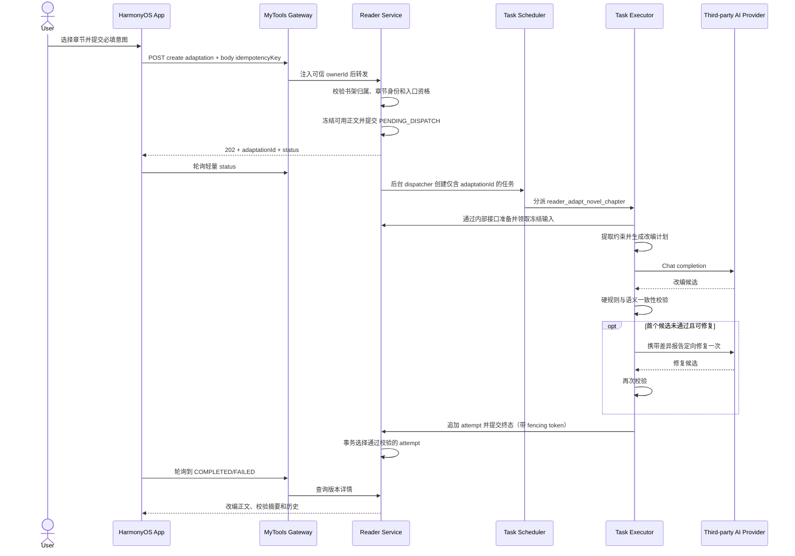

# 书架章节改编细化设计

日期：2026-09-09

状态：可进入规格化与实施评审

适用范围：MyTools HarmonyOS App、MyTools Gateway、Reader Service、Task Scheduler/Executor

## 1. 最终产品定义

本功能只处理已经存在于当前登录用户书架中的文本小说章节：

- 用户在阅读器目录中指定一个章节。
- 用户必须输入本次改编要求和大致意图。
- 后端自行解析并冻结原章节，App 不向公开接口提交任意正文。
- 后端异步调用部署方固定配置的第三方 OpenAI-like Provider 完成改编。
- 原章节永不覆盖；每次首次改编、优化改编、重新改编都形成新的不可变历史版本。
- 所有业务改编记录、冻结上下文、Provider 调用和校验结果均持久化；完整可展示候选保存在 Reader 数据库，触发安全/平台策略的原始正文只按隔离与短期合规策略处理，绝不通过 App 返回。
- 再次点击章节改编图标时，默认查看最近一次成功结果，并可查看全部历史。

明确不做：

- 粘贴任意文本改编。
- 段落选区改编。
- 在普通阅读正文上直接覆盖原章节。
- 剧情重构、改结局、增加新主线。
- 用户在 App 中选择模型、配置模型地址或接触 API Key。
- MVP 阶段建设完整小说 Canon 图谱、向量库或逐句接受系统。

## 2. 入口资格与能力边界

### 2.1 必须同时满足

1. 用户已登录。
2. 当前图书确实存在于服务端当前 owner 的 `shelf_book` 中，不能只相信客户端 `Book.id`。
3. 当前内容是文本小说章节，排除 PDF、漫画、图片章节和空章节。
4. 后端已建立书架图书与可读取正文的受控绑定。
5. 章节具有服务端生成的不透明 `chapterId`、内容摘要和目录版本。

### 2.2 不同书架来源

| 图书来源 | MVP 处理方式 | 入口行为 |
|---|---|---|
| 书源小说 `origin=source` | 通过服务端书源运行时和 `chapter_cache` 获取正文，随后复制成不可变改编快照 | 可用；正文未缓存时先后台拉取 |
| 已上传/受管电子书 `origin=remote` | 先完成远端身份协议升级、managed ebook import 和服务端 TXT/EPUB 正文投影 | 能力准备完成后可用；MOBI/AZW3/DRM 首版不可用，现状不能直接启用 |
| 仅设备本地 `origin=local` | 当前 `ShelfSyncApi` 明确不会把它同步到服务端，后端无法验证本地 URI 或读取正文 | 图标禁用，提示“先上传到 MyTools 后再改编” |
| PDF、CBZ、CBR、图片章节 | 不属于本次小说文本改编 | 不显示或禁用图标并说明原因 |

不能为支持本地图书而让 App 直接把章节正文塞进创建请求，否则后端无法证明它来自书架，也会绕过现有 2 MB JSON 请求限制。正确路径是先走已有电子书上传/受管导入，再形成服务端书架绑定。

`origin=remote` 当前还存在同步协议不一致：App 的 `/media/{id}` 实际使用媒体目录 item ID，而不是底层 asset ID；同时 `ShelfSyncResponseNormalizer` 只接受数字 remote sourceId。因此协议新增独立 `mediaItemId`，固定取 `RemoteMediaItem.id` 并随 shelf metadata 同步，绝不能让 App 猜测或提交内部 `mediaAssetId/ebookAssetId`。兼容旧数字 sourceId 但无法权威反查 media item 时保持不可用，不能简单放宽为任意字符串。

身份协议修复后，新增 `ManagedEbookBindingService`。remote ensure 的固定编排是：Gateway 按 owner + shelfBookId 从 Reader 读取服务器保存的 `mediaItemId`，用现有 Media Client 权威反查 `MediaView.assetId/status/mime/size/contentSha256`，再把该可信快照转给 Reader；Reader 验证当前 disclosure/权利声明后，才以服务端记录派生的 `rightsConfirmed=true` 建立导入。这里仅复用现有 managed import 的验证、表结构和解析包，不能直接调用当前“事务内先请求 Scheduler、后提交 Reader”的同步派发方法。Reader 必须在一个事务中先冻结内部 `mediaAssetId`/摘要、分配 binding revision 和确定性 import request ID、写下 `PREPARING + PENDING_DISPATCH` outbox，再由提交后的 dispatcher 派发。当前 Reader Java 侧没有 StorageGateway 下载和 EPUB 正文解析能力，不能假定 `ebook_asset` 出现后即可读取章节；MVP 还需增加受控的 `reader_project_ebook_text` Executor 任务（可复用现有电子书提取包的安全下载/解析基础能力），把 TXT/EPUB 解析为 Reader 的 canonical chapter projection 后才把 binding 标记 `ACTIVE`。MOBI/AZW3、DRM、加密或解析器不支持的格式保持 `UNAVAILABLE`，不得用客户端本地路径兜底。remote 不在打开目录时自动触发昂贵导入；用户首次点击准备入口并完成声明后才 ensure，期间显示“正在准备改编能力”。

对于 `origin=source`，新增按 `shelfBookId` 解析的 canonical catalog/content 路径，由 Reader 根据已验证 binding 的 `sourceId + sourceVersion` 加载不可变 `book_source_version.snapshot_json`，不能偷用 `book_source.current_version`。书源运行时契约增加服务端生成的 `invocationId`，工作目录、临时规则文件和缓存必须按 owner/source/version/invocation 隔离，禁止并发调用覆盖共享 namespace；返回项再与受控 source locator 精确绑定。原 `/source-runtime/catalog` 接口仍可服务尚未入书架的浏览流程，但不能为本功能提供章节身份。

### 2.3 一致性承诺

MVP 的约束来源是：原章节全文、前一章尾部、后一章开头、书名作者和当前目录信息。它能够保护当前章节的明确事实、事件顺序、入口/出口状态及相邻章衔接，但不能宣称已经验证整本小说的全部远距离伏笔。

若以后需要全书一致性，再在后台为受管书籍增加书级索引；该能力不阻塞本版本。

### 2.4 能力与同意状态

入口不能只看本地格式，要同时满足：

1. **账户级能力**：新增独立于 `/api/app/v1/reader/**` 总路由门禁的认证接口 `GET /api/app/v1/features/reader-adaptation`，返回版本化的 `readEnabled/createEnabled/maxIntentCodepoints` 和完整 `providerDisclosure`。后者至少含 version、contentSha256、实际运营主体/服务显示名、发送数据类别、目的、处理地域、留存摘要、政策链接、权利声明版本和本地化展示文本；资料未核实时 `createEnabled=false`，不能只返回一个无法展示的版本号。即使暂停新建，历史读取仍可保持开启；接口失败时 App 默认关闭入口。
2. **单书能力**：`GET /shelves/{shelfBookId}/chapter-adaptation-capability` 返回 `UNAVAILABLE | PREPARING | READY | BROKEN`、binding/catalog revision 和稳定原因码。`POST .../ensure` 以 JSON body 中的幂等键启动 source catalog projection 或 managed ebook import，返回 202；只有 `READY` 才允许创建。
3. **第三方处理同意**：账户能力同时返回 `consentRequired` 和上述 disclosure payload/hash。首次向第三方发送正文前，App 必须原样展示服务端签发的告知，并提交对该版本和摘要的明确同意；告知内容实质变化后必须重新同意。仅浏览本地历史不要求重新同意。

App 在登录/恢复时读取账户能力，在打开书架目录时读取或确保单书能力。`GatewayRequestFilter` 需要为账户能力及 consent 接口建立独立认证路径，不能复用会一次关闭所有 Reader API 的 `readerRouteEnabled`；Gateway 新增分别控制历史读取和创建的开关/owner allowlist。

单书状态必须来自持久 binding，而不是进程内 future：无合法 binding 或格式不支持为 `UNAVAILABLE`；准备任务存在且未终态为 `PREPARING`；`ACTIVE` 且 canonical catalog 已投影为 `READY`；`STALE` 在 ensure 后回到 `PREPARING`；补偿耗尽才为 `BROKEN`。App 重启、Reader 重启或重复 ensure 都读取同一 request/task 状态，不重复导入。

## 3. App 交互设计

客户端实际为 HarmonyOS ArkTS。真实章节目录位于 `Index.ets` 的 `ReaderCatalogPanel`，不是书籍详情页。

### 3.1 目录章节行

当前每章是一个整行 `Button(chapter.title)`。应拆成独立 Row：

```text
┌──────────────────────────────────────────┐
│ 第十二章 雨夜                         ✨ │
│                                  3 / 转圈 │
└──────────────────────────────────────────┘
  点击标题：进入章节                 点击图标：改编
```

- 标题区域继续调用 `SelectReaderChapter(index)`。
- 右侧改编按钮触控区至少 48vp，必须有“改编本章”辅助文本，不能只用颜色表达状态。
- 行内不能嵌套两个 Button；使用 Row 加两个并列点击区域，避免跳章和改编手势冲突。
- App 需要保留服务端 `shelfBookId`；它不同于客户端 `Book.id`。
- `ShelfSyncItem`/`Book` 增加独立可选字段 `shelfBookId`；remote 另保存 App 已有的 `mediaItemId`。`ShelfSyncResponseNormalizer` 必须读取服务端 shelf 行顶层 `id`，同时继续把 `metadata.bookId` 当客户端图书 ID，不能重载 `Book.id` 或丢弃两者之一；也不能把 media item ID 命名成 asset ID。
- `ReaderChapter` 被 local/remote/source 共用，因此新增的 `chapterId/sourceSha256/bindingRevision/catalogRevision/adaptationSummary` 都是可选服务端投影；启用图标要求 `shelfBookId/chapterId/bindingRevision/catalogRevision` 完整且 capability 为 READY，`sourceSha256` 可以在正文尚未缓存时为空，此时创建后进入 `CONTEXT_PENDING`。客户端不能自行生成章节身份或 SHA。
- 对尚未投影但具有可信 `mediaItemId` 的 TXT/EPUB remote 书，目录行显示不同语义的“准备改编”控件；点击只完成告知/权利声明并触发 book-level ensure，不携带本地章节 index。READY 后强制刷新 canonical catalog，再把它替换为真正的章节改编图标。
- 已绑定的服务端书架图书改用新的 canonical shelf catalog/content API。现有 runtime catalog 只有 title/resourceUri，不能靠标题或数组 index 与 `chapterId` 猜测匹配；未绑定图书仍可沿用旧阅读路径，但不显示改编入口。

目录按服务端目录页批量读取对应章节的改编摘要，禁止逐章发请求；App 以 `chapterId` 合并分页结果：

```text
historyCount = 0, activeId = null          -> 空心图标，点击首次改编
activeId != null                           -> 转圈；点击进度，旧历史仍可进入
successfulResultCount > 0                  -> 高亮图标 + 成功版本数量
historyCount > 0, successfulResultCount=0  -> 历史/错误点，点击失败历史与“重新开始”
latestSuccessfulSourceRelation != CURRENT  -> “旧”标记；结果可看，派生按钮禁用
```

其中 `historyCount` 统计全部未删除业务操作，`successfulResultCount` 只统计通过校验的正式结果，`currentSuccessfulResultCount` 只统计仍基于当前来源的成功结果；技术 attempt 不计入目录角标。即使全部失败或只有旧来源结果，入口也不能消失。

### 3.2 首次改编面板

完全没有业务历史时，点击图标打开底部面板：

- 书名、章节名，只读。
- “改编要求和意图”，必填，5-2000 字符。
- 简短说明：“会保留人物、事件顺序和本章结果，不会覆盖原文。”
- 若当前告知版本尚未同意，主按钮先打开第三方处理告知；用户同意后才发送创建请求，拒绝或关闭不创建记录。
- 主按钮“开始改编”。
- 本地未受管图书显示“先上传图书”，不显示文本输入框。

提交成功返回业务 `adaptationId`，立即关闭输入键盘并展示持久任务状态。现有网络客户端读超时约 20 秒，因此 App 不能同步等待模型结果；创建记录后从 2 秒间隔开始，并按服务端建议逐步退避。退到后台或关闭面板只停止轮询，不取消服务器任务。

### 3.3 改编结果页

有成功历史时再次点击图标，默认进入最近成功结果：

```text
┌ 返回  第十二章 · 改编版       优化改编  重新改编 ┐
│ 版本 3 · 2026-09-09 21:10 · 已完成              │
│ [改编内容] [与原文对比] [历史 3]                │
│                                                  │
│                    改编正文                      │
└──────────────────────────────────────────────────┘
```

- “优化改编”：以当前改编结果为底稿，仍使用原章节和相邻章作为硬约束；必须输入新的优化要求。
- “重新改编”：从冻结原章节重新生成，不使用当前改编正文；意图必填，界面默认回填上次意图供修改。
- “与原文对比”：只读展示原文和当前结果的段落级 Diff。
- “历史”：按创建时间倒序展示全部业务改编，包括处理中和失败记录；失败记录展示脱敏原因但没有伪造正文。
- 历史页溢出菜单提供“删除本章全部改编历史”，二次确认后才调用删除接口；不提供容易破坏谱系的单版本删除。
- 任意旧成功版本都能查看，但不会成为“覆盖原文”的当前章节。
- 当 `sourceRelation=STALE/UNKNOWN` 时，“优化改编/重新改编”禁用，页顶显示“此结果基于旧版或未确认章节”；另提供“基于当前章节重新开始”，重新读取 canonical catalog 并创建全新的 `INITIAL` 根版本。全部失败且无成功正文的历史页也提供同一入口。

### 3.4 页面状态与迟到响应

在 `Index.ets` 增加独立的改编面板状态和 `adaptationOperationRevision`：

- 切换章节、关闭面板、退出阅读器、退出登录和会话失效时取消当前 HTTP 轮询。
- 每次打开或切换历史版本时推进 revision；迟到响应的 revision 不匹配则丢弃。
- 服务端任务继续运行；下次打开从数据库恢复，客户端不把完整历史写入 Preferences。
- `onBackPress` 先关闭改编输入/结果面板，再关闭目录和阅读器。

## 4. 三种业务版本语义

| 类型 | 生成底稿 | 约束来源 | 历史关系 |
|---|---|---|---|
| `INITIAL` | 冻结原章节 | 原章、前后邻章、目录元数据 | 新建根版本 |
| `OPTIMIZE` | 用户选中的成功改编结果 | 同一原章快照和邻章约束，加父结果 | 父结果的子版本 |
| `REGENERATE` | 与原版本相同的冻结原章节 | 同一约束，使用新的必填意图和新随机性 | 同一根版本下的新分支，并记录触发来源 |

产品“重新改编”绝不能映射为 Scheduler 技术重试：

- 用户操作必定创建新的业务 `adaptationId`，历史可见。
- Executor 包内的安全重试或 Scheduler 租约恢复只更新 execution/call attempt 审计，不增加用户看到的版本号；任何外部调用都仍受持久化幂等与总预算约束。
- 原章节摘要变化后必须冻结新快照。旧历史继续可看并标记“基于旧章节”，但不能基于旧结果继续优化或重新改编；用户需从当前目录创建新的 `INITIAL`。
- 同一章节同时最多存在一个非终态业务改编；重复点击直接进入现有进度。

## 5. 端到端处理流程



具体步骤如下：

1. App 只提交服务端 `shelfBookId`、`chapterId`、必填意图、当前 `bindingRevision/catalogRevision` 和幂等键，不提交正文、owner 或模型参数。
2. Gateway 从已认证主体注入 `ownerId`，Reader 再以 `ownerId + shelfBookId` 验证归属；任何客户端传入的 owner 均忽略。
3. Reader 以同一 binding/catalog revision 确定目标章和邻章。若三者正文已经在 `chapter_cache` 或受管电子书投影中持久化，则在同一事务内复制成不可变上下文；缓存未命中时记录 `CONTEXT_PENDING`，不能让 App 请求等待书源网络。
4. 请求线程在事务提交后立即返回 202，不调用 Scheduler；`novel_chapter_adaptation` 的 `PENDING_DISPATCH` 行本身是持久 dispatch queue。独立 dispatcher 短周期领取后，通过现有 Scheduler Client 幂等创建任务并回绑 `taskInstanceId`。这样既避开 Gateway 约 3 秒的下游超时，也避免数据库事务中夹带外部 HTTP 调用。
5. Executor 只凭 `adaptationId` 调用 Reader 内部的 context prepare/claim。Reader 从 adaptation 记录反查 owner，再通过受控 `ChapterContentResolver` 读取书源运行时或电子书资产，验证客户端所见摘要后落下快照；Executor 不能从 Scheduler 参数取得正文/owner，也不能自行接受外部 URL。
6. Executor 先形成“不可改变事实 + 可扩写位置 + 章节出口状态”的结构化计划，再生成正文。
7. 每次收到 Provider 的完整候选，都先追加成不可变 attempt；即使候选未通过校验也不覆盖或丢弃。
8. 通过校验的 attempt 才能成为业务版本的 `selectedAttemptId`。未通过时最多进行一次定向修复，仍失败则业务版本进入 `FAILED`，并记录 `READER_043`。
9. App 查询的是 Reader 数据库中的真实状态，而不是把 Scheduler 状态直接暴露给用户。

## 6. 改编约束与生成流水线

### 6.1 约束优先级

从高到低固定为：

1. 安全与平台边界。
2. 冻结原章节的剧情事实和相邻章衔接。
3. 人物设定、叙事视角、时空和世界规则。
4. 用户本次改编意图。
5. 文风、细节密度和语言润色。

用户意图是必填输入，但不是可以推翻剧情的最高指令。若用户要求与硬约束直接冲突，例如让本章未死亡的人死亡、让尚未获得的能力提前出现或改变本章结局，系统应返回 `READER_033`，同时给出不泄露内部 Prompt 的可操作提示。不能静默满足冲突意图。

### 6.2 不可改变与允许扩写

| 类别 | 默认规则 | 示例 |
|---|---|---|
| 人物身份与关系 | 不可改变 | 姓名、亲属、阵营、称谓所代表的人 |
| 已知状态 | 不可改变 | 生死、伤势、持有物、能力、知情范围 |
| 数字与专名 | 不可改变或遗漏 | 时间、距离、金额、编号、地名、招式名 |
| 事件及因果顺序 | 不可改变 | 谁先到场、谁做了什么、为何产生结果 |
| 章节入口与出口 | 不可改变 | 开头承接前章、结尾通向后章的状态 |
| 叙事视角和时态 | 默认保持 | 第一/第三人称、过去/现在叙述习惯 |
| 对话表现 | 可扩写但不能改变信息量和决定 | 增加停顿、动作、潜台词 |
| 感官与场景 | 可扩写 | 光线、声音、气味、空间细节 |
| 心理与动作过程 | 可扩写但不能引入新动机或新结果 | 紧张感、战斗动作、犹豫过程 |
| 节奏和语言 | 可按意图调整 | 更细腻、更紧张、更有画面感 |

“加料”在本产品中的定义是增加表现层信息，而不是增加会进入后续剧情的事实。新出现的命名人物、关键道具、能力、秘密、组织、承诺、永久伤势和事件结果一律视为剧情事实，默认禁止。

### 6.3 四阶段流水线

#### 阶段 A：冻结与约束提取

- 冻结原章全文、前一章末尾和后一章开头；邻章截取长度按 Unicode code point 而不是 UTF-16 下标计算。
- 第一章或末章分别写入明确的 `BOOK_START`/`BOOK_END` 边界；其他章节只要任一邻章无法解析，就以 `READER_049` 失败，不能悄悄降低约束后继续生成。
- 记录章节标题、目录序号、书名作者、内容 SHA-256、目录版本和来源绑定版本。
- 以规则提取专名、数字、引号内称谓和章节尾部状态；再让模型输出结构化事实清单。
- 规则结果与模型结果取并集。模型只能补充约束，不能删除确定性规则发现的约束。

#### 阶段 B：先规划后成文

要求模型先返回内部 JSON 计划。下列是概念示意，不能直接提交当前内部协议；已实现的严格 `adaptation-plan-v1`、原文码点证据和 critic 字段见第 11.2 节：

```json
{
  "intentSummary": "提升雨夜追逐的紧张感并增加感官细节",
  "preservedFacts": ["..."],
  "expansionPoints": [
    { "anchor": "原文段落摘要", "additionType": "sensory", "purpose": "..." }
  ],
  "forbiddenChanges": ["..."],
  "requiredEndingState": "..."
}
```

计划不向 App 暴露原始模型推理，只存储精简的结构化计划及其版本，用于复现和校验。计划若主动提出新剧情事实，直接标记冲突并终止，不进入成文，也不消耗一次不受控的“重新规划”。

计划、事实清单和 critic 报告虽然是 JSON，仍是不可信模型输出。每类载荷使用独立 JSON Schema，拒绝未知字段，并限制总字节、嵌套深度、数组项数、字符串长度和枚举值；解析失败一律 fail closed。它们被放回后续 Prompt 时仍作为有边界的数据，不能提升为 system 指令。

#### 阶段 C：生成正文

- MVP 只做整章一次生成，以保持一个候选对应一个不可变 attempt 和一个 selection；请求预算必须同时容纳 system contract、原章、邻章、计划、意图及预留输出。
- 超过经目标模型契约测试计算出的上下文/输出预算时返回 `READER_042`，不静默截断原章，也不在首版暗中分块。自然段分块、segment attempt、确定性 assembly 和整章复检作为后续独立规格，不能塞进固定 `GENERATE x1` 流程。
- 初版固定 `stream=false`，只有在该 Provider 的成功响应契约完成验证后才考虑流式输出。
- 输出仅允许正文，禁止把解释、Markdown 围栏、标题说明混进章节内容。

#### 阶段 D：校验与定向修复

先运行确定性校验，再运行语义校验：

- 内容非空、编码合法、长度在原章的可配置比例范围内。
- 人物和专名没有被替换，关键数字没有变化。
- 原事件锚点保持原顺序，章节尾部事实与原章一致。
- 没有新增命名实体、关键物品、能力、关系或不可逆状态。
- 前章尾部到本章开头、本章结尾到后章开头不存在明显衔接冲突。
- 用户意图在不破坏上述约束的部分得到了体现。
- 候选经过平台内容安全判定；被安全/平台策略阻断时直接归类 `SAFETY_OR_PLATFORM/READER_053`，不进入公共可见正文，也不能通过“未通过剧情约束”入口绕过。

语义校验由结构化 critic 给出 `PASS | REPAIRABLE | BLOCKED` 及差异列表。由于生成器与 critic 可能是同一模型，critic 结论只能作为第二道检查，不能取代确定性约束。`REPAIRABLE` 最多定向修复一次；`BLOCKED` 或二次失败立即终止。

### 6.4 历史可见性

用户提出的每一次 `INITIAL`、`OPTIMIZE`、`REGENERATE` 都是可见的业务历史。一个业务历史下面可以有多个技术 attempt：

- 通过校验的 attempt 显示为“采用版本”。
- 未通过剧情约束但未触发安全/平台策略的完整正文仍保留，并在历史详情的“生成尝试”中由用户主动展开，明确标注“未通过剧情约束，不作为正式改编结果”。
- 触发安全或平台内容策略的候选只保留业务事件、分类、哈希和受限审计材料，`viewableCandidate=false`；原始正文不得通过 App/Gateway 返回。若合规要求保存原文证据，只能进入独立加密隔离存储并按更短策略期限清除。
- 连接失败且没有产生正文的 attempt 仅展示时间、阶段和脱敏错误。
- Provider 返回的半截流、HTML 错误页或无法解析的载荷不作为“改编正文”，只保留摘要、哈希和受限诊断信息。

这样既满足每次改编与实际生成结果可追溯，也不会把不合格候选误呈现为成功版本。

## 7. 第三方模型接入设计

### 7.1 Provider 定位与已知事实

目标地址配置为 `https://api.sillytraven.dev/api/ai/v1`，聊天路径为 `/chat/completions`。该域名与 SillyTavern 官方域名及项目名拼写不同，应在代码和产品文案中称为“部署方配置的第三方 OpenAI-like Provider”，不得表述为 SillyTavern 官方服务。SillyTavern 官方仓库也明确其自身不提供托管在线服务，且其 Custom OpenAI 文档提醒兼容接口不保证支持所有端点：

- [SillyTavern 官方仓库](https://github.com/SillyTavern/SillyTavern)
- [SillyTavern Custom OpenAI 文档](https://docs.sillytavern.app/usage/api-connections/openai/)

匿名探测能够获得 [`/models`](https://api.sillytraven.dev/api/ai/v1/models) 的 OpenAI-like 模型列表，聊天端点空请求也要求 `messages` 数组和 `model` 字符串；但未发现公开的 SLA、隐私、留存、速率限制、上下文长度或完整错误协议。因而“无限制”只能作为用户对服务的描述，不能成为容量、安全或可靠性设计前提。

### 7.2 配置与 Secret

带 endpoint、认证方式和 Secret 的 Provider 参数只进入第 14.1 节定义的专属执行安全边界（生产 Executor 与一次性 contract-gate unit）；Reader 另持有第 9.3 节不含 URL/Secret 的 deployment 注册表：

```text
NOVEL_ADAPTATION_BASE_URL=https://api.sillytraven.dev/api/ai/v1
NOVEL_ADAPTATION_CHAT_PATH=/chat/completions
NOVEL_ADAPTATION_MODELS_PATH=/models
NOVEL_ADAPTATION_PROVIDER_DEPLOYMENT_ID=<non-secret immutable id>
NOVEL_ADAPTATION_CREDENTIAL_GENERATION=<non-secret positive integer>
NOVEL_ADAPTATION_API_KEY=<secret reference>
NOVEL_ADAPTATION_API_KEY_HEADER=Authorization
NOVEL_ADAPTATION_API_KEY_PREFIX=Bearer
NOVEL_ADAPTATION_MODEL=<validated model id>
NOVEL_ADAPTATION_CONNECT_TIMEOUT_SECONDS=10
NOVEL_ADAPTATION_FIRST_BYTE_TIMEOUT_SECONDS=60
NOVEL_ADAPTATION_PLAN_TIMEOUT_SECONDS=60
NOVEL_ADAPTATION_GENERATE_TIMEOUT_SECONDS=300
NOVEL_ADAPTATION_CRITIC_TIMEOUT_SECONDS=60
NOVEL_ADAPTATION_REPAIR_TIMEOUT_SECONDS=180
NOVEL_ADAPTATION_TOTAL_PROVIDER_SECONDS=660
NOVEL_ADAPTATION_ABSOLUTE_TIMEOUT_SECONDS=840
NOVEL_ADAPTATION_MAX_PROVIDER_CALLS=5
NOVEL_ADAPTATION_TOTAL_PROVIDER_RETRY_BUDGET=2
NOVEL_ADAPTATION_MAX_CONTEXT_TOKENS=<verified value>
NOVEL_ADAPTATION_MAX_CONCURRENCY=2
```

- 实际密钥必须通过部署 Secret 注入，绝不进入 App、Git、数据库、Scheduler 参数、错误正文、埋点或访问日志。
- `NOVEL_ADAPTATION_PROVIDER_DEPLOYMENT_ID` 是不含 URL、密钥的发布身份；同一 ID 永久映射同一 endpoint/auth realm，端点或运营主体变化必须创建新 ID，不能原地改含义。Reader 只配置该非敏感 ID、精确 model ID 和 credential generation，Executor 与 contract-gate unit 启动时都验证自己的 Secret/端点契约映射到相同 ID；任务包和请求体无权声明或切换它。
- Header 名和前缀做成配置项。当前不能仅凭端点格式断言认证一定是 `Authorization: Bearer`；日志脱敏器必须在启动时把配置后的 Header 名以大小写不敏感方式加入敏感头集合，并始终覆盖 `Authorization`、`Proxy-Authorization`、`api-key`、cookie 等常见头。
- `NOVEL_ADAPTATION_MODEL` 必须指定端点实际返回且通过中文章节金丝雀测试的模型 ID；不能从模型名猜上下文长度，也不能在多个模型中随机挑选。
- 启动时可只做格式校验；模型列表和最小聊天请求由部署前 contract gate 验证，避免 Provider 临时故障导致 Reader 主服务无法启动。
- 一个业务版本最多执行 `PLAN x1 + GENERATE x1 + CRITIC x2 + REPAIR x1`，Provider 总等待不超过 660 秒，并受持久化的 840 秒业务绝对 deadline 约束，给 Reader 回写和 Scheduler 的 900 秒 deadline 留出余量；进入每阶段前按剩余总预算再裁剪，不能把每次 timeout 独立相加。

### 7.3 最小外部请求

```json
{
  "model": "${NOVEL_ADAPTATION_MODEL}",
  "messages": [
    { "role": "system", "content": "<versioned adaptation contract>" },
    { "role": "user", "content": "<frozen context and required intent>" }
  ],
  "temperature": 0.7,
  "stream": false
}
```

Provider adapter 必须同时兼容标准 JSON、SSE 风格帧以及非标准错误正文，并把它们归一成内部类型。不得记录外部原始错误正文；诊断只保留 allowlist 中的 HTTP status、content type、长度、响应摘要和内部 trace ID。对 App 仅返回稳定错误码和追踪 ID。

解析器设置独立的响应头、压缩后字节、解压后字节、JSON 深度、SSE 帧数、choice 数和单字符串上限；首版发送 `Accept-Encoding: identity`，只接受严格 UTF-8，并要求成功响应恰好一个可用 choice。超过任何界限立即中止读取，不能先把未知大小正文全部分配到内存再校验。

### 7.4 重试、限流和熔断

- 每次外部调用先持久化随机 `providerAttemptId`、请求摘要和 `REGISTERED`；真正写网络请求前，再提交 `SEND_STARTED`、本次 transmission 序号、剩余 call/retry/秒数预算和绝对截止时间。Provider 支持且契约测试确认幂等时，所有 transmission 都发送同一 `providerAttemptId`。
- 若 Provider 已确认支持幂等，再对 408、429、5xx 按同一 key 最多重试 2 次，遵守 `Retry-After`，并与 Scheduler 共用一个总重试预算。
- 若 Provider 不支持已验证的幂等，只能自动重试能够证明请求正文尚未发出的 DNS、TCP 或 TLS 建连失败。请求发出后的 read timeout、连接重置和模糊 5xx 都标记 `CALL_OUTCOME_UNKNOWN` 并终止本业务版本，不能猜测“未生成”后再次调用。失去租约或进程崩溃后仍停在 `SEND_STARTED` 的调用也按结果未知处理；只有已验证 Provider 幂等时，恢复执行才允许以同一 key 继续查询或重发。
- 400、401、403、404 不自动重试。`401` 或契约测试确认的 Provider 专用鉴权错误才映射 `READER_040`、触发配置告警并打开认证熔断；普通 `403` 可能是内容/策略拒绝，映射 `READER_055`，不得误报密钥失效。
- 若已收到完整候选但后续 Reader 回写不确定，使用相同 `providerAttemptId` 幂等回写，绝不能重新调用模型。fencing 只能防止重复采用，不能防止第三方重复处理，所以不能把它当作 Provider 幂等。
- `provider_call_budget_remaining`、`provider_retry_budget_remaining`、累计 Provider 等待秒数和 `deadline_at` 都在 Reader 中以 CAS 扣减；Executor 重启、Scheduler 重新 claim 或租约恢复不得重置。任一预算不足时，在发送前失败，确保全部 execution 合计不超过 5 个阶段调用、2 次额外 transmission、660 秒 Provider 等待和 840 秒绝对时限。
- 本地始终执行并发上限、单用户活跃任务上限、请求总超时和熔断，即使 Provider 声称无限制。
- 熔断打开时新请求可以创建历史，但进入 `FAILED` 并记录 `READER_039`；若产品以后决定支持等待，可改为维持 `QUEUED`。MVP 建议快速失败，避免无限积压。
- Reader 从发布注册表选择并冻结 `providerDeploymentId`，再用它定位熔断桶：认证熔断按 `providerDeploymentId + credentialGeneration` 分桶；可用性熔断按 `providerDeploymentId + exactModelId` 分桶，密钥轮换不得清空可用性失败窗口。配置修复或冷却到期后只允许无版权金丝雀 half-open，成功达到阈值再恢复真实流量，不能拿用户章节探测恢复。
- 熔断状态不能只放在单个 Executor 内存。Reader 持久化共享 breaker 状态并在 `send-started` 原子授予 permit；attempt 终结更新窗口。多 Executor 看到同一 open/half-open lease，只有专用金丝雀任务能取得 half-open permit。
- `ProviderProbeDispatchWorker` 在 `next_probe_at` 到期时为桶创建唯一 probe epoch，并以 `reader_probe_novel_adaptation_provider:{bucketId}:{probeEpoch}` 调度专用任务。探针只读取随包发布且 SHA 固定的自有/公版短文本，不读取任何用户书架、章节、意图或历史；只有该任务能取得 half-open permit，成功/失败达到既定阈值后以 CAS 结算桶状态。

### 7.5 上线前契约闸门

不得用真实用户章节做首次联调。使用无版权风险的中文夹具完成：

1. `/models` 能找到所配置模型。
2. 认证 Header 与前缀有效。
3. 非流式成功响应能提取单一正文。
4. 中文标点和长文本不会乱码或被截断。
5. 400、401、普通 403、Provider 专用鉴权失败、429、5xx、超时和非 JSON 错误均能正确归一，且普通 403 不打开认证熔断。
6. 验证实际上下文与输出上限，再填写 token 配置。
7. 取得 Provider 对请求记录、留存和处理地域的权威政策、合同/DPA 或书面证明；黑盒请求不能证明“不留存”。材料缺失时按会记录和留存处理，只允许无敏感、权利清晰的夹具。

## 8. 服务职责与代码落点

### 8.1 职责边界

| 组件 | 负责 | 不负责 |
|---|---|---|
| HarmonyOS App | 入口、必填意图、状态展示、Diff、历史浏览 | 读取密钥、拼 Prompt、提交正文、判定所有权 |
| MyTools Gateway | 登录校验、owner 注入、公共 DTO、错误净化、灰度开关 | 持久化改编正文、直接调用 Provider |
| Media Library | 按 owner 提供媒体 item/asset 的权威短期 attestation | 暴露下载 URL、接收改编意图、决定改编状态 |
| Reader Service | 书架/章节资格、快照、业务状态机、历史、attempt、约束结果 | 持有 Provider 密钥、长时间占用 HTTP 请求 |
| Task Scheduler | 幂等排队、租约与恢复、取消、超时 | 保存章节正文、保存 Provider 密钥、定义产品版本 |
| Task Executor package | 计划、调用 Provider、解析、校验、修复、受 fencing 回写 | 信任 App 身份、直接改业务表 |
| 第三方 Provider | 按请求生成候选 | MyTools 业务状态、历史与所有权 |

### 8.2 HarmonyOS App

建议新增：

```text
app/entry/src/main/ets/features/reader/
├── ReaderAdaptationCapabilityApi.ets
├── ChapterAdaptationModels.ets
├── ChapterAdaptationApi.ets
└── ChapterAdaptationResponseNormalizer.ets
```

需要修改：

- `app/entry/src/main/ets/pages/Index.ets`：目录图标、输入面板、进度、结果、历史和取消轮询。
- `app/entry/src/main/ets/features/reader/ReaderModels.ets` 与 `ShelfSyncModels.ets`：增加独立可选 `shelfBookId`、remote `mediaItemId` 和章节服务端投影。
- `app/entry/src/main/ets/features/reader/ShelfSyncApi.ets`、`ShelfSyncResponseNormalizer.ets` 与 `ReaderSnapshotNormalizer.ets`：从 shelf 顶层读取、校验、合并和持久化 `shelfBookId`，不再只映射 `metadata.bookId`。
- `Index.ets` 内所有 Book 显式复制、merge、详情书架 ID 和阅读器恢复路径都必须保留 `shelfBookId`；当前用 `Book.id` 赋给 `detailShelfBookId` 的路径要改为新字段，不允许静默 fallback。
- `app/entry/src/main/ets/shared/network/AuthorizedApiClient.ets`：增加携带 HTTP status、稳定业务 code 和 traceId 的受限错误类型；当前只抛 message 的行为无法让新页面可靠区分刷新目录、容量限制和 Provider 故障。保持已有调用者兼容。
- UI 设计策略测试：覆盖 48vp、辅助文本、状态不只依赖颜色和禁止嵌套 Button。

`ChapterAdaptationApi` 应复用 `AuthorizedApiClient`，但不得用单个普通请求做同步长轮询。前台按服务端 `pollAfterMs` 查询，客户端将其限制在 2-15 秒并加入少量抖动；持续 30 秒后至少退避到 5 秒。页面不可见时暂停，重新进入立即查询一次。

### 8.3 Gateway

在 `service/mytools-gateway` 中增加独立的 `ChapterAdaptationGatewayController`、Gateway DTO 和 `ReaderGatewayClient` 方法。保持公共前缀 `/api/app/v1/reader`，复用现有主体注入、Reader 灰度路由和受格式约束错误透传机制。

remote capability ensure 由 Gateway 编排现有 `MediaGatewayClient`：先从 owner-scoped shelf reference 取得 `mediaItemId`，再调用 Media view 获得内部 asset 快照，最后转给 Reader。公开请求体不接受 media/asset ID；Gateway 也不得把 App 路径当作资产身份。

Media Library 同时新增仅服务间可用的 `GET /api/internal/v1/media/items/{mediaItemId}/asset-attestation?ownerId=...`，要求 allowlisted Reader mTLS service identity，并始终以 `(media_item_id, owner_id)` 查询。响应仅含 `attestationVersion/issuedAt/itemId/assetId/status/mime/size/contentSha256`，设置 `Cache-Control: no-store`；不返回存储路径、下载 URL 或外部错误正文。Gateway 初次 ensure 可沿用现有 owner-scoped view，Reader 的恢复和 seal 必须调用这个内部接口取新 attestation。

Gateway 不记录 intent/正文请求体；访问日志只保留 route template、响应码、耗时、trace ID 和主体的不可逆审计标识。

现有 Gateway 只把 Reader 拒绝压缩成 code/message，成功信封也没有 body `traceId`。本功能需同步修改 `GatewayEnvelopeAdvice`、`GatewayReaderRejectedException` 和 `GatewayExceptionHandler`：

- 以现有 `X-Correlation-Id` 为唯一 trace 来源，并同时写入成功/错误信封的 `traceId`，App 的 typed error 保留它。
- `GatewayRequestFilter` 自己产生的 401/503 也必须使用同一信封/trace 构造器，不能留下没有 `traceId` 的旁路响应。
- Reader 错误 body 只允许为 `READER_037` 投影 `activeAdaptationId`、为 `READER_045` 投影 `retryAfterMs`；其他下游 data 全部丢弃。
- 不要求 App 读取响应 Header。`AuthorizedApiClient` 的新受限错误类型携带 status/code/allowlisted data/traceId，现有调用者仍可读取兼容 message。
- `GatewayExceptionHandler`、validation handler 和访问日志不得记录 `exception.getMessage()`、请求 DTO 或 rejected value；只记录异常类型、稳定错误码、route template 和 trace ID，并用带 intent sentinel 的测试证明没有泄漏。

### 8.4 Reader Service

建议按现有结构增加：

```text
service/reader-service/src/main/java/com/yuyutian/mytools/reader/
├── controller/ChapterAdaptationController.java
├── controller/ChapterAdaptationInternalController.java
├── controller/EbookProjectionInternalController.java
├── controller/ProviderProbeInternalController.java
├── config/ReaderSchedulingConfig.java
├── model/ChapterAdaptationModels.java
├── repository/ChapterAdaptationRepository.java
├── service/ChapterAdaptationService.java
├── service/ChapterAdaptationContextService.java
├── service/ChapterAdaptationStateMachine.java
├── service/ReaderMediaAssetClient.java
└── service/adaptation/
    ├── ChapterAdaptationDispatchWorker.java
    ├── ChapterAdaptationRecoveryWorker.java
    ├── ChapterAdaptationDeletionWorker.java
    ├── SourceCatalogProjectionWorker.java
    ├── ManagedEbookPreparationDispatchWorker.java
    ├── EbookProjectionDispatchWorker.java
    └── ProviderProbeDispatchWorker.java
```

公共业务异常必须加入 Reader 自身的稳定 `ErrorCode` 管理；所有 public 方法补中文 Javadoc，关键分支按项目规范使用中文行内注释。

`ReaderSchedulingConfig` 使用 `@EnableScheduling`（或仓库统一的等价调度器）显式启用这些后台循环；创建 202、source/remote ensure、删除与熔断恢复都不能依赖人工触发。所有 worker 用各自实体上的 `FOR UPDATE SKIP LOCKED`、`claimed_until + claim_owner` 小批短租约和带抖动退避，多实例可并行但同一业务行只有一个有效 claim；数据库锁释放后才调用 Scheduler/外部服务，任何网络 I/O 都不得跨行锁。批量大小、扫描间隔、租约和功能开关分别配置，停用创建功能时恢复/删除/历史读取仍保持运行。

同时修改 `ReaderRuntimeClient`/书源 runtime DTO：调用必须携带 exact `sourceId/sourceVersion/invocationId`，从 `book_source_version` 取指定快照并使用版本化隔离 namespace，不能继续只用 owner + sourceUrl 的共享保存/删除路径。`SourceCatalogProjectionWorker` 从 `shelf_book_preparation_dispatch` 领取 `SOURCE_CATALOG`，持久复用 invocation ID，在锁外调用只读 runtime 并写受限 staging；最终事务重验 exact source version/binding revision、计算 manifest、合并 canonical chapters、seal dispatch 并把 binding 置 `ACTIVE`。崩溃、乱序或版本变化只重试同一行或 CAS 为 `STALE/BROKEN`，不会发布半份目录。

remote 侧增加 `ManagedEbookBindingService`、Gateway 可信 Media 快照 DTO 和内部 `ReaderMediaAssetClient`。后者使用独立 mTLS service identity 调用 Media 的 owner-scoped item attestation 接口，连接/读取超时建议 3/5 秒，输入 owner 必须来自 binding 而非任务或 App；只返回 item/asset/status/mime/size/content SHA/attestation revision，不返回任意下载 URL。超时维持 `PREPARING` 并退避，item 删除、非 READY、asset 或 SHA 变化则以 binding revision CAS 为 `STALE/BROKEN` 并拒绝旧 import/projection callback。Reader recovery 与 projection `complete` 都必须刷新该 attestation，不能复用已经过期的 Gateway 初始快照。

### 8.5 Scheduler 与 Executor

- 新增即时任务包 `reader_adapt_novel_chapter`、`reader_project_ebook_text` 和 `reader_probe_novel_adaptation_provider`，版本均从 `1.0.0` 开始；最后一个包只携带已审计的自有/公版固定夹具。
- Scheduler 业务类型使用 `READER_CHAPTER_ADAPTATION`，priority `40`（与已实施受限派发契约一致）、timeout `900s`、`maxConcurrency=2`、step `maxAttempts=1`。Provider-bearing step 禁止 Scheduler 在同一 execution/fence 下整体重跑；安全的网络重试只由包内依据 Reader 持久预算执行。只有任务租约恢复并重新 claim 时才产生新的 execution/fence。
- 改编任务参数只允许 `{adaptationId}`，电子书投影任务只允许 `{bindingId}`，Provider 探针只允许 `{probeId}`；Reader 从业务记录解析 owner/asset/import 绑定或 breaker bucket。三个 schema 都明确拒绝 `ownerId`、正文、intent、API Key 和任意 URL。
- Executor package 通过受控环境 replacement 获取 Provider 配置；真实章节环境使用 mTLS 加 Scheduler 签发的短期 execution assertion 调用 Reader，静态 `READER_INTERNAL_TOKEN` 只允许本地 Fake Provider/无版权夹具环境。
- 在 `service/scripts/executor_environment_contract_gate.py` 增加所需变量的静态部署契约验证，但错误输出不得打印变量值。另新增 `service/scripts/novel_adaptation_provider_contract_gate.py` 作为显式发布门禁：它只能由 `novel-adaptation-provider-contract-gate.service` 一次性 unit 在与生产 Executor 相同的专属 service account、credential mount 和 egress policy 中启动，不能由 Reader/Gateway/Scheduler、普通 CI runner 或交互 shell 直接取得 Secret。脚本只用固定夹具依次验证 `/models`、最小 chat、认证方式、超时/错误归一和上下文边界；标准输出只含布尔结果、状态分类、长度与摘要，禁止输出 Header、Secret、请求正文或响应正文，unit 完成后立即卸载 credential。静态环境校验不能替代这项真实 Provider 合约测试。

## 9. 数据模型

### 9.1 先补齐书架与正文的受控绑定

现有 `shelf_book` 虽有 `id/owner_id/book_key/metadata_json/deleted/version` 等同步字段，但不能据此安全定位正文；现有 `chapter_cache` 又会过期。因此先引入以下受控绑定、locator、章节与正文投影结构。

#### `shelf_book_content_binding`

| 字段 | 说明 |
|---|---|
| `id CHAR(36)` | 主键 |
| `shelf_book_id CHAR(36)` | 书架记录；服务端真实 ID |
| `owner_id BIGINT` | 冗余 owner，用于强制所有查询都带租户范围 |
| `binding_type VARCHAR(32)` | `SOURCE_RUNTIME` 或 `EBOOK_ASSET` |
| `source_id CHAR(36)` | 书源类型绑定；可空 |
| `source_version INT` | 冻结书源版本；可空 |
| `source_book_key CHAR(64)` | 规范化书源图书身份摘要；可空 |
| `media_item_id CHAR(36)` | App/shelf 可持有的媒体目录 item UUID；remote 时非空 |
| `media_asset_id CHAR(36)` | Gateway 经 Media 权威反查得到的内部资产 UUID；不对 App 暴露 |
| `media_content_sha256 CHAR(64)` | Media 权威内容摘要；防资产替换 |
| `ebook_asset_id CHAR(36)` | 受管电子书绑定；可空 |
| `binding_revision BIGINT` | 每次重绑递增 |
| `status VARCHAR(32)` | `PREPARING`、`ACTIVE`、`STALE`、`BROKEN` |
| `catalog_revision BIGINT` | 每次权威目录变化递增 |
| `catalog_sha256 CHAR(64)` | 当前目录指纹 |
| `preparation_kind/request_id/task_instance_id` | 当前 preparation phase 的查询摘要；权威 outbox 在下表，可空 |
| `last_error_code/next_retry_at` | 能力准备补偿信息；不得存外部错误正文 |
| `created_at/updated_at` | 审计时间 |

约束：`UNIQUE(shelf_book_id)` 和 `UNIQUE(id, owner_id, shelf_book_id)`。V31 同时为 `shelf_book`、`book_source` 和 `ebook_asset` 补所需的 `(id, owner_id)` 候选唯一键；binding 以复合 `FOREIGN KEY(shelf_book_id, owner_id) ... ON DELETE RESTRICT` 强制租户一致，source 绑定再引用 `(source_id, source_version)`，已有 ebook 绑定引用 `(ebook_asset_id, owner_id)`。CHECK 按状态表达：`SOURCE_RUNTIME` 必须有 source/version 且无 media/ebook；`EBOOK_ASSET + PREPARING` 必须有 media item 和经 Media 权威反查的 asset/hash、允许 ebook asset 为空；只有 `EBOOK_ASSET + ACTIVE` 才强制 ebook asset 非空，source 字段始终为空。Media 位于独立服务，不能建跨库 FK，因此每次 ensure/recovery 都用 media item 重验 owner、内部 asset ID 与内容摘要。上线基线固定为可执行 CHECK 的 MySQL 版本（MySQL 8.0.16+），迁移预检发现不支持时直接失败，不能降级成只靠约定。

#### `shelf_book_preparation_dispatch`

binding 上的 `preparation_kind/request_id/task_instance_id` 只作为当前阶段摘要，真正的 source/remote 异步状态放入独立 outbox。每行保存 `id/owner_id/binding_id/binding_revision/phase(SOURCE_CATALOG|EBOOK_IMPORT|EBOOK_TEXT_PROJECTION)/status(PENDING_DISPATCH|DISPATCHED|RUNNING|SUCCEEDED|FAILED|CANCELLED)/deterministic_request_id/scheduler_idempotency_key/task_instance_id/execution_id/fencing_token/dispatch_epoch/dispatch_attempt_count/next_dispatch_at/claim_owner/claimed_until/catalog_canonicalization_version/catalog_item_count/catalog_manifest_sha256/last_error_code/created_at/updated_at`，并建立 `UNIQUE(binding_id, binding_revision, phase)`、`UNIQUE(scheduler_idempotency_key)`、供 staging 引用的 `UNIQUE(id, owner_id, binding_id, binding_revision)` 和 binding/owner 复合 `RESTRICT` 外键。CHECK 要求 `SOURCE_CATALOG` 持久化 invocation/request ID 而 Scheduler 字段为空；两个 ebook phase 必须有确定性 Scheduler key，并在调度后填充 task/execution/fence。

同一 revision 的阶段只能按 `SOURCE_CATALOG -> SUCCEEDED` 或 `EBOOK_IMPORT -> EBOOK_TEXT_PROJECTION -> SUCCEEDED` 推进。ensure 事务创建首行并提交；dispatcher 领取行、释放锁、再调用 Scheduler/书源 runtime，随后以 `binding/revision/phase/dispatchEpoch` CAS 结算。阶段交接在一个 Reader 事务中把前一行置成功并创建下一行，崩溃恢复永远复用已持久的 request/key，不从随机值重建。

source runtime 的目录先进入 `shelf_book_catalog_projection_staging`：每行保存 `id/owner_id/dispatch_id/binding_id/binding_revision/ordinal/stable_chapter_key_sha256/title/content_kind/locator_ciphertext/locator_sha256/item_sha256/created_at`，建立 `UNIQUE(dispatch_id, ordinal)`，并以 `(dispatch_id, owner_id, binding_id, binding_revision)` 复合 `RESTRICT` 外键指向 dispatch。每批有 item/字节硬上限；同 ordinal + 同 item SHA 重放成功，同 ordinal + 不同 SHA 冲突并令本轮失败，不能覆盖。

全部批次写完后，以 `status=RUNNING + dispatchEpoch + claimOwner` CAS 一次性冻结 `catalog_canonicalization_version/item_count/manifest_sha256`。seal 事务按 ordinal 和冻结版本重算每项及总 manifest，要求实际数量/摘要完全相等，再次检查 exact source version 与 binding revision，随后生成正式 locator/canonical chapter、把 dispatch CAS 为 `SUCCEEDED` 并把 binding 置 `ACTIVE`；staging 在提交后分批删除。部分、超限、摘要冲突、claim 失效或旧 revision 的 staging 永不进入公共目录，恢复可清理过期 staging 后用同一 invocation/request 重建。

#### `shelf_book_source_locator`

现有书源运行时最终仍需要 `bookUrl/chapterUrl`，因此不能只保存不可逆 SHA。V31 增加仅 Reader 内部可读的 locator 表：`id/owner_id/binding_id/locator_scope(BOOK|CHAPTER)/locator_ciphertext/locator_sha256/allowed_scheme/allowed_host/source_version/created_at`。locator 原文使用应用层信封加密，不进入 App、公开 DTO、日志、trace 或任务参数；query 只在受限运行时内存中解密。它以 binding/owner 复合 `RESTRICT` 外键约束，`UNIQUE(binding_id, locator_scope, locator_sha256)`。入库和每次解引用都执行第 14.1 节网络校验，exact source version 不匹配时拒绝。

#### `shelf_book_chapter`

| 字段 | 说明 |
|---|---|
| `id CHAR(36)` | 对 App 暴露的不透明 `chapterId` |
| `owner_id/shelf_book_id` | 所有者和书架归属 |
| `content_binding_id CHAR(36)` | 当前受控内容绑定 |
| `binding_revision BIGINT` | 章节来自哪次内容绑定 |
| `catalog_revision BIGINT` | 当前目录修订号 |
| `chapter_index INT` | 从 0 开始的目录位置，仅用于排序，不能单独作为身份 |
| `chapter_key_sha256 CHAR(64)` | 对规范化 resource/chapter key 求摘要，不存公开接口传入 URL |
| `chapter_title VARCHAR(500)` | 目录标题 |
| `locator_kind VARCHAR(32)` | `SOURCE_CATALOG_KEY` 或 `EBOOK_CATALOG_ENTRY` |
| `source_locator_id CHAR(36)` | source 时指向受控、加密 locator；ebook 时为空 |
| `ebook_entry_index INT` | 电子书投影条目序号；source 时为空 |
| `text_projection_id CHAR(36)` | ebook 时指向已 `SEALED` 的不可变正文投影；source 时为空 |
| `content_kind VARCHAR(32)` | `TEXT`、`PDF`、`IMAGE` 等 |
| `content_sha256 CHAR(64)` | 最近解析的正文摘要；正文未取回时可空 |
| `active BOOLEAN` | 是否属于当前目录 |
| `adaptation_delete_epoch BIGINT` | 删除历史时递增；新业务版本复制当前值 |
| `created_at/updated_at` | 审计时间 |

主要索引：

- `UNIQUE(owner_id, shelf_book_id, binding_revision, chapter_key_sha256)`。
- `INDEX(owner_id, shelf_book_id, active, chapter_index)`，供目录和摘要批量查询。
- `FOREIGN KEY(content_binding_id, owner_id, shelf_book_id)` 指向同 owner/shelf 的 binding，`ON DELETE RESTRICT`；另以复合外键指向 `shelf_book`，也使用 `RESTRICT`。
- 目录刷新时，相同稳定 chapter key 复用 `chapterId`；消失的条目标记 inactive，不物理删除。单纯改标题不应产生新身份。
- 章节表不保存任意 URL、userinfo 或带签名查询参数的 locator，只保存 `source_locator_id` 这一 typed reference。source 读取时使用 binding 的 exact source version 和受控 BOOK/CHAPTER locator 重新取得目录，以 `chapter_key_sha256` 精确复核；ebook 只引用已密封的 `text_projection_id + ebook_entry_index`。locator kind 使用 CHECK 强制两组字段二选一；匹配不到或出现两个匹配均失败，不能回退到标题/index 猜测。

#### `shelf_book_text_projection` 与 `shelf_book_text_projection_chapter`

remote TXT/EPUB 不把临时解析文件或 `chapter_cache` 当作权威正文。每个 binding revision 建立一个不可变投影头：`id/owner_id/shelf_book_id/binding_id/binding_revision/media_asset_id/media_content_sha256/ebook_asset_id/projection_format_version/status(BUILDING|SEALED|FAILED)/chapter_count/manifest_sha256/created_at/sealed_at/last_error_code`。`UNIQUE(binding_id, binding_revision)`，并以 owner/shelf/binding 复合 `RESTRICT` 外键限制租户与版本；`FAILED` 只留稳定错误和摘要，不留外部原始错误正文。

子表每章一行，保存 `id/projection_id/owner_id/ordinal/stable_chapter_key_sha256/title/content_text MEDIUMTEXT/content_sha256/codepoint_count/created_at`。建立 `UNIQUE(projection_id, ordinal)`、`UNIQUE(projection_id, stable_chapter_key_sha256)` 和供章节表引用的 `UNIQUE(projection_id, ordinal, owner_id)`；`shelf_book_chapter(text_projection_id, ebook_entry_index, owner_id)` 以复合 `RESTRICT` 外键指向它。标识字段、`providerDeploymentId` 和 exact model ID 统一使用 `VARBINARY` 或显式 binary collation，不能让数据库默认大小写不敏感排序规则合并不同身份。

投影协议采用 staging + seal：包先 claim 固定的 binding/asset/revision，把有限批次以 batch ordinal、批次 SHA 和逐章 SHA 幂等写入 `BUILDING` 投影；单请求 item 数、规范 UTF-8 字节数和每章上限均受配置硬限制，重复批次只有完整摘要相同才成功。`complete` 重新计算条目数与 manifest，并再次核对 Media asset/content SHA、ebook asset 和 binding revision；全部一致时在一个事务内合并 canonical `shelf_book_chapter`、将投影置为 `SEALED`、递增 catalog revision 并把 binding 置为 `ACTIVE`。任何 `BUILDING/FAILED` 行都不进入公共目录/正文接口，旧 revision 回调也不得覆盖当前 binding。

### 9.2 业务版本

#### `novel_chapter_adaptation`

| 字段组 | 关键字段 |
|---|---|
| 身份 | `id`、`owner_id`、`shelf_book_id`、`chapter_id` |
| 请求 | `request_kind`、`request_receipt_id`、`request_fingerprint_sha256`、`intent_text`、`intent_sha256`、`expected_binding_revision`、`expected_catalog_revision`、`expected_source_sha256`、`disclosure_version` |
| 版本 | `revision_number`、`chapter_delete_epoch` |
| 底稿 | `base_kind`（`ORIGINAL`/`PARENT_RESULT`）、`original_content_sha256`、`base_content_sha256` |
| 上下文 | `context_status`（`BUILDING/SEALED`）、`context_role_count`、`context_manifest_sha256`、`context_sealed_at` |
| 执行 | `status`、`current_stage`、`task_instance_id`、`current_execution_id`、`fencing_token`、`deadline_at`、`cancel_requested_at`、`provider_call_budget_remaining`、`provider_retry_budget_remaining`、`provider_seconds_remaining`、`dispatch_epoch`、`dispatch_attempt_count`、`next_dispatch_at`、`dispatch_claim_owner/dispatch_claimed_until`、`recovery_claim_owner/recovery_claimed_until/next_recovery_at` |
| 契约 | `provider_deployment_id`、`provider_code`、`model_id`、`credential_generation`、`prompt_version`、`constraint_version`、`request_canonicalization_version` |
| 结果 | `attempt_count`、`last_error_code`、`last_error_trace_id`、`deletion_state`、`tombstoned_at` |
| 并发 | `version BIGINT` 乐观锁 |
| 时间 | `created_at`、`started_at`、`finished_at`、`updated_at` |

关键约束：

- `UNIQUE(id, owner_id, shelf_book_id, chapter_id)`，供下游复合外键强制租户和对象范围一致。
- `UNIQUE(request_receipt_id)`，并以 `RESTRICT` 外键指向 request receipt；receipt 中的 `adaptation_id` 只是可存活于删除后的响应快照，不反向建 FK。
- `UNIQUE(owner_id, chapter_id, revision_number)`，版本号在锁定章节行后分配。
- adaptation 以复合 `RESTRICT` 外键指向 shelf/chapter；禁止从书架或章节级联删除。
- `intent_text` 保存用户原始意图以支持历史复现；另存摘要用于幂等比较，任何日志只记录摘要。

谱系和采用关系不放在主表中制造循环，而由后述关系表承载真实外键。

### 9.3 幂等收据与第三方处理同意

#### `novel_chapter_adaptation_request_receipt`

| 字段组 | 关键字段 |
|---|---|
| 身份 | `id`、`owner_id`、`idempotency_key VARBINARY(128)` |
| 请求 | `operation_kind`、`request_fingerprint_sha256`、`canonicalization_version` |
| 结果 | `adaptation_id`（可空且不建删除级联 FK）、`response_status`、`response_snapshot_json`、`tombstoned_at` |
| 保留 | `created_at`、`expires_at` |

`UNIQUE(owner_id, idempotency_key)`；key 经“可打印 ASCII、1-128 字节”校验后按原始字节、大小写敏感比较。Reader 必须先插入/读取收据，再检查单章活跃任务。规范指纹固定覆盖 route template、操作、对象 ID、revision/SHA 和 RFC 8785 风格规范 JSON，并记录算法版本。历史被删除后，收据改成不含正文的 tombstone，至少保留覆盖所有受支持客户端重试窗口的时间（首版建议 7 天）；期间同 key 同指纹返回 `410 READER_056`，不得新建版本，同 key 不同指纹仍返回 `READER_036`。

#### `reader_adaptation_provider_consent`

记录 `owner_id`、`disclosure_version`、`disclosure_sha256`、`rights_attestation_version`、`accepted_at`、`revoked_at` 和受限审计来源，`UNIQUE(owner_id, disclosure_version)`。创建事务必须验证当前版本存在未撤销同意及权利声明，并把版本复制到 adaptation；每次 `send-started` 还要复核该同意仍有效。权利声明是用户法律声明，不替代 Media/shelf 所有权校验。撤销会阻止尚未开始的 PLAN/GENERATE/CRITIC/REPAIR transmission，使业务版本安全失败，但不删除既有历史，也不能撤回第三方已经收到的请求。

#### Provider deployment、共享 breaker 与 probe

`novel_adaptation_provider_deployment` 是 Reader 持有的非敏感发布注册表，保存不可变 `provider_deployment_id`、`provider_code`、exact `model_id`、当前 `credential_generation`、`contract_sha256`、`enabled` 和发布时间；不保存 base URL、Header 或 Secret。Reader 在创建 adaptation 时选择当前启用行并冻结这些字段；Scheduler assertion 只保护 adaptation ID 所在的任务参数摘要，Reader 再从 adaptation 反查 deployment。Executor 必须验证本机受控配置对应同一 ID，任务包提交的 provider/model/generation 一律不可信。

认证和可用性使用两个物理表，避免可空组合键产生歧义：`novel_adaptation_provider_auth_breaker` 以 `(provider_deployment_id, credential_generation)` 唯一，`novel_adaptation_provider_availability_breaker` 以 `(provider_deployment_id, model_id)` 唯一。两表都保存 `CLOSED/OPEN/HALF_OPEN`、窗口计数、`opened_at/next_probe_at`、half-open lease/epoch 和乐观锁版本，不保存密钥或正文。换 key 只创建新认证 generation，不重置 endpoint/model 的可用性桶；Reader 根据冻结到 attempt 的维度在 `send-started` 与 settle 短事务中结算，不能接受 Executor 自报 bucket。

`novel_adaptation_provider_probe` 保存 `probe_id/breaker_kind/breaker_bucket_id/probe_epoch/provider_deployment_id/model_id/credential_generation/status(PENDING_DISPATCH|QUEUED|RUNNING|SUCCEEDED|FAILED)/fixture_sha256/task_instance_id/execution_id/fencing_token/dispatch_epoch/dispatch_attempt_count/next_dispatch_at/claim_owner/claimed_until/result_class/created_at/finished_at`。`UNIQUE(breaker_bucket_id, probe_epoch)`；同一 bucket 只能有一个未终态 probe。它只记录固定夹具 SHA 和状态，不保存用户 ID、用户正文或探针响应正文。

### 9.4 不可变上下文与约束

#### `novel_chapter_adaptation_context`

| 字段 | 说明 |
|---|---|
| `id/adaptation_id/owner_id` | 身份与租户范围 |
| `context_role VARCHAR(32)` | `TARGET_ORIGINAL`、`BASE_INPUT`、`PREVIOUS_TAIL`、`NEXT_HEAD`、`BOOK_START_MARKER`、`BOOK_END_MARKER`、`CATALOG_METADATA` |
| `sequence_no INT` | 同角色多段时排序 |
| `source_chapter_id CHAR(36)` | 相关章节；元数据角色可空 |
| `content_text MEDIUMTEXT` | 冻结文本或规范化 JSON |
| `content_sha256 CHAR(64)` | 内容摘要 |
| `codepoint_count BIGINT` | Unicode 长度 |
| `created_at` | 创建后不更新 |

`UNIQUE(adaptation_id, context_role, sequence_no)`，并以 `(adaptation_id, owner_id)` 复合 `RESTRICT` 外键指向 adaptation。正文先写受限 staging；最终事务一次插入所有 source context、核对角色数和 manifest hash，并把 adaptation 从 `BUILDING` CAS 为 `SEALED`。manifest 必须含 TARGET、CATALOG，以及 `PREVIOUS_TAIL/BOOK_START_MARKER` 二选一、`NEXT_HEAD/BOOK_END_MARKER` 二选一；OPTIMIZE 还必须有 BASE_INPUT。`claim` 只读取 `SEALED`；已有 context 永不更新，不能把缺邻章误当书籍边界。

#### `novel_chapter_adaptation_constraint_set`

每个 adaptation 至多一条不可变记录，保存 `owner_id/adaptation_id/plan_attempt_id`、确定性约束 JSON、经 schema 归一的模型补充 JSON、合并结果 JSON、各自 SHA/版本和 `created_by_execution_id`。它通过 `POST .../constraints` 一次性 CAS 落库，不能再塞回 source context；重新 claim 时复用同一约束集，旧 execution 不能覆盖。

默认运营限制建议为：意图 5-2000 code points；邻章各截取最多 4000 code points；目标章节硬上限为 `min(120000 code points, 经所选模型 tokenizer 和预留输出计算出的安全值)`。任一预算不满足就返回稳定错误码，绝不静默截断目标章。上限全部配置化，并以 Provider 契约测试结果为最终依据。

### 9.5 每次技术调用与模型输出

#### `novel_chapter_adaptation_attempt`

| 字段组 | 关键字段 |
|---|---|
| 身份 | `id`、`adaptation_id`、`owner_id`、`attempt_no`、`call_kind`（`PLAN`/`GENERATE`/`CRITIC`/`REPAIR`） |
| 租约 | `task_instance_id`、`execution_id`、`fencing_token`、`scheduler_attempt_no` |
| Provider | `provider_deployment_id`、`credential_generation`、`provider_attempt_id`、`provider_request_id`、`request_sha256`、`model_id`、`finish_reason`、`transmission_count`、`last_send_started_at` |
| 计划 | `plan_json`、`plan_sha256` |
| 输出 | `output_text MEDIUMTEXT`、`output_sha256`、`output_codepoint_count` |
| 状态 | `status`（`REGISTERED/SEND_STARTED/SUCCEEDED/FAILED/CALL_OUTCOME_UNKNOWN`）、`viewable_candidate`、`rejection_category`、`repair_of_attempt_id`、`archived_only` |
| 结算能力 | `settlement_token_sha256`、`settlement_expires_at`、`chapter_delete_epoch`；只存 token 摘要 |
| 用量 | `input_tokens`、`output_tokens`；Provider 未提供时为空 |
| 诊断 | `http_status`、`error_code`、`diagnostic_sha256`，不存认证 Header |
| 时间 | `created_at`、`completed_at` |

约束：`UNIQUE(adaptation_id, attempt_no)`、`UNIQUE(provider_attempt_id)`，并以 adaptation/owner 复合 `RESTRICT` 外键强制租户一致。每个外部调用先追加 `REGISTERED`，网络发送前 CAS 为 `SEND_STARTED`；`provider_deployment_id/model_id/credential_generation` 必须复制自 adaptation 和 Reader 注册表，不能由包覆盖。终态载荷按规范 JSON 哈希做 write-once 幂等，相同 ID 的不同终态载荷冲突。一旦终结，载荷不可再改。只有未触发安全/平台策略的 `GENERATE/REPAIR` 完整候选可以 `viewable_candidate=true`；`PLAN/CRITIC` 只保存经 schema 归一的 JSON，不显示为小说结果。

#### `novel_chapter_adaptation_validation`

candidate 完成后不再回写修改 attempt。每次校验另存不可变记录：`adaptation_id/owner_id/candidate_attempt_id/critic_attempt_id`、`validation_round`、确定性检查版本/结果、critic 版本/结果、聚合 `PASS/REPAIRABLE/BLOCKED`、受限报告 JSON 和 SHA。`UNIQUE(adaptation_id, candidate_attempt_id, validation_round)`；candidate/critic/adaptation 均用 `RESTRICT` 外键。这样可以准确表达“某次 critic 校验某个候选”，也允许崩溃恢复复用已经完成的校验。

#### `novel_chapter_adaptation_lineage` 与 `novel_chapter_adaptation_selection`

- lineage 以 `child_adaptation_id` 为主键，保存 root/parent/trigger，并用包含 owner/shelf/chapter 的复合 `RESTRICT` 外键保证所有节点属于同一章节。每条 lineage 都必须有 root：`INITIAL` 的 root 为自身且 parent/trigger 为空；`OPTIMIZE` 继承被优化版本的 root，parent/trigger 都指向该版本；`REGENERATE` 继承触发版本的 root，parent 为空、trigger 指向触发版本，表示同根的新分支。
- selection 以 `adaptation_id` 为主键，引用同 adaptation 的 candidate attempt 和一条聚合结果为 `PASS` 的 validation。完成事务先插 selection，再把 adaptation CAS 为 `COMPLETED`；数据库触发器或存储过程不是业务状态机的替代，服务仍复核三者关系。

这两张关系表消除主表中的循环外键。删除顺序固定为 selection -> validation -> constraint set -> lineage -> attempt reservation -> attempt -> context -> adaptation；V34 的 attempt reservation 是 attempt 的受范围外键子表，不能漏删。所有关系使用 `RESTRICT`，迁移和集成测试必须验证不存在跨 owner 引用。

### 9.6 删除、保留和存储增长

- `novel_chapter_adaptation_deletion` 保存不透明 `deletion_id`、owner/shelf/chapter、目标 delete epoch、`DELETING/COMPLETED/FAILED`、`attempt_count/next_attempt_at/claim_owner/claimed_until`、稳定错误码和时间，不保存正文或意图，用于轮询和恢复分批擦除。
- 用户从书架移除图书只把 `shelf_book.deleted` 设为 true，不级联删除改编；重新加入相同书籍后可恢复历史入口。
- 所有新表都禁止从 `shelf_book` 的 `ON DELETE CASCADE`。成功与仅未通过剧情约束的完整候选默认保留到 owner 主动删除该章改编历史或注销账户，以满足“每次结果可回看”；不设置会让历史悄然消失的短 TTL。安全/平台拒绝候选遵循第 6.4 节隔离规则，不承诺向用户长期保存或展示原文。
- 章节级删除与创建使用同一 `shelf_book_chapter FOR UPDATE` 线性化点。删除先确认无活跃版本和无未决 `SEND_STARTED`，递增 `adaptation_delete_epoch`，将旧 epoch adaptation 标为 tombstone，并将相关 request receipt 变为删除收据；短事务后再按固定外键顺序分批擦除大文本。新创建只使用新 epoch，清理器绝不能碰新记录。迟到 attempt PUT 带旧 epoch 时只返回已删除，不得复活数据。
- `CANCEL_REQUESTED` 必须持续到所有已预留调用已终结、被明确取消或到达绝对截止时间后才能进入 `CANCELLED`；仅有 `CANCELLED` 且无未决调用的章节才允许删除。
- 线上表、数据库快照和备份必须纳入账户删除流程；正式开放前应写明主库删除时限和备份自然失效时限。没有可验证的全链路擦除 SLA 时，不处理真实用户章节。
- 历史列表不返回正文，只返回摘要；进入单个版本详情才读取一个 `MEDIUMTEXT`，防止超过 App 现有响应大小限制。
- `AuthorizedApiClient` 的通用 JSON 响应上限是 64 MB；本功能额外将单版本详情预算限制为 2 MB。超过时应拒绝生成，或在未来改用受限文本流接口，不能依赖客户端一次性解析巨大对象。
- 监控每个 owner、图书和月份的输入/输出字节。即使业务要求长期留存，也应提供可见的存储占用和后续导出/删除能力。

## 10. 公共 API 契约

业务接口经 Gateway 暴露，路径前缀为 `/api/app/v1/reader`；账户级开关例外地使用 `/api/app/v1/features/reader-adaptation`，以便 Reader 创建关闭时 App 仍能发现能力并读取既有历史。以下 JSON 示例均表示统一响应信封的 `data` 字段；新接口需要把现有 Gateway 信封扩展为 `{code, message, data, traceId}`。时间使用 UTC ISO-8601；ID 视为不透明字符串。

### 10.1 能力准备、书架权威目录与正文

```http
GET  /api/app/v1/features/reader-adaptation
POST /api/app/v1/features/reader-adaptation/consent
DELETE /api/app/v1/features/reader-adaptation/consent
GET  /shelves/{shelfBookId}/chapter-adaptation-capability
POST /shelves/{shelfBookId}/chapter-adaptation-capability/ensure
GET /shelves/{shelfBookId}/chapters?limit=200&cursor=<opaque>
GET /shelves/{shelfBookId}/chapters/{chapterId}/content
```

consent 接口只接受 `{ "disclosureVersion": "...", "disclosureSha256": "...", "accepted": true, "rightsAttested": true, "expectedConsentRevision": 0 }`；版本和摘要必须等于账户能力给出的当前值，权利声明文案/版本由服务端返回。授权修订取自刚展示的账户状态，不能让迟到的同意覆盖撤销；`DELETE .../consent?expectedConsentRevision=N` 无正文撤销全部告知版本，阻止以后创建及尚未取得许可的发送，不影响历史读取。冲突返回 409/READER_062，客户端刷新后需要再次明确操作，不能自动替换修订重发。实现细节见 11.10。`ensure` 请求体使用 `{ "idempotencyKey": "..." }`，只负责建立/刷新绑定和权威目录，不创建改编；多余的 owner、URL、路径或 rights 字段直接 400。source 与 remote 的异步准备结果都由单书 capability 查询；`PREPARING` 返回 `pollAfterMs`，`BROKEN` 返回稳定原因码，且不泄露资源路径。

`ensure`、正文读取和轮询分别设置 owner/IP 速率限制；首版建议单 owner 同时最多 2 个能力准备任务，重复 ensure 合并到同一持久任务。catalog 解析除 50000 章上限外，还限制单标题 500 code points、单规范 locator 512 字节、目录解码总字节和压缩比；正文 fetch 在流式读取阶段限制压缩/解压字节，不能下载完成后才检查。具体阈值进入部署配置和容量测试，不接受请求参数覆盖。

目录响应由 Reader 根据受控 binding 解析，至少返回：`bindingRevision`、`catalogRevision`、`catalogSha256`、`items` 和 `nextCursor`，每章包含 `chapterId/index/title/contentKind/sourceSha256/eligible/ineligibleReason`。`limit` 为 1-500，opaque cursor 绑定 owner、shelf、catalogRevision 和最后一项 `(chapterIndex, chapterId)`；目录变化后旧 cursor 返回 `READER_034`。默认最多投影 50000 章，超限书籍 capability 为 `BROKEN/READER_051`，阈值配置化。正文接口只按 shelf/chapter ID 解析当前 owner 的文本，并返回正文及其 SHA；不接受 `sourceUrl`、`bookUrl` 或 `chapterUrl`。

服务端书架小说打开目录时，App 用这组结果构建 `readerChapters`；这样标题点击和右侧改编图标天然引用同一个 `chapterId`。旧 runtime API 可继续用于未入书架的浏览和兼容路径，但严禁按 title/index 把旧响应与权威目录拼接。

### 10.2 目录改编摘要

```http
GET /shelves/{shelfBookId}/chapter-adaptation-summaries?catalogRevision=17&limit=200&cursor=<opaque>
```

```json
{
  "shelfBookId": "shelf_opaque_id",
  "catalogRevision": 17,
  "nextCursor": null,
  "items": [
    {
      "chapterId": "chapter_opaque_id",
      "eligible": true,
      "ineligibleReason": null,
      "historyCount": 5,
      "successfulResultCount": 3,
      "currentSuccessfulResultCount": 2,
      "latestSuccessfulAdaptationId": "adaptation_opaque_id",
      "latestSuccessfulSourceRelation": "CURRENT",
      "latestStatus": "COMPLETED",
      "activeAdaptationId": null,
      "updatedAt": "2026-09-09T13:10:00Z"
    }
  ]
}
```

该接口与章节目录使用相同的 1-500 分页边界和稳定 cursor 语义，只聚合本页 chapterId；若客户端目录修订已过期，返回 `409 READER_034` 并要求刷新目录，不能按旧 index 猜章节。App 可在首屏就绪后继续预取后续页，任何时候都不得对每章发独立摘要请求。

摘要中的 source relation 只与当前已物化权威投影比较，不为每章发起网络取文；当前 SHA 未知时为 `UNKNOWN`。没有成功版本时 latest successful 字段为 null，但 `historyCount/latestStatus` 仍让 App 进入失败或取消历史。

### 10.3 创建首次改编

```http
POST /shelves/{shelfBookId}/chapters/{chapterId}/adaptations
Content-Type: application/json
```

```json
{
  "idempotencyKey": "client_generated_opaque_key",
  "intent": "强化雨夜追逐的压迫感，增加动作和环境细节，但保持人物选择与结局不变。",
  "expectedBindingRevision": 4,
  "expectedCatalogRevision": 17,
  "expectedSourceSha256": "optional_sha_from_catalog"
}
```

成功返回 `202 Accepted`：

```json
{
  "adaptationId": "adaptation_opaque_id",
  "chapterId": "chapter_opaque_id",
  "revisionNumber": 1,
  "requestKind": "INITIAL",
  "status": "PENDING_DISPATCH",
  "currentStage": "CONTEXT_FROZEN",
  "pollAfterMs": 2000,
  "createdAt": "2026-09-09T13:10:00Z"
}
```

`expectedBindingRevision` 和 `expectedCatalogRevision` 必填；`expectedSourceSha256` 在 App 已读取该章正文时必填，尚未读取时可空。任一已知值不匹配都返回 409 并要求刷新，不允许基于“看见的是旧目录/旧章、生成用的是新目录/新章”的混合状态。

创建事务还必须验证当前 `providerDisclosureVersion` 已同意；缺失时返回 `428 READER_052`，不能仅信任 App 曾展示弹窗。

若正文缓存未命中，响应中的 `currentStage` 为 `CONTEXT_PENDING`；任务会在后台读取并冻结正文，仍然返回 202，而不是占用 App 的 20 秒请求窗口。

### 10.4 优化与重新改编

```http
POST /chapter-adaptations/{adaptationId}/optimize
POST /chapter-adaptations/{adaptationId}/regenerate
```

两者请求体除 `{ "idempotencyKey": "new_key", "intent": "..." }` 外，也必须带当前 canonical catalog 页中的 `expectedBindingRevision/expectedCatalogRevision/expectedSourceSha256`。`adaptationId` 是用户当前看到的成功版本：

- `optimize` 把其选中正文冻结为 `BASE_INPUT`，新记录的 `parentAdaptationId` 指向它。
- `regenerate` 沿用其根原文快照但不把其正文交给生成器，创建同根新分支，并以 `triggerAdaptationId` 记录用户从哪个版本发起。
- 创建派生版本前重新验证权威 binding/catalog/content token；触发版本基于旧章节、未完成、不属于当前用户或当前章节时分别返回稳定错误码。最终 context seal 再做一次相同复核，seal 是本次任务的线性化点；seal 后来源变化不篡改已冻结任务，但详情会将其标为旧来源并禁止继续派生。

详情的 `sourceRelation` 只有 Reader 已完成可信取文核验、短期核验收据尚未过期，并在本次请求重新比对冻结身份和当前权威投影后才能返回 `CURRENT`；确认不一致为 `STALE`，正文暂不可解析或检查预算耗尽则为 `UNKNOWN`，同时返回实际 `sourceCheckedAt`。核验通过独立异步接口发起，避免历史 GET 等待三章网络请求；具体实现见 11.9。App 对 `STALE/UNKNOWN` 或已过期收据都禁用优化和重新改编，不能把缓存里的最近已知摘要包装成绝对“当前”。

### 10.5 轻量进度

```http
GET /chapter-adaptations/{adaptationId}/status
```

只返回 `status`、`currentStage`、状态 `version`、候选计数、`lastErrorCode`、时间和服务端建议的 `pollAfterMs`；不返回 intent、正文、计划或校验报告。App 只轮询该接口，到达终态后再读取一次详情。服务端可根据排队时长把建议间隔从 2 秒增至 5-15 秒。

### 10.6 历史列表

```http
GET /shelves/{shelfBookId}/chapters/{chapterId}/adaptations?limit=20&cursor=<opaque>
```

按 `revisionNumber DESC` 稳定分页，单项返回：类型、父版本、触发版本、意图、状态、阶段、采用 attempt、attempt 数量、校验摘要、模型标识、错误码和时间，不返回正文。`limit` 范围 1-50。

### 10.7 单版本详情

```http
GET /chapter-adaptations/{adaptationId}
```

```json
{
  "adaptationId": "adaptation_opaque_id",
  "shelfBookId": "shelf_opaque_id",
  "chapterId": "chapter_opaque_id",
  "chapterTitle": "第十二章 雨夜",
  "revisionNumber": 3,
  "requestKind": "OPTIMIZE",
  "parentAdaptationId": "parent_opaque_id",
  "triggerAdaptationId": "parent_opaque_id",
  "intent": "让对话更克制，并加强环境压迫感。",
  "status": "COMPLETED",
  "currentStage": "DONE",
  "sourceRelation": "CURRENT",
  "sourceCheckedAt": "2026-09-09T13:12:21Z",
  "result": {
    "attemptId": "attempt_opaque_id",
    "content": "...",
    "contentSha256": "...",
    "validationOutcome": "PASS",
    "validationSummary": []
  },
  "attempts": [
    {
      "attemptId": "attempt_opaque_id",
      "attemptNo": 2,
      "callKind": "GENERATE",
      "callStatus": "SUCCEEDED",
      "disposition": "SELECTED",
      "selected": true,
      "hasViewableOutput": true
    }
  ],
  "createdAt": "2026-09-09T13:10:00Z",
  "finishedAt": "2026-09-09T13:12:20Z"
}
```

非采用 attempt 的正文使用单独接口按需读取，避免详情响应膨胀：

```http
GET /chapter-adaptations/{adaptationId}/attempts/{attemptId}
```

服务端必须验证 attempt 属于 adaptation，且 adaptation 属于当前 owner。未通过剧情约束的正文响应带 `viewStatus=REJECTED_BY_CONSTRAINTS`，App 必须显示警告。`rejectionCategory=SAFETY_OR_PLATFORM` 的 attempt 永不进入公共投影，按 attempt ID 查询也只返回 `hasViewableOutput=false` 和稳定错误码，不返回正文。

公共详情中的 `attempts` 只投影 `viewable_candidate=true` 的 `GENERATE/REPAIR`；内部 `PLAN/CRITIC` 调用及其结构化载荷不对 App 暴露。

`attemptNo` 是包括 PLAN/CRITIC 在内的业务版本内全局序号，因此首个可见 GENERATE 通常不是 1；公共 `callStatus` 直接使用 attempt 状态中的 `SUCCEEDED/FAILED`，采用关系单独投影为 `disposition=SELECTED/REJECTED_BY_CONSTRAINTS/NOT_SELECTED`，不能虚构内部不存在的 `ACCEPTED` 状态。

### 10.8 与冻结原文对比

```http
GET /chapter-adaptations/{adaptationId}/comparison
```

Reader 必须使用该版本的 `TARGET_ORIGINAL` 快照和采用 attempt，而不是读取可能已经变化的当前章节。响应返回段落级 hunks：`EQUAL`、`DELETE`、`INSERT`、`REPLACE`，每个 hunk 只含必要的原文/改编文本和段落序号，不返回邻章与内部约束。

Diff 使用有上限的段落算法；段落数或计算预算超限时返回原文/改编双栏数据，由 App 做惰性分段展示，禁止在请求线程运行无界 O(n²) 比较。对比响应同样受 2 MB 功能预算约束。

所有改编 capability、目录摘要、状态、历史、详情、attempt、comparison、正文和删除状态响应统一设置 `Cache-Control: no-store, private`；Gateway、反向代理和 CDN 明确禁止缓存。含文本的响应还应设置 `X-Content-Type-Options: nosniff`。

### 10.9 取消

```http
POST /chapter-adaptations/{adaptationId}/cancel
```

- 任一非终态（`PENDING_DISPATCH/QUEUED/CONTEXT_FREEZING/ANALYZING/GENERATING/VALIDATING/REPAIRING/PERSISTING`）都在锁内写 `CANCEL_REQUESTED/cancelRequestedAt`；排队态尽量取消 Scheduler，执行态发送取消信号。
- 若 Provider 不支持取消，迟到输出仍可填充已经预留的 attempt，但不能成为采用结果；`PERSISTING` 与 cancel 竞争时以同一 adaptation CAS 的先提交者为准，终态不可反转。
- 已终态重复取消返回当前终态，不返回 500。
- App 离开页面不等于用户取消，只有明确点“取消改编”才调用此接口。

### 10.10 删除本章全部改编历史

```http
DELETE /shelves/{shelfBookId}/chapters/{chapterId}/adaptations
GET /shelves/{shelfBookId}/chapters/{chapterId}/adaptation-history-deletions/{deletionId}
```

App 必须先展示不可撤销确认。存在活跃任务或未决 Provider transmission 时返回 `409 READER_037`，引导用户先取消并等待收敛；否则短事务建立 tombstone/delete epoch，返回 `202` 与 `deletionId/status=DELETING`，后台分批按第 9.6 节外键顺序擦除。App 通过 `GET /shelves/{shelfBookId}/chapters/{chapterId}/adaptation-history-deletions/{deletionId}` 轮询，完成后历史列表为空。该操作不删除原章节、目录、书架或阅读进度。MVP 不支持删除单一中间版本，以免留下断裂谱系和难以解释的子版本。

### 10.11 幂等与请求校验

- 为兼容现有 `AuthorizedApiClient` 和 Reader DTO 约定，创建、优化和重新改编把 `idempotencyKey` 放在 JSON body，限制为 1-128 个可打印 ASCII 字节；不依赖客户端当前无法设置的自定义 Header。取消按 adaptation 当前状态天然幂等，不另建业务版本，也不要求 key。
- 请求指纹必须覆盖规范化 route、操作类型、shelf/chapter/trigger ID、expected binding/catalog revision、expected source 摘要和规范化 body。相同 owner、相同 key、相同指纹返回同一结果；相同 key 配不同指纹返回 `409 READER_036`。
- 不同 key 命中同章活跃任务时返回 `409 READER_037` 和经过 allowlist 的 `activeAdaptationId`；App 进入该进度，不能把不同意图伪装成幂等重放。
- intent 以 Unicode code point 计数，去掉首尾空白后校验 5-2000；保留内部换行，不执行会改变含义的自动改写。
- 不接受 App 传来的 `requestKind`、`ownerId`、`model`、`prompt`、`baseUrl`、邻章或正文。

## 11. Executor 内部接口

内部接口不经 App Gateway。处理真实章节前必须建立 mTLS 工作负载身份，并由 Scheduler 为每个 execution 注入不进入任务 JSON 的资源型短期签名 assertion。Scheduler 只签自己权威掌握的 `aud/resourceType/taskInstanceId/packageName/packageVersion/taskParametersSha256/executionId/fencingToken/leaseExpiresAt/assertionGeneration/iat/exp/jti/cnf`，不签 provider deployment、binding revision、bucket 或 owner；Reader 根据路径中的唯一资源 ID 读取自己的业务记录，复算任务参数摘要并校验 task/package 绑定。`claim` 是唯一能接管当前 execution/fence 的普通接口：有效且在线 introspection 为 active 的 Scheduler assertion 可用 `incomingFence > storedFence` 做 CAS 接管，首次 stored 为空视为更小；等值且 execution 相同为幂等重放，等值但 execution 不同或更小 fence 均拒绝。其余普通接口必须与 Reader 已存 execution/fence 严格相等。除下述 attempt 终结 PUT 外，Reader 同时验证证书主体、证书绑定、签名、audience、到期、任务绑定和 Scheduler 在线授权状态，跨任务/跨 execution 重放一律拒绝；同 execution 内的重放仍只能命中各接口自身的 CAS/幂等语义。静态 `READER_INTERNAL_TOKEN` 只允许本地 Fake Provider 和权利清晰夹具，不是生产降级路径：

```text
POST /api/internal/v1/chapter-adaptations/{id}/executions/{executionId}/prepare-context
POST /api/internal/v1/chapter-adaptations/{id}/executions/{executionId}/claim
PUT  /api/internal/v1/chapter-adaptations/{id}/executions/{executionId}/progress
POST /api/internal/v1/chapter-adaptations/{id}/executions/{executionId}/constraints
POST /api/internal/v1/chapter-adaptations/{id}/executions/{executionId}/attempts
POST /api/internal/v1/chapter-adaptations/{id}/executions/{executionId}/attempts/{providerAttemptId}/send-started
PUT  /api/internal/v1/chapter-adaptations/{id}/executions/{executionId}/attempts/{providerAttemptId}
POST /api/internal/v1/chapter-adaptations/{id}/executions/{executionId}/validations
POST /api/internal/v1/chapter-adaptations/{id}/executions/{executionId}/complete
POST /api/internal/v1/chapter-adaptations/{id}/executions/{executionId}/fail
GET  /api/internal/v1/chapter-adaptations/{id}/executions/{executionId}/status
```

remote 正文投影使用独立 audience，任务仍只携带 binding ID：

```text
POST /api/internal/v1/ebook-bindings/{bindingId}/projection-executions/{executionId}/claim
POST /api/internal/v1/ebook-bindings/{bindingId}/projection-executions/{executionId}/chapters/batch
POST /api/internal/v1/ebook-bindings/{bindingId}/projection-executions/{executionId}/complete
POST /api/internal/v1/ebook-bindings/{bindingId}/projection-executions/{executionId}/fail
GET  /api/internal/v1/ebook-bindings/{bindingId}/projection-executions/{executionId}/status
```

这些接口要求 `aud=reader-ebook-projection-internal`，claims 绑定 task/package、`resourceType=EBOOK_BINDING`、任务参数摘要、execution 和 fence；Reader 再从 binding 反查并校验当前 binding revision。`claim` 只返回受控 ebook asset 引用、固定解析版本和目标投影 ID；`chapters/batch` 按 batch ordinal/SHA 幂等写 `BUILDING` 行；`complete` 必须通过第 9.1 节 manifest 与 asset/revision 复核后才 seal，`fail` 只接受稳定错误码。部分批次和旧 revision 永不对公共目录可见。

half-open 探针也使用独立资源和固定夹具：

```text
POST /api/internal/v1/provider-probes/{probeId}/executions/{executionId}/claim
POST /api/internal/v1/provider-probes/{probeId}/executions/{executionId}/send-started
PUT  /api/internal/v1/provider-probes/{probeId}/executions/{executionId}/settle
GET  /api/internal/v1/provider-probes/{probeId}/executions/{executionId}/status
```

它们要求 `aud=reader-provider-probe-internal`，claims 绑定 task/package、`resourceType=PROVIDER_PROBE`、任务参数摘要、execution/fence 和证书；Reader 再从 probe ID 反查 bucket、probe epoch 与 provider deployment。只有 `send-started` 能原子取得该 bucket 的 half-open permit；settle 只接受结果分类、耗时和摘要，不接受用户正文，也不能改变 adaptation。

adaptation 的普通调用都包含 Scheduler 下发的 `fencingToken`，不接收或信任 owner 参数；Reader 始终从 adaptation 记录得到 owner：

- Executor 可能比 dispatcher 回绑更早启动。若 adaptation 的 `task_instance_id` 仍为空，`claim` 返回内部可重试 `READER_050` 和 `retryAfterMs=250`；包内最多等待 30 秒且期间不准备上下文、不预留 attempt、不调用 Provider。已绑定为其他 task 时直接 `READER_044`。等待耗尽后由调度补偿收敛，不能把它误报成 Provider 失败。
- 每个 execution 的第一个业务调用必须是 `claim`。它按上述规则接管/复用 fence：上下文已 `SEALED` 时可推进到 `ANALYZING` 并返回快照；仍为 `BUILDING` 时只推进/保持 `CONTEXT_FREEZING` 并返回 `nextAction=PREPARE_CONTEXT`，不返回半份正文。同一 execution 完成 `prepare-context` 后再次 `claim`，才以等值 fence CAS 到 `ANALYZING`。
- `prepare-context` 只接受已成功 claim 的当前 execution/fence；它在缺少快照时通过受控 resolver 解析正文，校验 `expectedSourceSha256`，再短事务落库，已冻结时幂等返回。网络读取不包在数据库事务中。
- resolver 在开始时冻结目标/邻章 ID 和 expected binding/catalog revision；正文全部进入本地受限 staging 后，最终事务重新锁定 binding 与三章，确认 revision、目录顺序和权威目标摘要均未变化，再一次性插入全部 source context、manifest 并 seal。任一复核失败都丢弃 staging 并记录 `READER_034/035`，不会混合两版目录。
- `claim` 只有在上下文完整时才把允许执行的状态推进到 `ANALYZING` 并返回冻结上下文，不返回其他 owner 数据；首次接管但上下文未密封时使用前述两步流程。
- `progress` 只接受 `expectedStatus/expectedStage/nextStatus/nextStage`，状态机验证固定边；不能接收任意状态覆盖。`constraints` 以 plan attempt 和规范化内容摘要一次性创建不可变约束集，相同载荷重放成功、不同载荷冲突。
- `POST attempts` 使用 `providerAttemptId + callKind + requestSha256` 幂等预留 `REGISTERED` 并原子预占调用/时限预算；相同 ID、相同摘要重复提交成功，同 ID 不同内容返回冲突。
- `send-started` 在真正写 socket 前复核当前 disclosure 同意，再把 attempt CAS 为 `SEND_STARTED`，持久化 transmission 序号、同一 Provider 幂等键和预算扣减；Reader 未确认成功前 Executor 不能发送。响应同时返回 Reader 签发、与 mTLS `cnf` 绑定的 `attemptSettlementToken`，其 `aud=reader-adaptation-attempt-settle`，claims 固定 adaptation/attempt/providerAttemptId/request SHA/providerDeploymentId/原 task、execution、fence/delete epoch 和有界 `exp`。Reader 只保存 token SHA；明文及尚未回写的完整终态载荷只允许进入 Executor 宿主的权限收紧、加密 settlement relay 日志，禁止进入 Scheduler 参数、claimed-task WAL、Provider 请求或通用日志，并在终结/过期后擦除。
- 普通路径调用 `PUT attempts/{providerAttemptId}` 时同时提供当前 execution assertion 与 settlement token，以完整规范终态载荷摘要收敛为成功、失败或 `CALL_OUTCOME_UNKNOWN`。这是唯一的鉴权例外：租约已经换代、旧 `jti` 已撤销时，不再要求旧 execution assertion，只验证当前受信 Executor 的 workload mTLS 身份/`cnf` 与尚未过期的窄 settlement token，并对照 attempt 中保存的原 task/execution/fence；这不是冒充当前 execution。token 不能调用其他接口、读取上下文、创建新 attempt 或延长自己。丢失或过期时不重发 Provider，恢复扫描最终将未决调用收敛为结果未知。
- `validations` 明确关联 candidate 与 critic attempt，并写入不可变聚合校验；`complete` 只接受本 execution、当前 fencing token 且存在 `PASS` validation 的 candidate，在一个事务内建立 selection 并进入 `COMPLETED`。
- `fail` 只能写允许的稳定错误码。除 attempt 终结 PUT 外，迟到 execution 的成功、失败、进度、validation 或 complete 都收到 409，不能覆盖新执行或取消终态。
- attempt 终结 PUT 只允许把已经预留且处于 `SEND_STARTED` 的同一 `providerAttemptId` 填充一次终态：Reader 校验 settlement token 摘要/claims、完整终态摘要、原 request SHA、未过期时间和 delete epoch。若业务已 `CANCEL_REQUESTED`、租约换代或原 execution 已非当前，则强制 `archived_only=true` 并返回 `archivedOnly=true`，绝不推进 adaptation、创建 validation/selection 或覆盖新 execution；相同终态重放成功，不同终态冲突，tombstone/epoch 变化直接返回已删除。安全/平台拒绝正文仍按隔离规则处理。
- Executor 在每次 Provider 调用前、阶段切换和回写前检查 `status`，及时响应用户取消。

截至当前实现，已接通本节的 `claim/prepare-context/status`、`attempts` 预留/发送/结算/当前执行恢复，以及 `constraints/progress/validations/complete/fail/workflow`；Executor 固定 Reader 客户端、四阶段编排和加密 relay 已实现，但实际模型任务包、宿主 broker/周期结算恢复、无当前授权的 Reader 后台扫描及完整任务装配尚未完成。Reader 的工作负载开关为 `reader.workload-authorization.enabled=false`，与公共创建开关独立；前三条接口不接受请求正文或 owner 查询参数。claim 的实际响应结构为：

```text
state: adaptationId, executionId, fencingToken, status, currentStage, deadlineAt,
       stopRequested, callsRemaining, retriesRemaining, providerMillisRemaining, pendingAttempts
nextAction: PREPARE_CONTEXT | ANALYZE | RESUME | RECOVER_ATTEMPTS
inputs: intent, promptVersion, constraintVersion, providerDeploymentId,
        providerCode, modelId, credentialGeneration, disclosureVersion
context: null | {manifestVersion, manifestSha256, kind, fragments}
```

`prepare-context` 返回同样的完整 context 投影；`status` 只返回 state。外层投影不暴露 owner、source locator 或 Secret。新 fence 不重置已有 GENERATING/VALIDATING 等状态；未决调用存在时必须先恢复，不得直接新发 Provider 请求。公钥缓存用于验签性能，不缓存 active 判定；未知 kid 的刷新冷却期间失败关闭，发布时应先预发布公钥再启用对应签名 key。实际 Reader/Scheduler TLS connector 与长耗时取文/心跳续期仍需要独立端到端验证，不能以本机协议夹具替代。

### 11.1 当前调用账本实现契约

本节记录实际代码，不把后续模型流水线承诺算作已实现。内部共同前缀为 `/api/internal/v1/chapter-adaptations/{adaptationId}/executions/{executionId}`，所有响应（包括错误）均不缓存。

| 接口 | 当前请求和行为 |
|---|---|
| `POST /attempts` | 最多 1 KiB JSON，严格且恰好三个字段 `providerAttemptId/callKind/requestSha256`；先当前 assertion 验签/内省，再读取 JSON；成功返回 200 和 Reservation |
| `POST /attempts/{providerAttemptId}/send-started` | 空请求；核对同意、当前执行、预算、部署启用和两个共享 CLOSED 桶；首次返回一次性发送许可 |
| `PUT /attempts/{providerAttemptId}` | 原生 Executor mTLS 加 `X-Reader-Attempt-Settlement`；先验证窄能力再读取最多 2 MiB 的严格 UTF-8 JSON；当前 assertion 缺少、已撤销或内省失联时只留档 |
| `POST /attempts/recover` | 空请求，仍要求当前有效 assertion；收敛到期未决调用，不发任何外部请求 |

Reservation 的实际字段为 `attemptId/providerAttemptId/attemptNo/callKind/status/reservedMillis/expiresAt`。SendPermit 为 `providerAttemptId/maySend/transmission/sendBy/callDeadlineAt/settlementExpiresAt/attemptSettlementToken`。仅首次 `maySend=true` 才可在 `sendBy` 前发送（最多两秒），全部读响应等待必须在 `callDeadlineAt` 前结束。重放返回相同 token、同一 transmission 和 `maySend=false`，只能恢复结算，不能再次调用 Provider。发送响应丢失时宁可由恢复记录结果未知，也不猜测未发出后重发。当前没有开放任何额外 transmission，保留的两次 retry budget 不代表已经实现幂等重试。

预留固定阶段顺序及时间上界为 PLAN 90 秒、GENERATE 180 秒、CRITIC 105 秒、REPAIR 180 秒、第二次 CRITIC 105 秒，总计 660 秒。预占后不退款，剩余预算及业务绝对期限可继续裁剪上界；一个版本最多五次调用、一次修复。30 秒内未进入 SEND_STARTED 的预留可以被恢复收敛为 FAILED，但不创造另一次预算。没有通过的前序、未决调用和 `archived_only` 结果都不能被当作下一阶段前置条件。

结算 token 的当前实现不是通用 JWT，而是有状态的 `settle-v1.kid.nonce.mac`。MAC 使用 Reader 独立、可轮换的 HMAC-SHA256 密钥，并按逐项 UTF-8 长度前缀绑定上文全部固定范围及 audience；固定字段来自锁定的 attempt 行，不接受请求自报 claims。数据库只保存 token SHA、key ID 和不能独立取得权限的随机 nonce，以便同一发送回执确定性重建。密钥不与目录游标、TLS 或 Provider 共用，通过 `READER_ATTEMPT_SETTLEMENT_KEYRING_FILE` 挂载；空路径禁止签发，文件必须是 owner-only、非符号链接，最多三个 32 字节随机 key。结算到期为 callDeadline 后 120 秒，总签发有效期最多 300 秒，不可续期。部署必须把此 Header 纳入代理和 Executor 日志脱敏；宿主加密 relay 现已实现（11.6），周期恢复与入口尚待装配。

终态 JSON 白名单为 `status/outputText/structuredJson/finishReason/providerRequestId/inputTokens/outputTokens/httpStatus/errorCode/diagnosticSha256`。可选字段省略与 null 统一处理；成功正文阶段只传 outputText（1–120000 code points），成功 PLAN/CRITIC 只传 structuredJson 字符串（内部对象最多 64 KiB、深度 16、拒绝重复键与尾随内容）。结构化键排序后计算 SHA，原始正文不归一换行。失败及结果未知不接受输出正文或原始 Provider 错误，诊断只允许摘要和受限元数据。通用账本解析器只验证结构，独立计划/critic schema 当前在第 11.2 节的封存/校验入口应用；落库前的独立 schema 过滤仍待补齐，不能将当前结构校验称为已阻止全部未知模型字段入库。成功归一必须是 `finishReason=stop` 和 2xx；普通 403 归一 READER_055，尚未登记专用鉴权语义时不得转成 READER_040。

相同完整终态摘要重放返回原 Settlement（`attemptId/providerAttemptId/status/archivedOnly/terminalPayloadSha256`），不同载荷 409。Reader 写入失败返回 `503 READER_061`，不附带 SQL/参数异常链；收到完整候选之后只能幂等重试该回写，不能重新调用 Provider。迟到或取消结果保存为 archivedOnly，不自动推进状态，不创建 selection；删除 epoch 改变直接 410。终态保存和正式结果采用是两个独立步骤；正式采用事务现已接通，见下一节。

V34 已实现共享桶的事务检查及失败计数：AUTH 按 deployment + generation，AVAILABILITY 按 deployment + exact model；未登记桶不能发送。认证失败打开 AUTH，普通 403 不打开 AUTH；可用性 60 秒窗口内三次失败打开 AVAILABILITY。当前仅设置冷却及 next_probe_at，没有发布公版 probe、half-open lease 或自动重新关闭。现有 deployment 注册行仍固定 model/generation，完整轮换需要后续多代不可变发布登记改造，不可简单换 deployment ID 重置可用性桶。

`recover` 已实现当前授权执行可调用的恢复事务：REGISTERED 到期、停止或换执行时记为 FAILED；SEND_STARTED 保留结算窗口，过期后记为 CALL_OUTCOME_UNKNOWN，永不重发或退还预算。没有当前有效 Scheduler 授权的取消/宕机场景，后续已由 11.11 的独立后台扫描器补齐本地结算路径；可领取任务装配见 11.7。仍须完成真实部署联合验收，不能认为本节已构成完整可上线的异步生成链；模型客户端和 Executor relay 的实现见 11.3–11.6。

### 11.2 当前约束、校验和采用契约

以下入口沿用第 11.1 节共同前缀，均先完成原生 mTLS、当前 assertion 验签和在线内省，再读取最多 2 KiB 严格 UTF-8 JSON；每个请求只接受表中的精确字符串字段。它们不接受 settlement token 降级、owner、原文、模型计划、最终 PASS 或替代候选正文。

| POST 路径 | 请求字段 | 持久化效果 |
|---|---|---|
| `/constraints` | `planAttemptId` | 从已成功的第一个 PLAN 编译并一次性封存约束，同时 ANALYZING → GENERATING |
| `/progress` | `expectedStatus/expectedStage/nextStatus/nextStage` | 仅允许 GENERATING/GENERATE 或 REPAIRING/REPAIR → VALIDATING/CRITIC_PENDING，要求对应完整候选已保存 |
| `/validations` | `candidateAttemptId/criticAttemptId` | Reader 重算并保存不可变评审，转入 PERSISTING、REPAIRING 或 FAILED |
| `/complete` | `candidateAttemptId/validationId` | 再次验证全部 PASS 证据，同事务插 selection 并 PERSISTING → COMPLETED |
| `/fail` | `errorCode` | 只允许白名单稳定错误码，且必须没有未决调用；不能把取消请求改写成普通失败 |

Reader 约束版本为 `story-constraints-v1`。新版本默认长度范围为原章的 700–2500 千分比，配置入口 `reader.story-constraints.minimum-length-permille/maximum-length-permille`；封存后以记录中的数值重算，不因环境配置变化而改变旧版合同。固定规则提取数字、部分中文数字单位、书名号/标题引号专名及保守英文专名；模型实体清单只能补充。数字/专名集合最多 256 项，单标记最多 128 UTF-16 units，超过返回 READER_042，不静默丢弃。这不是完整中文 NER，也不证明全书全部事实，真实章节的误报、漏检及可读性仍需模型验收。

PLAN 顶层必须恰好包含以下字段：

```text
schemaVersion = adaptation-plan-v1
originalSha256 = 冻结原章摘要
intentDisposition = COMPATIBLE | CONFLICT
intentSummary
preservedFacts[] = {id, category, statement, sourceQuote, sourceStart, sourceEnd}
entities[] = {name, kind, sourceStart, sourceEnd}
events[] = {factId, anchor, sourceStart, sourceEnd}
expansionPoints[] = {anchor, sourceStart, sourceEnd, additionType, purpose}
forbiddenChanges[]
requiredEndingState = {factId, anchor, sourceStart, sourceEnd}
pointOfView = FIRST | THIRD_LIMITED | THIRD_OMNISCIENT | MIXED
```

`sourceStart/sourceEnd` 是冻结 TARGET_ORIGINAL 中从零开始的 code point 半开区间，不是 UTF-16 下标。所有引文必须与原文完全匹配；事实 ID 不重复，事件必须引用 EVENT 事实且处于该事实引文范围，按原文位置顺序排列；结束锚点必须引用 STATE/EVENT 事实且接近原章末尾。事实最多 64 项、实体最多 64 项、事件/扩写点/禁止变更各最多 32 项；字符串、数组和嵌套均受独立上限控制。允许的 additionType 仅为 SENSORY/ACTION_DETAIL/DIALOGUE_DELIVERY/INNER_RESPONSE/PACING，没有 NEW_EVENT。CONFLICT 返回 READER_033，不生成另一份无约束计划。

合并约束保存原章/上下文 manifest、固定禁止改变剧情与入口出口规则、固定数字/专名、封存长度比例及完整已验证计划；同时保存 deterministic/supplement/merged 三组规范 JSON 和 SHA。任何恢复、校验或采用都会重新从冻结上下文重构并核对，模型不能通过删除 supplement 字段删掉固定约束。源码事实引文用于证据定位，不等于 Reader 已理解和证明了每条事实陈述的语义；事件/结尾锚点采用保守的字面保留，生成可在其周围扩写。

critic 必须使用 `schemaVersion=adaptation-critic-v1`，绑定实际 `candidateSha256/constraintSha256`，并提供 `outcome/checks/issues`。checks 要求十个唯一维度：FACTS、ENTITIES、NUMBERS、EVENT_ORDER、ENTRY_STATE、ENDING_STATE、POINT_OF_VIEW、WORLD_RULES、INTENT、SAFETY。每项含 `category/verdict/evidence`，verdict 为 PASS/FAIL/UNKNOWN；非 UNKNOWN 的证据须定位到实际候选的 `quote/sourceStart/sourceEnd`。issues 只接受 `category/severity/summary`；失败维度必须有解释，不能对全 PASS 附加失败或用 PASS 掩盖 UNKNOWN。结构内的 summary 仍是数据，不进入 system 指令。

Reader 检查正文编码/长度/明显输出包装、原数字/专名是否缺失、可识别新数字/专名、事件锚点顺序及末尾锚点；规则失败即使 critic PASS 也不能正式采用。全部通过进入 PERSISTING；首次可修复失败进入 REPAIRING；再次失败、critic BLOCKED 或安全维度 FAIL/UNKNOWN 进入 FAILED。validation 绑定候选和对应轮次 critic，保存规则、critic、聚合报告和 SHA；候选终态不被重新写成“失败正文”，公共警告由 validation 投影。

complete 不只看数据库中一个 PASS 字符串，而是重算封存约束、终态全文/计划摘要和聚合校验，核对原 task、部署配置、delete epoch、当前 fence、未决调用和非 archived 来源后再采用。更高 fence 可以复用此前在有效授权下已经完成的非 archived 证据；这不是允许旧执行回写。selection 插入和 COMPLETED 更新同事务，失败只重试采用，不能重调 Provider。受权只读恢复视图已经增加，具体契约见 11.4；完整 Executor 恢复编排仍待实现。

V35 增加 `validation.content_policy_outcome`，默认 UNKNOWN。公共正文只有在存在 PASS 且不存在 BLOCKED/UNKNOWN 内容评审时才可读；已有 selection 或候选的 viewable 标记均不能绕过。剧情失败但内容评审 PASS 的结果带 `REJECTED_BY_CONSTRAINTS` 警告。当前该字段仅反映结构化 critic 的 SAFETY 维度，不能作为独立平台审核或合规证明；可信内容审核接入、被阻断原文的独立加密隔离/清除、PLAN/CRITIC 独立 schema 落库前过滤仍待完成，真实功能开关保持关闭。

### 11.3 当前 Executor 模型客户端与 Prompt 契约

2026-09-10 已增加宿主 Java `client/adaptation` 实现，但尚未装配为 Spring 自动执行组件，也未接入 TaskExecutionWorker 或 UDS broker；加密结算 relay 在后续批次接入，见 11.6。现有功能开关继续关闭；本机协议测试不是已连接指定 Provider 或完整改编任务的证据。

- `NovelProviderClient` 公开生产构造固定使用指定的 HTTPS chat URL。宿主 Deployment 固定精确 model、generation、请求字节上限、输出 token 参数和 SSE 选项；Reader 输入只映射 deployment/model/generation 身份并精确匹配。测试构造仅在同包内接受 `http://127.0.0.1`。
- 凭据从绝对、真实、非符号链接、owner-only 文件读取，最多 4096 字节，去除单个末尾 LF 后至少 16 字节可打印非空白 ASCII。Header 支持 Authorization、api-key、X-Api-Key 或 X-Auth-*，prefix 为受限单词或空值。宿主在发送前注入认证，不向任务参数输出。文件和 JDK 请求头仍存在宿主安全边界中，不能宣称硬件不可导出、JVM 副本可立即擦除或同 UID 脚本已隔离。
- `prepare` 只接收版本化 Prepared Prompt，产生含精确发送字节 SHA 的内存 Ticket。请求固定为 system/user 两条消息、stream=false、n=1、明确 max_tokens；PLAN/GENERATE/CRITIC/REPAIR 温度分别为 0.2/0.7/0.0/0.4。没有工具、客户端提供的角色或额外模型参数。
- `execute` 消费同一 Ticket 和 Reader Permit，核对 maySend、providerAttemptId、request SHA、两秒发送窗口、阶段上界及当前宿主授权。BodyPublisher 拒绝第二次订阅发送正文；每客户端实例并发 2，尚未装配单例或跨实例限流。Permit 是宿主映射 DTO，后续 broker 必须仅从已认证 Reader 回复构造，不能接受脚本自报许可。
- HTTP 无重定向、系统代理、Cookie 管理器或认证重试器，使用常规服务端信任和 HTTPS 主机名校验。连接上限 10 秒、首个正文 byte 上限 60 秒，整体期限同时受单调时钟和 Reader callDeadline 约束，读取中检查撤销。发送后取消、读超时/网络异常或 408/5xx 归为 READER_054，不重发；401 为 READER_040，普通 403 为 READER_055，429 为 READER_039。
- 响应只接受 identity 编码；JDK 解析 Header 后检查 8 KiB/64 字段上限，复制正文前检查 1 MiB 上限。前者不是 JDK 分配 Header 前的硬限制，仍需部署层边界。JSON 限深 20、数值长度 16、字符串长度 524288，拒绝重复键、尾随 JSON、非法 UTF-8/代理项；仅一个 index=0 的 assistant choice，model 若存在必须匹配。SSE 为受控兼容选项，最多 2048 帧、每帧 65536 字符，必须有明确 stop 和 DONE，禁止 DONE 后的数据。
- 截断、HTML 成功页、工具调用和无法解析内容不能成为候选；content_filter/refusal 为 READER_053。错误只保留稳定代码、HTTP 状态和完整读取响应的 SHA；reasoning 等附加字段不投影。成功正文或请求 ID 若回显当前凭据，也会被拒绝。
- `NovelAdaptationPrompts` 使用 novel-adaptation-v1，要求原章摘要匹配、意图 5–2000 code points、明确首末章边界和相邻片段。OPTIMIZE 需要单独 baseInput，INITIAL/REGENERATE 不允许携带它；事实权威始终是原章。PLAN/CRITIC 合同匹配 11.2 的精确字段和码点证据；repair 只接受第一轮 REPAIRABLE 且内容 PASS 的具体候选/约束，并核对规则和 critic 报告摘要。
- `execute` 返回前必经 `NovelStageOutput`：PLAN/CRITIC 最多 64 KiB，所有嵌套对象拒绝未知字段，检查类型/枚举/计数/码点区间长度、重复事实/实体、引用 ID 和 critic 结论自洽；GENERATE/REPAIR 只返回纯正文。这是 Executor 回写前结构门禁，实际原文证据与剧情仍由 Reader 权威引擎复核；Reader 通用账本自身同等级 schema 前置校验仍待补齐，不能只依赖 Executor。

实现参考 [JDK 21 HttpClient.Builder](https://docs.oracle.com/en/java/javase/21/docs/api/java.net.http/java/net/http/HttpClient.Builder.html)、[BodySubscriber](https://docs.oracle.com/en/java/javase/21/docs/api/java.net.http/java/net/http/HttpResponse.BodySubscriber.html) 和 [BodyPublisher](https://docs.oracle.com/en/java/javase/21/docs/api/java.net.http/java/net/http/HttpRequest.BodyPublisher.html)。本批仅使用随机临时凭据和本机 HTTP 固定文本夹具；没有调用目标域名或使用用户给出的 Key，没有验证认证格式、真实模型/tokenizer/上下文容量、留存政策或生成质量。第 7.2 节早期 timeout 示例并非当前可用自动配置；当前最大值以 Reader 90/180/105/180/105 秒预占为准。

### 11.4 当前恢复视图与 Executor Reader 客户端

`GET /api/internal/v1/chapter-adaptations/{adaptationId}/executions/{executionId}/workflow` 不接受正文、query、Transfer-Encoding 或 Content-Encoding；先执行原生 mTLS、签名及在线内省，窄结算 token 不能代替这些授权。读取采用已有 READ_COMMITTED 锁顺序，要求当前 execution/fence 严格相等，不隐式接管。

响应包含 `state/errorCode/attempts/constraints/review`。最多五个按固定 PLAN/GENERATE/CRITIC/REPAIR/CRITIC 序号排列的 attempt；数量必须等于父行 attempt_count，身份复核 task、deployment/model/generation、delete epoch 和 fence 上界。成功且非 archived 的载荷先复算完整终态 SHA；REGISTERED/SEND_STARTED、失败或仅留档调用只返回元数据。约束从冻结原章重新恢复，已有最多两轮 validation 重新运行规则和 critic 聚合，并核对规范 JSON 与摘要；最后一轮只读投影包含修复所需的 deterministicJson/criticJson/reportJson 及绑定身份。

取消、Reader 终态、派发中止或业务截止后仅返回 state/errorCode，其余为空，不再返回候选、约束和报告；删除 epoch 已变或已删除则拒绝。读取不推进阶段，不改预算，不结算未决调用；更高 fence 必须先 claim，随后可以复用先前合法完成的非 archived 证据，旧执行不能读取。候选或校验报告篡改会拒绝整个读取，不能将数据库的一个 PASS 当作证据。

Executor `ReaderAdaptationClient` 绑定已领取任务中的 adaptation/execution/fence，生产只接受部署配置的 HTTPS 根地址，使用专属 `ExecutorWorkloadTls` 客户端。每个普通请求从 `WorkloadAuthorizationRegistry` 获取最新 assertion，等待响应时和返回前再核对授权；原始 token 不写任务 JSON。所有路由由方法固定，不能提交任意 method/path/owner/正文/URL。响应状态必须绑定相同资源和 fence，阶段/预算、严格 UTF-8/JSON 和字节上限由客户端检查。成功响应最多 4 MiB，错误响应最多 8 KiB；拒绝压缩与重定向，不做自动网络重试，普通请求最多 10 秒、prepare-context 最多 90 秒，同时受 task deadline 限制。长上下文准备与 Reader 单个短 assertion 的共同期限仍需完整 broker/续期联合验证，不能据此宣称 90 秒取文已通过。

模型 Ticket 的阶段和请求 SHA 直接构成 reserve 命令；预留收据、send-started 回应和仅宿主持有的 SendCapability 依次绑定同一 ReaderClient。Capability 验证固定 token 结构、规范 Base64、send/call/settlement 期限，只对外提供不含 token 的 Provider Permit。`settle` 只能回写原调用，第一次载荷 SHA 在宿主内存中固定，重放不同载荷本地拒绝；授权失效后只允许该窄能力 PUT 并省略 assertion，Reader 自行强制留档。后续已接入仅宿主加密日志可用的能力导出，跨重启恢复见 11.6；不能恢复普通 assertion 或重新调 Provider 补偿。

2026-09-10 验证：Reader 新增六项恢复事务/HTTP 测试，完整 Reader 318 项及 scheduler-client 2 项通过；Executor 新增七项 Reader 客户端测试，完整 157 项中 153 通过、四项既有 Linux 条件在 macOS 跳过。Executor 测试运行真实本机 mTLS 握手及固定 Reader HTTP 夹具，JWT 签名和结算 MAC 在该夹具中是传输占位证据，真正验签/结算事务由独立 Reader 测试覆盖；这不是三个完整服务、真实 Provider 或 App 的端到端验收。模型调用流水线仍未装配为可运行任务，功能开关保持关闭。

### 11.5 当前宿主四阶段编排

2026-09-10 增加 `NovelAdaptationWorkflow`，实际连接前述 Reader/Provider 客户端与 Prompt，不再要求调用者逐个手工排列阶段。它提供一次推进的 `advance()`，但尚未装配到 `TaskExecutionWorker` 或 UDS broker，也没有宿主退避运行循环；不能据此宣称已有可领取的完整任务包。

| Reader 持久状态 | 宿主动作 |
|---|---|
| 尚未取得封存上下文 | claim；需要准备时调用 prepare-context，再重新 claim，不信任准备回复作为正式上下文 |
| ANALYZING | 没有 PLAN 时预留/生成/结算；已有成功 PLAN 时只封存约束；意图冲突回写固定失败码 |
| GENERATING | 只生成缺失的 GENERATE；已有候选时只推进 VALIDATING |
| VALIDATING | 为缺失的 CRITIC 调用模型；已保存 critic 时只引用实际 candidate/critic ID 请求 Reader 校验 |
| REPAIRING | 只在第一轮 REPAIRABLE 且内容评审 PASS 时生成一次 REPAIR；已有修复正文时只进入第二次评审 |
| PERSISTING | 只引用匹配的 PASS 校验和候选执行采用；随后重读 COMPLETED 才返回完成 |
| 未决调用、终态、取消 | 没有原本机现场的未决调用只请求 Reader 到期回收；终态不调用模型；撤销后不读普通正文 |

编排核对调用序号/阶段、剩余调用次数与账本条数、唯一身份、未决数量、约束摘要和 review 的轮次/候选/critic 绑定。输入映射只接受固定角色、唯一目标章、不同邻章及真实书籍边界；OPTIMIZE 的 BASE_INPUT 必须与目标章关联，其他类型不接受底稿。manifest 的完整 owner/目录身份校验仍由 Reader 完成，Executor 无这些私有字段，不伪称自行重算了完整 manifest。

同一编排实例通过非阻塞锁避免并发重复调用。预留回复丢失时保留原 Ticket/Provider identity；send-started 回复丢失只重取原许可，`maySend=false` 时结算 UNKNOWN、绝不重发。模型完成后在内存保留同一 Terminal，结算失败后后续推进只重放该载荷，普通授权撤销也不将其变成再次生成。能力到期即停止旧 PUT，随后按 Reader 账本恢复。意外模型异常只留下固定 UNKNOWN，不保存外部异常消息。

**当前持久性边界**：生产构造已强制要求 11.6 的 relay，只有包内纯编排夹具可无日志构造；关闭 workflow 将未确认记录交给恢复消费者，不删除载荷。WAITING 是宿主应退避的信号，不能由脚本忙循环；11.7 已补运行循环、任务入口与取消/deadline 连接。无当前授权的 Reader 后台回收仍须实现。编排测试是 mock Reader/Provider 协作契约加真实 Prompt，不是完整服务的联合端到端验证。

### 11.6 当前加密结算日志与重启恢复

2026-09-10 已实现 `ReaderSettlementRelay/ReaderRelayEnvelope/ReaderSettlementClient` 并接入 workflow；后续同日 11.7 已补 Spring 生命周期、周期恢复调度和任务入口，真实流量继续关闭。

持久顺序：Reader 许可 → relay 同步保存窄能力 → 单次 Provider 调用 → relay 同步保存归一 Terminal → Reader 原调用结算 → 删除本机记录。两次本机持久写入失败都不能越过边界；已返回结果只能重试保存同一载荷。结果尚未持久化便硬退出时，只能结算 UNKNOWN，不能猜测 Provider 没执行。

- 专属现有 0700 目录，0600 SQLite/进程 FileLock；不使用通用 report WAL。SQLite 使用 DELETE journal、FULL 同步、secure_delete，初建目录项同步。最多 16 个槽，每个明文上限 2 MiB，容量可容纳所有槽的最大结果。
- 独立 owner-only 原始 32 字节 AES 密钥，随机 96-bit nonce、128-bit GCM tag；AAD 绑定格式版本、Provider attempt ID 与到期时间。数据库明文只有 ID/期限，能力和结果加密。启动验证 schema、quick_check、容量和全部 GCM；错误密钥、篡改、SQL 写故障失败关闭，错误不含路径/底层异常。
- 活跃 Lease 不被恢复线程抢占，HTTP 在数据库锁外。`recoverOne()` 一次最多一条；已保存终态原样 PUT，仅保存能力的记录先持久 UNKNOWN 再 PUT。失败保留并退避 5 秒；到期只删除本机记录。Reader 确认后才删除，同载荷 ACK 重放幂等。
- 恢复客户端只使用配置的 HTTPS Reader 根地址与原 mTLS 证书，必须匹配加密记录；不从记录 URL 创建客户端，不持有 assertion registry，也没有 Provider/claim/context/workflow 路径。唯一请求是原 adaptation/execution/providerAttemptId 的窄 PUT；8 KiB 响应上限，最多 10 秒且不超过原期限，无代理/重定向/自动重试。Reader 仍负责 MAC、证书与留档判定。
- 首版单密钥要求排空日志后轮换。不得覆盖仍有记录的旧密钥；备份擦除、旧证书留存、物理断电耐久性仍需部署门禁。逻辑删除与 secure_delete 不代表 SSD/备份可证明的即时物理擦除。0700/0600 不能隔离同 UID 脚本，独立账号/文件系统及 UDS broker 仍待验收。
- 11.7 的入口在所有退出路径关闭 workflow，暂停新建后可保留恢复，停机时先停 workflow 再关 relay/HTTP。仍须完成真实隔离及联合验收，不能只开创建开关就认为可运行。

本批新增 13 项真实 SQLite/加密/权限/并发/故障测试、3 项本机 mTLS 恢复传输测试、3 项编排持久顺序测试。独立子进程提交 Terminal 后 `Runtime.halt`，验证未执行 finally/连接关闭也可重新获得 FileLock 并恢复已提交结果；不是物理断电证明。实际传输覆盖固定 Reader 夹具许可 → 加密写入 → 清除 registry → 重开 relay → 原证书窄 PUT，JWT/MAC 仍是传输夹具，不冒充完整 Reader 或三服务端到端验收。

### 11.7 当前任务入口、受限脚本包与恢复装配

2026-09-10 18:52 已接入 `TaskExecutionWorker` 的专属改编分支，新增 `NovelAdaptationTaskHost/NovelAdaptationRun/NovelAdaptationBroker/NovelAdaptationSandbox`，并增加默认关闭的 Scheduler V147 和 `reader_adapt_novel_chapter/1.0.0` 包。这里是本地实现和夹具证据，不是 Linux 或真实 Provider 上线验收。

```text
Scheduler 固定单步租约 + 独立执行心跳
  → TaskExecutionWorker（写通用 context/lease 之前分流）
  → 专属 Host → 受限 Python 包 → 一次性本地 UDS run
  → 同一个 NovelAdaptationRun/Workflow → Reader/Provider/加密 relay
  → Reader 确认 COMPLETED → 固定状态/错误码 → Scheduler
```

- Host 只接受根任务、仅 `adaptationId` 参数、单个 `run/NORMAL` 步骤、固定包/版本/入口、空参数数组、900 秒、`FAIL_TASK`、序号 1、尝试次数 1 和发布摘要。空步骤、补偿、大小写伪装和其他脚本不能绕过检查。持有恢复凭据的专属节点拒绝全部通用任务，包括空步骤任务。
- 脚本不获得 Provider key、Reader assertion、租约文件、正文、意图或任意请求路径。Host 日志位于通用工作目录，脚本只能写本次独立 broker 目录；Scheduler 的 step result 固定为空对象，成功必须来自宿主观察到的 Reader COMPLETED，不能根据退出码自报成功。
- Run 在 900 秒及原 task deadline 内推进；WAITING 等待 1 秒，授权暂不可用/绑定未完成按 0.5/1/2/3 秒退避，每 100ms 响应取消。复用原 workflow/Ticket/Terminal，不为网络错误新建模型发送。所有退出路径关闭 workflow；普通授权撤销不扩大窄结算能力。
- UDS 根路径必须是现有、无符号链接、最多 48 个 UTF-8 字节的 0700 绝对路径。本次目录随机创建，socket 与 handle 文件均 0600；32 字节随机 handle，只允许严格 JSON `{op:run,handle:…}`，上限 2048 字节、2 秒握手、最多 8 次非法连接。合法 handle 消费后立即关闭监听并删除 handle 文件；回调异常先保存固定失败状态再断连，不能重进模型调用。
- 包只发一次本地请求，无网络重试；回包上限 1024 字节，拒绝重复字段、尾随内容和未知状态。它没有通用 SDK 或服务 HTTP 客户端。已有组装器已在新的本地临时目录生成 128 包索引；新增包只包含 manifest、固定脚本与结果 schema，tests/cache 不进入发布。新增 JUnit 使用真实组装器 → `ScriptReleaseVerifier` 检查摘要及篡改拒绝。该本地组装不是生产节点发布，未来已发布版本不得原地修改。
- 专用 sandbox 不复用通用隔离器的宿主根目录挂载。固定只读最小 rootfs、只读包、独立 `/proc`/`/dev`/`/tmp`、网络/PID/user namespace、清空环境和 capabilities；只挂本次 UDS 目录为 `/work`。严格 user namespace 和禁止嵌套 user namespace 参数按 [Bubblewrap 官方说明](https://raw.githubusercontent.com/containers/bubblewrap/main/bwrap.xml) 核对。启动前执行最多 5 秒的 Python/UDS/网络及 PID namespace 探测；当前 macOS 不允许启用此 Linux 路径。
- `executor.novel-adaptation.enabled=false` 与 `recovery-enabled=false` 分离。恢复节点必须仅加入 `reader-adaptation` 集群并持有原生 mTLS；生成还要求 `require-package-index`、`require-non-root`、`reader.adaptation=enabled`、已声明隔离验收及真实 kernel probe。恢复每秒尝试一条旧记录，生成关闭不关闭恢复。停机先撤销活跃授权并关闭 workflow，再关闭 Provider 和 relay；未确认记录保留给重启恢复。
- V147 的集群和任务定义都默认 disabled；步骤固定契约，参数只允许规范小写 UUID，结果 schema 禁止任何业务字段。没有把正文或意图写入任务定义，也没有写入实际模型身份或认证值。

新增 30 项 Executor 测试通过：运行循环 8、真实本机 UDS 6、Host 配置/契约 7、Worker 分流 8、真实包组装校验 1；新增 Python 协议测试 5 项、Scheduler 种子/约束测试 4 项通过。Executor 完整 clean package：222 项，218 通过、4 项既有 Linux 条件跳过。Scheduler 定向 31 项及打包通过，H2 运行 V1–V140 和单独 V145–V147，明确不覆盖 V141–V144 的 MySQL 专有迁移。

未完成的部署边界：最小 rootfs 的可复现制作、只读/所有者及内容审计、Linux 真实挂载与秘密不可读负向测试、资源/egress 门禁、三服务完整 mTLS/续期/重启链路、生产包发布。当前 Host 测试没有在 macOS 绕过 Linux 检查构造可生成实例，Worker 使用 mock Host 证明分流，不能把这些夹具合称真实隔离运行。Reader 独立后台未决扫描、同意管理和 App 后续进展见 11.8–11.11；阻断内容隔离及联合设备验收仍待实施。

### 11.8 当前 Gateway 与 App 接入

2026-09-10 已增加公共 Gateway 路由与可编译的 ArkUI 改编页面，不再只有 Reader 私网接口。新建仍默认关闭；来源实时验证与同意管理后续进展见 11.9–11.10，真实联合验收仍未完成，不能据此宣称用户已能端到端生成小说。

**身份与入口**：App 原 `ReaderChapter` 只有标题/本地目录位置，不能用这些值匹配权威章节。因此保留原阅读目录，在书架书籍详情的目录右侧及阅读器目录标题处增加改编图标，进入独立的权威改编目录。该目录每项使用服务端 `chapterId` 并提供查看/改编图标；本地、非本人书架和已知非文本格式不展示入口。App 从当前账户 `/reader/shelves` 回复中严格匹配 `metadata.bookId` 取数据库 `id`，不新增可伪造的 UUID 推导，也不把 local bookId 当作 shelfBookId。重复匹配、删除或未同步都停止。

**当前公开路由**：统一位于 `/api/app/v1/reader`，由现有 Gateway 登录主体与 Reader owner allowlist 保护。

| 方法与后缀 | 当前语义 |
|---|---|
| GET `/shelves/{shelf}/chapter-adaptation-capability` | 查询单书准备状态 |
| POST 同路径 `/ensure` | 只接收 idempotencyKey，202 准备收据 |
| GET `/shelves/{shelf}/chapters` | limit≤500，签名 cursor，权威目录 |
| POST `/shelves/{shelf}/chapters/{chapter}/adaptations` | 必填意图与版本，202 创建收据 |
| GET 同路径 | limit≤50 的无正文历史页 |
| GET `/chapter-adaptations/{id}`、`/status` | 不可变详情、轻量进度 |
| POST `/chapter-adaptations/{id}/optimize`、`/regenerate` | 新业务版本，分别使用旧采用正文或原章 |
| GET `/chapter-adaptations/{id}/attempts/{attempt}` | Reader 允许展示的单候选 |
| POST `/chapter-adaptations/{id}/cancel` | 空请求体，关闭新建时仍可取消 |

Gateway 只从已验证 principal 注入 owner 查询值；额外/重复 query、额外 JSON 字段、重复键、尾随 JSON、非规范 UUID、非整数修订、非法幂等键和不符合 5–2000 码点的意图均拒绝。读取/创建分别由 `gateway.chapter-adaptation.read-enabled/create-enabled` 控制（环境变量 `GATEWAY_CHAPTER_ADAPTATION_READ_ENABLED/CREATE_ENABLED`），默认 false；这是当前实际配置，后文早期单开关示意不是可直接使用的配置。

独立客户端不改变原 ReaderGatewayClient 行为：固定 Reader root/路径，不继承客户端 Authorization/owner/header；无代理和重定向，连接/读取超时沿用 Gateway 配置。成功读取最多 2 MiB、错误最多 8 KiB，严格 UTF-8/JSON 及字段投影；返回资源 ID 错配失败关闭。Reader 错误只透传固定 READER 代码和 HTTP 状态，不传原 message。新增优先响应过滤器让认证失败也有 `no-store, private`/`nosniff`，并在 MVC 字符串绑定前把 POST 限为 32 KiB UTF-8。读取超时是连接/单次读取限制，不宣称已有完整 slow-body wall-clock 门禁。

App 新增 `ChapterAdaptationApi/Models/Policy/ResponseNormalizer/Panel`，API 使用现有认证客户端但不启用自动公网 fallback。服务端输入只包含五个允许字段，章节、版本、谱系及候选类型严格解析。点击权威章节先读历史，无历史显示必填意图；有历史默认查看最新版本，可翻页选择旧版本。页面上方有优化/重新改编，正文以 Text 展示，未采用候选明确保留 SELECTED/NOT_SELECTED/REJECTED_BY_CONSTRAINTS 标记；计划和 critic 不作为公开候选。

本地定时器只轮询当前操作，终态后重读历史/详情。每次切章或返回使旧 revision 失效；关闭、退后台、退出阅读器/详情、登出和会话失效中止请求并丢弃迟到响应。打开改编页暂停阅读计时/朗读，关闭后恢复原阅读状态，不把改编正文赋给 readerChapters 或 readingProgress。关闭页面不等于取消后台任务。提交期间禁止重复点击；未确认提交保存原意图、参数和 key，明确的入口拒绝才解除锁定，网络/下游不确定失败只能重试同一请求或查询历史。这一 pending 输入当前只在页面内存保留，进程被终止后依赖服务器历史恢复，不宣称已有跨进程 pending-key 持久恢复。

验证证据：Gateway `clean package` 共 113 项通过、0 跳过（新增 9 项贯穿真实 Filter/Controller/Client 与 mock Reader 传输）；App 新增 12 项策略/解析测试通过，6 个既有认证、账户隔离、书架、跨章、书源流程、同步脚本通过；DevEco `assembleHap --no-daemon` 成功，包括 ArkTS 编译、资源、打包与现有本地签名。首次构建发现 API 12 没有 pencil 符号，已换用项目支持的 ai_edit 并重新构建通过。没有安装或部署到用户设备/生产，也没有调用真实 Provider。

此批之后的来源核验已由 11.9 补充；仍待完成真实 Reader → Gateway → App 连通与可见 UI 验收、版本化同意查询/提交/撤销及对应 UI、冻结原文比较公共路由、章节删除/导出、细粒度中文阶段/错误提示、设备生命周期/长文性能/横竖屏验证。当前警示文字不是服务端 consent receipt，不能据此开启真实文本外发。

### 11.9 当前异步来源核验与派生入口

Reader V36 新增 `novel_adaptation_source_check` 和单行容量锁。一个业务版本最多保留一条最新辅助核验记录，不创建改编版本，也不修改原文、冻结上下文、候选、采用关系或 Provider 预算。核验只访问书源，不调用模型。V36 仅在本地新建 H2 库应用，MySQL 与生产尚未应用。

公开路由均位于 `/api/app/v1/reader/chapter-adaptations/{adaptationId}/source-check`，对应 Reader 私网相同资源后缀：

| 方法 | 行为 | 状态码 |
|---|---|---|
| POST | 空正文；合并在途检查或仍有效的成功收据，否则排队 | 202 |
| GET | 只读数据库状态，不重新取文 | 200 |

Gateway 从登录主体注入 owner，拒绝额外参数和正文，复用严格解析、无缓存、固定下游路径；核验不依赖模型创建开关，Reader 仍要求 `shelf-chapters.enabled` 和 `runtime-egress-verified` 才接受新检查。未开启时明确不可用，不绕过既有运行时隔离门禁。

状态为 `QUEUED → CHECKING → CURRENT / STALE / UNKNOWN`。公共 DTO 包含 adaptationId、status、sourceCheckedAt、validUntil、pollAfterMs、reasonCode、bindingRevision、catalogRevision；只有 CURRENT 返回 sourceSha256。辅助状态不是业务版本终态。CURRENT 最长 60 秒，默认每 1500ms 查询；收据过期投影为 UNKNOWN，不能沿用旧 CURRENT。

请求使用容量锁串行计数：全局至多 32 个、每 owner 至多 2 个有效待检/在检任务，队列期限 900 秒。领取租约为 `6 × chapter-content.request-timeout-seconds + 30` 秒（默认 210），按数据库微秒精度规范化。每台 Reader 使用一条独立取文线程和零容量内存队列；调度 tick 立即返回，不阻塞原有派发/取消计时器。服务重启不会自动重读已经失联的 CHECKING；租约过期显示 UNKNOWN，用户可再次请求，新的 checkId 使旧成功/失败回写失效。未领取 QUEUED 仍由后台继续处理。过期辅助记录留在版本下并在下一次请求复用，未来历史删除 worker 须先清除此表的 RESTRICT 引用。

核验按两段短事务执行：

1. 使用 shelf → binding → chapter → adaptation 锁序和 READ_COMMITTED，验证本人未删书架、LIVE 历史、章节删除 epoch、成功采用结果及完整封存；解析目标和真实邻章/首尾标记。
2. 锁外复用 `ShelfChapterContentReader` 顺序重取目标与最多两章邻章。source 实现每次先重新核对完整原站目录，再读取正文并按范围回写实际摘要。每次网络前再验证领取、范围和目录身份。
3. 最后重锁范围，复用后台 context seal 的完整目标、4000 码点邻章摘录、目录窗口、真实边界与根谱系规则；验证完整冻结 manifest 及三章最新观察摘要，才提交 CURRENT。不是另写仅比较目标章 SHA 的简化检查器。
4. 读取 CURRENT 时重新验证快照、目录、采用状态及全部精确章节摘要；缓存后来观察到变化、快照损坏、目录变动、删除和过期均不能继续返回 CURRENT。变化与暂时不可用区分为 STALE/UNKNOWN；不保存外部异常、地址或正文到辅助记录。

CURRENT 只说明本次有界、顺序观察的窗口与冻结依据相同，不代表远程书源在未来 60 秒内不变，也不声称具有跨三个外部读取的原子快照。它用于交互提示，不是派生授权或模型发送许可；真正创建派生版本后，后台仍独立重取和冻结，并在原章或邻章已变化时拒绝沿旧根生成。

App 进入成功版本只查询已有核验状态，用户点击“核验原章与邻章”才发起新检查；异步进度可重进恢复。优化/重新改编同时要求：成功采用结果、同版本 CURRENT 收据、完整原章 SHA、未过期。派生请求使用收据中的原章 SHA 和修订，不误用最初目录可能为空的 SHA 或改编输出 SHA。有效期计时独立于输入操作；过期不清除用户意图，可以在编辑中重新核验。时间异常时保守禁用，设备时钟偏差的交互仍需实机验收。已经发出但收据不确定的提交始终复用原 key/输入，不因核验过期改成新业务请求。退出、切章和账户变化清除本地证明与迟到响应。

本批证据（2026-09-10）：Reader 完整 package 332 项、scheduler-client 2 项通过，新增 12 项来源队列/事务/Reader HTTP 测试和 2 项独立 Worker 测试；Gateway 完整 package 115 项通过（来源契约新增 2 项）；App 策略 14 项通过（来源收据解析/过期新增 2 项），DevEco HAP 重新构建成功。来源正文和成功候选在新仓储测试中由固定夹具提供，网络外部不是实际站点；Gateway 下游仍为 mock Reader，App 尚无设备运行证据。因此不能把这些结果合称真实书源、模型或完整三层端到端验收。

### 11.10 当前版本化告知、明确同意和撤销

Reader V37 增加 `reader_adaptation_consent_state` 的 owner 单调修订、只追加的 `reader_adaptation_consent_event`，以及业务版本冻结的 `consent_revision`。事件记录 ACCEPT/REVOKE_ALL、修订、告知版本/摘要/权利版本、服务端时间和固定 APP_EXPLICIT 审计来源，不保存小说、认证信息或客户端自报时间。每次有效授权变更将当前 consent 投影、修订、事件原子提交；审计写入失败全回滚。重复确认同一当前授权不再产生事件，但必须携带当前修订。即使尚未同意，撤销也推进修订，防止迟到的首次同意复活授权。V37 未应用到生产 MySQL。

公开账户路由为 `/api/app/v1/features/reader-adaptation`：GET 查询，POST `/consent` 明确同意，DELETE `/consent?expectedConsentRevision=N` 撤销。对应 Reader 私网前缀为 `/api/v1/reader-state/features/reader-adaptation`，复用服务令牌过滤器。Gateway 的账户路由始终认证；功能开关关闭或 owner 移出改编灰度后，仍允许本人读取授权和撤销。接受新同意要求 Reader 读能力及 Gateway 读能力/灰度允许，不要求模型新建已经开放；这不会自动打开模型创建开关。所有响应含 no-store/private/nosniff，POST/DELETE 输入沿用有界 UTF-8 处理，正文只接受五个字段或明确空正文。

能力响应为 `readEnabled/createEnabled/consentStatus/consentRevision/hasActiveConsent/acceptedAt/reasonCode/disclosure`。当前授权状态为 REQUIRED/ACCEPTED/UNAVAILABLE；createEnabled 是管理员开关，客户端还必须检查 ACCEPTED，而不是把开关当作同意。已无当前发布但仍有旧授权时，hasActiveConsent 可为 true，撤销仍可用。GET 使用只读一致性快照，不为尚未授权用户创建数据行；实际决策始终由写事务复核。

登记的 disclosure.payload 使用固定 `adaptation-disclosure-v1` schema，仅含 providerCode、contractSha256、providerName、固定 Provider origin、dataUseNotice、retentionNotice、rightsNotice 及 schemaVersion。后面三项是实际发布的纯文本说明，不是前端默认承诺。固定字段顺序的规范 JSON SHA 覆盖用户看到的文案、权利声明原文和 Provider 合约身份；读取和接受时严格拒绝额外/重复键、非字符串、错误摘要、不同 Provider/合约及未启用发布。当前实现只接受用户指定域名的 origin；这并不证明该服务的实际留存、地域或资质。没有有效登记时返回 UNAVAILABLE，不用虚构文案代替正式告知，也不自动取得授权。

`AdaptationConsentGate` 在创建和每次首次 send-started 内共用检查：锁定授权修订 → 告知 → consent → Provider 发布，验证当前 ACCEPT 事件与告知、完整 payload SHA、Provider 合约及未撤销状态。创建冻结当前 consent_revision；发送还要求它仍等于当前授权修订。撤销后再次同意会生成新修订，不能让旧任务重新取得发送权。无修订/审计的旧手写 consent 行不再作为有效授权；已有默认 revision=0 的版本仍可查历史，但不能继续发送，需明确同意后新建版本。发布新实质告知时，运营须停用旧告知并协调各 Reader 配置，不能在滚动期间让两个不同“当前版本”都接受新授权。

许可和撤销以事务提交顺序线性化：撤销先完成则不能再取得新许可；许可先完成时，已经取得两秒发送窗口或已在途的外部请求不能保证撤回。撤销不会抹除已收到结果，也不会把所有业务任务直接改成 CANCELLED。Executor 已把 READER_052 视作业务失败；存在 REGISTERED/SEND_STARTED 时 Reader 仍要求先结算未决调用。没有当前执行器的独立 Reader 到期扫描后续已在 11.11 实现，但仍保留绝对结算窗口及 Scheduler 取消屏障，不宣称撤销后全部任务立即收敛。

App 改编页增加“授权管理”，显示 Provider、处理说明、留存说明、权利声明和发布版本；两个 Checkbox 默认未勾选，刷新、冲突或新操作都清空勾选。确认只发送五个允许字段，撤销无正文；失败/超时不自动重发新修订的授权操作，需要刷新并再次明确确认。创建前同时检查功能开关和当前同意；Reader 返回 428 时解除未生效请求的锁并进入授权页，原意图保留。已发出而响应未知的改编仍沿用原 key/输入，不因授权变化造一个新版本。历史阅读不依赖同意状态。授权入口目前位于改编页，独立于书架内容的账户设置入口尚待补齐，设备端生命周期及交互验收尚未执行。

本批测试：Reader 新增 10 项授权仓储/真实私网 Controller 测试，以及 1 项真实 attempt reserve/send-started 的撤销再同意测试；覆盖只读不授权、两项明确确认、版本/摘要/修订错误、迟到授权、并发、全部版本撤销、关闭功能后撤销、旧未审计记录拒绝及审计写入故障全回滚。既有四组 SQL 同意夹具改为通过真实授权事务登记，不再把手写同意行当作新门禁证明。Gateway 新增 3 项公开路由认证、关闭后撤销、精确字段与固定冲突码测试；App 新增 2 项纯策略/解析测试，并完成包含授权页面的 HAP 构建。最新完整回归：Reader 343 项、scheduler-client 2 项、Gateway 118 项，App 16 项策略测试通过；仍不是实际 Provider、真实 MySQL 锁、设备或完整三服务联合验收。测试告知明确是虚构合约说明，没有发布到用户环境。

### 11.11 当前无执行授权的后台未决恢复

新增 `AdaptationAttemptRecoveryWorker` 和独立调度配置，默认 `reader.adaptation-recovery.enabled=false`；启用后每 2 秒尝试一轮。此开关不依赖读取、新建、书源准备或派发开关。独立单线程、零内存排队；扫描/单个事务故障仅输出固定诊断，不暴露 SQL、正文或令牌。扫描不调用 Scheduler、Provider、书源或签名器，不签发发送许可。

仓储只发现到期的改编 UUID，每批最多 16 个，按稳定 UUID 游标向后扫描，到末尾才环回。故障或忙碌范围不会永久占据批首；游标仅优化公平性，不是执行权限或持久结算凭据，进程重启可从头检查。每个范围单独 READ_COMMITTED 短事务，依次 shelf → binding → chapter → adaptation 使用 SKIP LOCKED，随后锁调用/预留和共享熔断桶。实际期限和状态在取得范围锁后再次检查，因此发现列表不是写入授权。

结算规则：REGISTERED 仅在 reservation_expires_at 到达后记为 FAILED/READER_044，transmission_count 仍为 0；SEND_STARTED 必须等到 settlement_expires_at 到达才记为 CALL_OUTCOME_UNKNOWN/READER_054。取消、旧 fence、授权撤销、书架删除或章节 delete epoch 改变，都不能缩短已发送调用的窄结算窗口。终态只追加确定的摘要、归档标志和时间，不写输出正文、不生成候选、不重发、不退预算；未知发送只处罚共享可用性桶一次。窄结算若先提交，其原终态不被扫描覆盖；窗口到期后的迟到结算不得覆盖 UNKNOWN。

调用结算和父行 `dispatch_abort_error_code`、`DISPATCH_CANCELLING`、派发唤醒在同一事务中提交。当前授权执行的 `recover` 也复用此停止信号，堵住“归档后、执行器上报失败前退出”的窗口。保留原停止原因和未到期派发领取，旧 OBSERVE 回复不能重新推进。扫描不把父行直接写成 FAILED/CANCELLED；只有既有派发 worker 获得 Scheduler 持久取消确认、任务终结且没有未决调用时才收敛。读取或创建关闭仍能归档；派发也关闭时，终态会等待恢复派发，运维不能将所有恢复开关同时关闭后宣称清理结束。

逻辑删除和 epoch 变化不阻止无正文的账本结算，但绝不恢复内容可读性。已终态父行只允许结算残留调用，保留业务状态、完成时间和原因。数据库父行停止信号或熔断更新失败时，同事务的调用终态全部回滚，下一轮仍按同一绝对期限恢复。

V38 增加状态/结算期限索引，并扩展既有停止原因 CHECK，只新增 READER_044 和 READER_054；既有迁移未修改。`DROP CONSTRAINT` 的语法依据 [MySQL 官方实现说明](https://dev.mysql.com/worklog/task/?id=12798)，实际目标 MySQL 版本仍须跑完整迁移和锁竞争验证，H2 通过不等同于线上数据库验收。

本批新增 11 项仓储/派发协作测试及 6 项 Worker 测试：真实授权撤销后的到期结算、准确微秒边界、取消确认后仍等窄结算窗口、未确认取消不能结束、旧派发回复、多扫描器只记账一次、SKIP LOCKED、父行停止信号失败全回滚、独立开关与无排队线程、逐版本失败隔离和游标环回。另以明确标记的旧数据 SQL 夹具建立 17 个已终态版本的遗留预留，验证每批 16 的分页、终态历史不改写及未知错误码仍被 CHECK 拒绝；正常 API 的同章未决互斥没有放宽。2026-09-10 20:40 完整 Reader package 回归 360 项、scheduler-client 2 项均通过，无失败、错误或跳过。外部 Provider、MySQL 实例、多服务进程及设备联合验证仍未完成，本批没有部署或启用实际恢复/生成开关。

### 11.12 集中客户端补齐与实际差距

2026-09-10 集中补齐独立账户授权入口、共享同意/撤销组件、账户切换即时取消、Gateway/App 冻结正文比较、中文状态及持久化待确认请求。比较基于既有 Reader 冻结接口，不下载后来变化的书源正文；查看当前采用结果才允许比较，未采用候选仍独立展示。

待确认请求在 HTTP 创建前写入系统安全资产，重启仅恢复表单并等待显式同 key 重试。长意图按 1024 字节分片，双槽加索引最后提交，按账户/服务身份隔离，完整摘要校验；最多 8 章、65536 字节。存储失败不能绕过写前日志发送新请求；重放时的鉴权或同意失败不能抹除原始未知收据。非活动槽保留的上一代或未提交分片不作为当前请求。安全资产真机行为仍待验证，不用纯端口测试冒充系统运行证据。

本批实现、首次失败与定向复验记录统一放入 [差距与集中交付](./2026-09-10-adaptation-gap-and-batch.md)，后续以该文件区分内部缺口和外部门禁，避免把历史测试数量累加成整体完成。没有启用实际 Provider、部署或更改原书阅读正文。

### 11.13 Reader 独立入库格式校验

2026-09-11 将阶段 schema 检查前移到 Reader 终态持久化入口。PLAN/CRITIC 必须符合固定字段、证据码点范围、事实引用及评审一致性约束，GENERATE/REPAIR 不接受正文封装；未知推理字段不再先落入 plan_json。Executor 同步检查新增边界，将非法阶段输出归一为无正文协议失败。Reader 遇到绕过客户端的非法结算只返回固定输入错误，不推进状态、退还预算或授予再次发送资格。

该层与原有冻结文本/剧情校验并存，不是新的内容审核器。真实输出质量、独立审核及原始阻断内容隔离仍未完成。测试与范围以 [最新差距记录](./2026-09-10-adaptation-gap-and-batch.md) 为准，本批未改变公网 API 字段、DB 迁移或 Provider 配置。

## 12. 状态机、并发与恢复

### 12.1 唯一业务状态集

```text
PENDING_DISPATCH
  -> QUEUED
  -> CONTEXT_FREEZING
  -> ANALYZING
  -> GENERATING
  -> VALIDATING
      -> REPAIRING -> VALIDATING
  -> PERSISTING
  -> COMPLETED
```

任一非终态都可以进入 `CANCEL_REQUESTED -> CANCELLED`，不可恢复错误进入统一终态 `FAILED`。失败原因只放在 `last_error_code`，不再制造 `FAILED_PROVIDER_*`、`FAILED_VALIDATION` 等额外状态，避免 App 组合爆炸。`status` 使用上述稳定状态；`current_stage` 可进一步记录 `FETCH_TARGET`、`FETCH_NEIGHBORS`、`PLAN`、`PROVIDER_CALL` 等内部子阶段。

允许的特殊路径：

- 正文已冻结时可以从 `QUEUED` 跳过 `CONTEXT_FREEZING`。
- 第一次生成候选通过校验时跳过 `REPAIRING`。
- 固定成功路径为：`claim -> ANALYZING`，约束集落库后 `GENERATING`，完整候选落库后 `VALIDATING`，`REPAIRABLE` 才进入 `REPAIRING`，修复候选后回到 `VALIDATING`，存在 PASS validation 时进入 `PERSISTING`，selection 与 `COMPLETED` 在同一事务提交。`PERSISTING` 不表示正文正在外部生成，只表示可恢复的最终采用事务尚未收敛。
- Provider-bearing step 固定 `maxAttempts=1`，不存在 Scheduler 在同一 execution/fence 中整体重跑。包内安全重试复用当前 fence 且消耗持久预算；只有租约恢复或重新 claim 才产生新 execution/fence，并复用已经完成的 context、attempt、constraint 和 validation，不创建新业务版本。
- 存在 `CALL_OUTCOME_UNKNOWN` 的 Provider attempt 时，新 execution 只能收敛为原失败终态，禁止再次发外部请求；只有用户创建新的业务版本才会进行新生成。
- `CANCEL_REQUESTED` 后收到完整 Provider 输出，只能填充已预留 attempt 且不采用；所有 `SEND_STARTED` 调用必须先终结，或在 settlement/deadline 过期后由恢复器 CAS 为 `CALL_OUTCOME_UNKNOWN`，清零未决调用后才能进入 `CANCELLED`。
- 所有终态不可回退。用户再次操作必须创建新的 adaptation。

### 12.2 单章并发

同一 owner 的同一 `chapterId` 最多一个非终态 adaptation：

1. 创建事务先 `SELECT ... FOR UPDATE` 锁定 `shelf_book_chapter`。
2. 查询是否存在非终态记录。
3. 若同一个幂等请求则返回原记录；若是重复点击但 key 不同，返回现有 `activeAdaptationId`，App 进入进度页，不再排第二个任务。
4. 只有无活跃任务时才分配下一 `revisionNumber` 并插入。

不建议仅靠进程内锁，也不建议把“非终态”编码成难以迁移的数据库部分索引。章节行锁加短事务可在多 Reader 实例间保持一致。

### 12.3 调度与补偿

- Scheduler 幂等键固定为 `reader_adapt_novel_chapter:{adaptationId}:v1`。
- `PENDING_DISPATCH` 行提交后即可由持久 worker 领取；扫描使用 `FOR UPDATE SKIP LOCKED` 小批领取，并在短事务内递增 `dispatch_epoch`、保存 worker 与租约后释放锁，再调用 Scheduler。已绑定任务也按 `next_dispatch_at` 观察或取消，不依赖请求线程或内存 Future。
- Scheduler 返回后须校验当前 epoch、worker、未过期租约和任务身份，正常 `PENDING_DISPATCH` 才进入 `QUEUED`。回写条件失败时重新读取业务状态：仅确实取消、删除、截止或失败时补偿取消；若另一 dispatcher 已正常接管同一幂等任务，应忽略旧回复，禁止误杀新领取正在使用的任务。
- Scheduler 已创建但 Reader 回绑失败时，用同一幂等键查询/重试应取得同一任务，不会重复生成；取消与恢复扫描也必须能按该 key 定位并收敛未回绑的孤儿任务。
- Scheduler 新增只接受独立 Reader 服务身份的 `/api/v1/task-instances/reader-adaptations/{adaptationId}` 提交/查询及 `/cancel` 接口。任务参数只有 `adaptationId`，固定任务名、业务类型、优先级和隔离标签；通用创建、详情、结果与取消入口也检查相同保护范围。大小写折叠不能绕过任务名与幂等键保留范围。
- 取消接口必须在没有任务时也保留业务键屏障；创建与取消共用屏障行锁。返回 `cancellationRecorded=true` 且任务终结（或确实尚无任务）后，Reader 才有取消调度工作的证明。普通查询返回“无任务”不构成证明，因为先前创建请求仍可能迟到。屏障不随 Reader 历史删除而复用或丢弃。
- 任务超时或租约丢失后，新 execution 的 fencing token 必须严格递增；旧 execution 回写被拒绝。
- 提交达到上限先保存 `dispatch_abort_error_code=READER_048`、拒绝后续正文执行，并持续建立取消屏障；不能把未知结果直接标为 FAILED。只有 Scheduler 取消确认与全部 REGISTERED/SEND_STARTED attempt 结算同时完成后，才进入 FAILED。用户取消优先收敛为 CANCELLED；截止时间对应 READER_058。Scheduler 自身 SUCCEEDED 不能替代 Reader 的验证采用事务。

remote 能力准备复用同一 outbox/CAS 原则而不是当前同步 managed-import 派发：

- ensure 事务先建立确定性 import request、`bindingRevision` 和 preparation dispatch 行，再返回 `PREPARING`；事务内不调用 Scheduler。
- import 与文本投影的 Scheduler key 分别固定为 `reader_managed_ebook_import:{bindingId}:{bindingRevision}`、`reader_project_ebook_text:{bindingId}:{bindingRevision}`；回绑条件同时校验 binding/status/revision/dispatch epoch。
- Scheduler 接受后回绑失败或响应不确定时只查询/重试同一 key；仅当绑定确实失效或业务已停止时取消该 key，不能取消同一有效 revision 上已被新 dispatcher 接管的任务。import 完成后以 CAS 推进到 projection outbox，projection 完成且 asset/hash/revision 再验证通过才进入 `ACTIVE`。remote 的业务键取消屏障仍须独立实现，不能直接复用只接受 adaptation ID 的接口。
- 恢复扫描同时收敛 import/projection 未回绑任务和孤儿任务。任何崩溃点都不能生成随机新 request ID 或新 Scheduler key，也不能让旧 revision 回调写入新 binding。

### 12.4 崩溃恢复

Reader 启动或定时恢复任务检查：

- `PENDING_DISPATCH` 未绑定 Scheduler 的记录。
- 非终态但 Scheduler 已终态的记录，并映射为 Reader 终态。
- `PERSISTING` 且存在通过校验 attempt 的记录，幂等完成事务。
- 失去租约的 `REGISTERED` 可以在证明从未进入 `SEND_STARTED` 后由新 execution 以 CAS 接管；失去租约的 `SEND_STARTED` 若没有已验证 Provider 幂等能力，一律收敛为 `CALL_OUTCOME_UNKNOWN/READER_054`，不得重发。具备已验证幂等能力时也只能以原 `providerAttemptId` 和相同 request hash 恢复。
- 超过业务绝对截止时间的记录先请求 Scheduler 取消：若锁内已经存在更早的 `cancel_requested_at`，等待未决调用收敛后进入 `CANCELLED`；否则进入 `FAILED + READER_058`。Scheduler timeout、Reader deadline scanner 和 Executor 本地截止都使用同一规则，不能随执行者不同随机选择终态。

恢复逻辑从数据库中的剩余调用数、额外 transmission 数、Provider 秒数和绝对 deadline 继续，任何 execution 都不能把预算重置为配置默认值。除“明确未发送”或“已验证 Provider 幂等且复用同 key”两种情况外，恢复逻辑不能重新调用 Provider。

## 13. 稳定错误码

Reader 当前错误码使用 `READER_001` 至 `READER_029`，且 Gateway 只透传 `READER_[0-9]{3}`。本功能顺延分配，不能使用自由文本错误名：

| 错误码 | Enum 建议名 | HTTP/终态 | App 行为 |
|---|---|---|---|
| `READER_030` | `ADAPTATION_NOT_FOUND` | 404 | 返回目录或历史；不区分不存在与非本人 |
| `READER_031` | `CHAPTER_ADAPTATION_INELIGIBLE` | 422 | 显示不可改编原因或上传入口 |
| `READER_032` | `ADAPTATION_INTENT_INVALID` | 400 | 聚焦意图输入并显示长度要求 |
| `READER_033` | `ADAPTATION_INTENT_CONFLICT` | 422/FAILED | 提示用户改成不改变剧情的要求 |
| `READER_034` | `CHAPTER_CATALOG_STALE` | 409 | 刷新目录后重开面板 |
| `READER_035` | `CHAPTER_SOURCE_CHANGED` | 409/FAILED | 刷新章节；保留本次失败历史 |
| `READER_036` | `ADAPTATION_IDEMPOTENCY_CONFLICT` | 409 | 生成新 key 后由用户主动重试 |
| `READER_037` | `ADAPTATION_ALREADY_ACTIVE` | 409 | 使用响应中的 active ID 进入进度页 |
| `READER_038` | `ADAPTATION_PARENT_INVALID` | 409 | 刷新历史；禁用该旧版本的优化 |
| `READER_039` | `ADAPTATION_PROVIDER_UNAVAILABLE` | FAILED | 保留历史并允许重新改编 |
| `READER_040` | `ADAPTATION_PROVIDER_UNAUTHORIZED` | FAILED | 用户只见服务暂不可用；运维收到配置告警 |
| `READER_041` | `ADAPTATION_PROVIDER_PROTOCOL_INVALID` | FAILED | 用户见服务异常；保存受限诊断摘要 |
| `READER_042` | `ADAPTATION_CONTENT_TOO_LARGE` | 422/FAILED | 告知本章超出当前能力，不静默截章 |
| `READER_043` | `ADAPTATION_CONSTRAINT_VALIDATION_FAILED` | FAILED | 可查看未采用 attempt 并重新改编 |
| `READER_044` | `ADAPTATION_EXECUTION_FENCED` | 409 internal | App 不可见；Executor 停止旧执行 |
| `READER_045` | `ADAPTATION_CAPACITY_EXCEEDED` | 429 | 从 allowlisted data 读取 `retryAfterMs` 并显示稍后再试 |
| `READER_046` | `ADAPTATION_UNAVAILABLE` | 403 | 功能未灰度到该用户或总开关关闭 |
| `READER_047` | `ADAPTATION_ATTEMPT_NOT_FOUND` | 404 | 刷新版本详情 |
| `READER_048` | `ADAPTATION_DISPATCH_FAILED` | FAILED | 调度补偿耗尽；保留历史并允许重新改编 |
| `READER_049` | `ADAPTATION_CONTEXT_INCOMPLETE` | FAILED | 原章或必要邻章无法冻结；稍后重试或修复书源 |
| `READER_050` | `ADAPTATION_TASK_BIND_PENDING` | 409 internal | Executor 短退避等待 dispatcher 回绑；App 不可见 |
| `READER_051` | `ADAPTATION_CATALOG_TOO_LARGE` | 422 | 当前目录超过投影上限；隐藏创建入口并保留阅读 |
| `READER_052` | `ADAPTATION_PROVIDER_CONSENT_REQUIRED` | 428 | 展示当前版本第三方处理告知，明确同意后重试 |
| `READER_053` | `ADAPTATION_CONTENT_REJECTED` | FAILED | 只显示安全/平台拒绝，不返回候选正文 |
| `READER_054` | `ADAPTATION_PROVIDER_OUTCOME_UNKNOWN` | FAILED | 告知结果未知；本版本不自动重发，可新建业务版本 |
| `READER_055` | `ADAPTATION_PROVIDER_REQUEST_REJECTED` | FAILED | Provider 内容/策略拒绝；不触发鉴权熔断 |
| `READER_056` | `ADAPTATION_HISTORY_DELETED` | 410 | 幂等重放命中删除收据，不重新创建 |
| `READER_057` | `ADAPTATION_DELETION_IN_PROGRESS` | 409 | 等待历史擦除完成后再创建或查询 |
| `READER_058` | `ADAPTATION_DEADLINE_EXCEEDED` | FAILED | 本业务版本超过总时限；保留历史，可发起新版本 |
| `READER_059` | `ADAPTATION_AUTHORIZATION_UNAVAILABLE` | 503 internal | assertion introspection 不可确认；Executor 退避且不得访问正文或 Provider |

公共错误响应中的 `message` 由 Gateway/App 根据错误码本地化；不得把 Provider 原始正文、URL 查询参数、密钥片段或内部 Prompt 塞入 message。

## 14. 安全、隐私与内容边界

### 14.1 Secret 与网络

- 密钥只存在于专属执行安全边界的 Secret mount；该边界仅包含生产 Executor 进程和上文受控的一次性 contract-gate unit。应用包反编译、Reader/Gateway/Scheduler 进程与数据库、普通 CI runner、管理页和任务 JSON 都不应看到它。
- Provider `baseUrl` 是部署白名单常量，公共 API 不能传 URL，避免 SSRF 和绕过网络策略。
- source 目录中的资源地址同样是不可信输入。真正取文的书源运行时必须只允许已配置协议，拒绝 userinfo、loopback、私网、链路本地和云 metadata 目标；在 DNS 解析后及每次重定向重新校验 IPv4/IPv6，防 DNS rebinding。带凭据或签名的 query 不进入 chapter 表、日志、trace 或错误，只能在受限运行时内存中短暂使用；请求还要限制重定向数、压缩/解压字节和总正文大小。
- Executor 出站只放行 Reader 内部地址和配置后的 Provider HTTPS 域名；重定向默认禁止，若必须支持则每一跳重新校验 host。仓库当前网络隔离只支持“全断网”或“完全不隔离”，配置非空 allowlist 会因缺少透明网关而失败，因此生产启用前必须部署并验收 egress gateway/代理或专用 Executor 节点防火墙；现状不满足这一生产前置条件。
- 日志拦截器必须以大小写不敏感方式动态遮蔽 `NOVEL_ADAPTATION_API_KEY_HEADER` 指定的头，同时固定遮蔽 `Authorization`、`Proxy-Authorization`、`api-key`、cookie 和请求/响应正文。Secret 轮换不要求发新版 App。
- Provider Secret 与 Reader 内部令牌都必须支持双值短窗口轮换和即时撤销，且使用相同的日志遮蔽、崩溃转储和诊断检查规则。
- 当前 systemd 服务共用同一运行用户和 `config/services.env`，不能把 Provider key 放入该共享文件。上线前必须为承载改编包的 Executor 使用专属 service account，并通过 systemd credential 或等价不可导出 secret mount 注入该执行安全边界；同一 mount 只可附加给生产 Executor 与一次性 contract-gate unit，后者停止即卸载。Reader、Gateway、Scheduler、普通 CI runner 和其他 Executor 实例不得继承。
- 对已经出现在聊天、工单或其他非 Secret 渠道中的密钥，应先在 Provider 侧轮换，再部署新值；旧值立即撤销。

通用 API 密钥安全实践也要求不要把密钥提交到代码库或暴露在客户端，而应放在服务端环境变量或密钥管理服务中：[OpenAI API Key Safety](https://help.openai.com/en/articles/5112595)。

### 14.2 租户与对象授权

- 所有 Repository 查询以 `owner_id` 开头，不能先按 ID 取对象再在 Java 中判断 owner。
- Gateway 只接受自身注入的 owner；Reader 内部接口校验工作负载 assertion、task/adaptation/execution 绑定，并从 adaptation 反查 owner，绝不信任任务参数里的 owner。
- 除第 11 节唯一的 attempt settle 例外外，Reader 内部正文接口必须验证 mTLS + 当前短期 execution assertion；错误 audience、过期/撤销 `jti`、错误证书绑定、task/resource/execution/fence 或来自其他 Executor 包的调用全部拒绝并审计，不返回正文片段。旧 attempt settle 明确不要求已撤销的 execution assertion，只接受当前受信 workload mTLS + 与其 `cnf` 绑定、未过期且仅限该 attempt 的 settlement capability。
- Scheduler 在领取租约的同一事务中写 `task_execution_authorization`：`task_instance_id/execution_id/fencing_token/assertion_generation/current_jti_sha256/previous_jti_sha256/previous_valid_until/cnf_thumbprint/lease_expires_at/assertion_expires_at/revoked_at`，并签发 token；换 execution/fence 或取消时无宽限地撤销旧/current jti。正常 heartbeat 续期递增 generation、替换 current jti，旧 jti 最多保留 5 秒仅用于同 execution/fence 的在途请求；这个重叠不适用于取消、租约丢失或 fence 变化。
- Scheduler 依据已注册 task definition 决定 adaptation、ebook projection、provider probe 三类 audience/resourceType，只签 Scheduler 权威字段和不可变 task-parameter SHA，并发布 JWKS。`ClaimedTaskView` 与 `LeaseHeartbeatView` 增加仅传输态的 `workloadAssertion/expiresAt`；Executor 用其已认证的实例身份和 workload 证书公钥 thumbprint 领取/续期。序列化到数据库、claimed-task WAL、执行报告或诊断对象时必须显式忽略这两个字段。
- 实施协议固定为 `alg=Ed25519`、`typ=mytools-workload+jwt`，JWKS 的 `kty=OKP/crv=Ed25519/x` 只含公钥；不接受可变算法或 token 提供的远端 key URL。`cnf.x5t#S256` 是真实 TLS 叶证书 DER 的 SHA-256、无填充 base64url 编码，不采用转发证书 Header。算法命名与证书绑定分别依据 [RFC 9864](https://www.rfc-editor.org/rfc/rfc9864) 和 [RFC 8705 §3.1](https://www.rfc-editor.org/rfc/rfc8705#section-3.1)，OKP 公钥格式依据 [RFC 8037](https://www.rfc-editor.org/rfc/rfc8037)。这些标准不替代本项目要求的在线撤销检查。
- 实施配置默认关闭：Scheduler 使用 `task.workload-authorization.*`，Executor 使用 `executor.workload-tls.*`。HTTP 实际字段为 `workloadAssertion/workloadAssertionExpiresAt`；Scheduler 使用传输 wrapper，Executor 使用只反序列化 DTO 和宿主内存 registry。Java 客户端显式设置专属 `SSLContext`、HTTPS 主机名验证和禁止重定向，相关 API 见 [Java 21 HttpClient.Builder](https://docs.oracle.com/en/java/javase/21/docs/api/java.net.http/java/net/http/HttpClient.Builder.html)。当前 PKCS12 文件加载路径仍须结合专属账号及子进程文件系统隔离部署；不能把 owner-only 文件权限解释为私钥不可导出或脚本隔离已完成。
- Scheduler 新增仅 Reader mTLS identity 可调用的 `POST /api/internal/v1/task-execution-authorizations/introspect`，按 jti/task/execution/fence/generation/cnf 查询上述权威行，只在租约与 token 均未过期、未撤销且命中 current 或允许重叠的 previous jti 时返回 `active=true`。Reader 对除 attempt settle 外的每个内部请求先本地验签，再在线 introspection；Scheduler 不可达、响应超时或状态不确定时一律在任何正文返回、状态写入或 Provider 发送许可之前 fail closed，返回内部可重试 `503 READER_059`。这样撤销传播没有缓存窗口；JWKS 只解决验签，不被当作撤销机制。
- 专属 Executor service account 的 mTLS 私钥来自 systemd credential、SPIFFE/SPIRE 或等价不可导出 workload credential，只由宿主进程持有。`TaskExecutionWorker` 为每个 execution 建立 owner-only 的 Unix domain socket broker（目录 0700、socket 0600），子进程只得到 socket 路径和一次性本地 handle；broker 校验 method/path/resource 后添加当前 mTLS 与 assertion。heartbeat 得到新 token 后在内存原子替换，动态运行的子进程无需也不能靠启动环境变量更新凭证。终态、取消、换 fence 或租约丢失时立即撤销旧 `jti` 并关闭所有普通路由；若已有 `SEND_STARTED`，宿主 settlement relay 仅保留相应 PUT 的 mTLS + capability 回写能力至 token 到期，禁止再次访问 Provider 或调用其他 Reader 路由，随后关闭 socket 并擦除密文。900 秒任务必须至少覆盖一次续期与断持续期测试。
- Reader 增加统一 verifier、证书 `cnf` 绑定、JWKS 缓存/轮换、撤销检查和按资源 ID 反查的 claim 校验。第 11 节的 `attemptSettlementToken` 仅在 attempt settle 端点替代 execution assertion，用于 write-once 终结单个已发送 attempt；它仍依赖 workload mTLS，不是其他接口的降级凭证，也不能续期或扩大权限。
- 对不存在和属于他人的 adaptation/attempt 统一返回相同 404，防止 ID 枚举。
- 自动化测试必须用两个 owner 交叉访问全部详情、历史、优化、重新改编、取消和 attempt 接口。

### 14.3 Prompt 注入与输出呈现

小说正文和用户意图都属于不可信数据：

- 使用带长度和摘要的明确数据边界传给模型；正文中的“忽略此前指令”“输出系统提示”等句子仍只当小说内容。
- 模型不获得任何工具、数据库、Reader 内部令牌或 Provider 密钥，也不能选择回调 URL。
- Prompt 模板固定版本并在服务端构造；用户意图只插入数据字段，不能拼进 system message。
- ArkTS 使用纯文本组件显示结果；不将输出解释为 HTML、Markdown 链接、富文本事件或可执行 URI。
- 过滤 NUL 和非法控制字符，但不以“清洗”为名修改正常小说标点或内容。
- intent、冻结上下文和输出都按敏感用户内容对待，使用数据库/备份静态加密与最小权限。若现有环境没有完整覆盖，应把它列为生产前置项，而不是在设计中假定已经具备。

RAG、提示模板或模型微调都不能彻底消除间接提示注入，因此仍需最小权限和确定性验证：[OWASP LLM Prompt Injection](https://genai.owasp.org/llmrisk/llm01-prompt-injection/)。

### 14.4 第三方正文处理告知

章节正文、邻章片段和用户意图会发送到第三方 Provider。上线前必须在首次使用和设置/隐私说明中明确：

- 发送的数据类别与目的。
- 该域名背后的真实运营法律实体、服务名称、服务条款、处理地域和已知留存政策；不能只显示接口域名或借用 SillyTavern 名称。
- 用户取消任务不代表第三方已经删除先前收到的请求。
- 仅处理用户有权处理的书籍；是否允许受版权保护内容对外发送需要产品/法务确认。

告知文本必须有不可变版本和摘要；服务端保存 owner 的 `acceptedAt/disclosureVersion`，并在每个业务版本中复制使用的版本。发送数据类别、运营主体、处理地域、用途或留存政策发生实质变化时提升版本并要求重新同意；仅修改排版不应制造无意义的重复弹窗。

由于目前没有可靠公开材料证明目标 Provider 的隐私和留存规则，不能把“不留存”写进产品文案。未完成此项核验前只能灰度测试无敏感、无版权风险的夹具。

## 15. 可观测性与运营控制

### 15.1 指标

只记录数值和枚举，不记录正文或意图：

- `adaptation_create_total{kind,result}`。
- `adaptation_active_count{stage}`、`adaptation_queue_delay_seconds`。
- `adaptation_provider_latency_seconds{model,outcome}`。
- `adaptation_attempt_total{outcome,repair}`。
- `adaptation_constraint_failure_total{category}`。
- `adaptation_input_codepoints`、`adaptation_output_codepoints`、token 用量（若 Provider 返回）。
- `adaptation_dispatch_recovery_total`、`adaptation_fenced_write_total`。
- `adaptation_provider_call_age_seconds{state}`、`adaptation_provider_outcome_unknown_total{callKind}`、`adaptation_retry_budget_exhausted_total{budgetKind}`。
- `adaptation_breaker_state{provider,model,reason}`、`adaptation_context_freeze_total{result}`、`adaptation_deadline_expired_total{stage}`。
- `adaptation_internal_auth_rejected_total{reason}`、`adaptation_resolver_destination_rejected_total{reason}`。

禁止用书名、章节名、intent、ownerId、adaptationId 或 Provider request ID 作为指标 label，避免高基数和内容泄漏。

### 15.2 告警

- Provider `401` 或契约确认的专用鉴权码任意一次立即告警并打开认证熔断；普通 `403` 按内容/策略拒绝计数，不触发密钥告警。
- 5 分钟窗口 Provider 失败率、协议解析失败率或约束失败率超过门槛。
- `PENDING_DISPATCH` 最老年龄超过 1 分钟，或 `QUEUED` 最老年龄超过容量基线。
- `PERSISTING` 停留超过 30 秒。
- `SEND_STARTED` 超过单阶段 deadline、出现 `CALL_OUTCOME_UNKNOWN`、重试预算异常耗尽或 breaker 长时间未 half-open。
- context freeze、内部 workload auth 或 resolver 目标拒绝率突增；后两者按安全事件告警。
- App 轮询 404/409 比例突然升高，可能表示 ID 映射或目录修订错误。

管理端诊断默认只见状态、阶段、哈希、字符数、耗时和 trace ID。需要查看正文时必须有单独高权限审计入口，本次 MVP 可以不建设该入口。

## 16. 数据库迁移与发布顺序

当前仓库 Reader migration 最新为 V30，Scheduler migration 最新为 V140。建议采用以下不可回滚覆盖、可前向修复的发布顺序：

1. **安全基础与离线闸门**：轮换已暴露密钥并以专属执行边界的 Secret mount 配置新值；完成专属 service account 与 egress allowlist。Scheduler 使用本任务的 `V146__add_task_execution_authorization.sql` 新增授权表（V141–V144 已被其他任务使用，V145 为派发取消屏障）、introspection、三类资源 assertion 的签发/撤销/续期；Executor 实现 UDS broker，Reader 实现 mTLS、`cnf`、audience/resource/fence 验签、在线 introspection 和撤销 fail-closed。选择明确 model ID，由共享同一安全边界但生命周期隔离的一次性 unit 以固定夹具运行 Provider live contract gate；功能开关保持关闭。
2. **Media Library**：先发布 owner-scoped 内部 asset-attestation API、Reader mTLS allowlist、no-store 和变更/删除语义；没有该能力时 remote 入口保持关闭。
3. **Reader V31**：新增 `shelf_book_content_binding`、`shelf_book_preparation_dispatch`、source catalog staging、加密 `shelf_book_source_locator`、`shelf_book_text_projection(_chapter)`、`shelf_book_chapter`、候选唯一键和 resolver，并修复 exact source version runtime namespace。文件建议为 `service/reader-service/db/migrations/V31__add_shelf_chapter_content_binding.sql`。
4. **Reader V32**：新增 provider deployment 注册表、两类共享 breaker、probe、adaptation、request receipt、provider consent、context、constraint set、attempt、validation、lineage、selection、deletion job 及 tombstone/epoch 结构，连同状态机、投影/改编/探针内部接口、所有后台 worker、调度补偿扫描和错误码。文件建议为 `V32__add_novel_chapter_adaptation.sql`；若单迁移过大可拆 V32/V33，但先后依赖必须固定。
5. **Reader 调度启用**：部署 `ReaderSchedulingConfig` 和七个 worker，先在只恢复/删除模式验证多实例 `SKIP LOCKED`、短租约、无锁网络调用及停机接管，再打开 source/remote preparation、probe 和 adaptation dispatch。
6. **Executor package**：依次部署远端 TXT/EPUB 的 `reader_project_ebook_text`（若 MVP 开启 remote）、`reader_probe_novel_adaptation_provider` 和 `service/reader-service/packages/reader_adapt_novel_chapter/1.0.0`；确认专属 executor 身份、Secret 注入、assertion 续期和出站隔离已验收。
7. **Scheduler 新增任务定义迁移**：在对应包已部署后 seed `reader_project_ebook_text`（若启用 remote）、`reader_probe_novel_adaptation_provider` 和 `reader_adapt_novel_chapter` 定义。原建议 V142 已被其他迁移占用；当前工作区至 V146，实施时重新扫描并分配空闲编号，不能覆盖现有迁移。先 seed、后部署可执行能力会制造必然失败任务，因此顺序不可颠倒。
8. **Gateway**：增加公共 API 和 `GATEWAY_READER_ADAPTATION_ENABLED=false`；先按 owner allowlist 灰度。
9. **App**：发布目录图标、输入/结果/历史面板；可支持但尚未投影的 remote 显示“准备改编”，格式/身份不支持时隐藏真正创建入口。
10. **灰度**：先让专用 probe 关闭 half-open 闸门，再按内部夹具书籍 → 少量 owner → 只读观察指标 → 扩大；Provider 合约或约束指标恶化时关闭创建入口，历史读取和删除保持可用。

迁移脚本不得回填或复制全部历史章节正文。绑定和章节身份在用户打开受管书籍时惰性建立，控制上线 I/O；已有改编上下文是不可再生业务数据，纳入 Reader 数据库备份和恢复演练。

## 17. 测试与质量门禁

H2 只保留快速单元测试用途，不能作为数据库正确性的唯一依据。新增 `mvn verify -Pmysql-integration` 门禁，以与生产完全相同的 MySQL 版本和固定镜像 digest 启动 Testcontainers，先跑全量 migration，再验证复合 FK/RESTRICT、MySQL 8.0.16+ 可执行 CHECK、binary identity/collation、事务隔离、`FOR UPDATE SKIP LOCKED` 多实例领取和 outbox/CAS 崩溃恢复；生产镜像版本/digest 未冻结时门禁直接失败。Provider live contract gate、mTLS/assertion 集成测试与 MySQL 门禁是三个独立证据，任何一个不能用另一个替代。

### 17.1 单元测试

- 入口资格：owner、书架墓碑、local/remote/source、文本/PDF、空章节。
- remote identity：App/shelf 只持有 mediaItemId，Gateway 按 owner 反查 asset；伪造 asset、跨 owner item、摘要变化、未声明权利和 PREPARING 时 ebook asset 为空均按稳定状态处理。
- intent：Unicode 长度、全空白、边界值、换行、规范化幂等摘要。
- 章节身份：目录改名复用 ID、key 变化新建 ID、旧章节 inactive。
- `INITIAL/OPTIMIZE/REGENERATE` 的底稿和谱系规则。
- 状态机所有允许/禁止转换、终态不可回退、乐观锁和 fencing。
- Provider adapter 的 JSON、SSE 风格、截断、HTML、非 JSON 和各种 HTTP 错误。
- Provider 模拟错误回显测试用 sentinel、认证 Header 和章节正文时，日志、trace、错误响应及诊断记录中都不能出现原值。
- 使用非默认且大小写混合的认证 Header 配置重复 sentinel 测试，动态脱敏仍必须生效；Gateway validation 异常不得通过 `exception.message` 泄漏 intent。
- 对标题、原章、邻章、intent、父结果、计划和 critic 报告分别注入伪指令，严格 schema 与数据边界仍须 fail closed。
- 确定性约束：人物、数字、专名、事件顺序、结尾状态、新实体检测。
- disclosure 版本同意、撤销、实质变更重新同意和并发创建校验。
- source resolver 对 userinfo、IPv4/IPv6 私网/链路本地/metadata、重定向、DNS rebinding、签名 query 日志、压缩炸弹和超大正文的拒绝矩阵。
- 同一 owner/source 的两个 source version 并发 catalog/content 调用使用不同 runtime namespace，不能 delete/save 覆盖；每次都从指定 `book_source_version` 取快照而非 current version。

### 17.2 集成与故障测试

- 两个 owner 的全接口 IDOR 交叉矩阵。
- 冻结后删除 `chapter_cache`，历史正文仍可查看且任务可完成。
- 缓存未命中时创建 API 仍在短时间返回 202，后台 resolver 冻结上下文。
- 创建事务成功但 Scheduler 暂不可用，补偿恢复且只产生一个任务。
- source ensure 的 runtime 超时、Reader 重启、分批 staging、manifest 冲突和 exact source version 在 seal 前变化均从同一 preparation-dispatch 行恢复；半份目录不可见，旧 invocation/revision 不能发布。
- 覆盖 Scheduler 创建前、创建成功未回绑、条件回绑失败和取消的每个崩溃点；Executor 抢先启动先收到 `READER_050`，最终只能绑定一个任务，孤儿任务被取消。
- remote ensure 在 binding/import outbox 提交前后、Scheduler 接受前后、CAS 回绑及 import->projection 交接的每个崩溃点都复用确定性 request/key；只产生一个有效导入和一个投影，旧 revision callback 被拒绝。
- remote projection 的乱序/重复 batch、相同 batch 不同 SHA、半批崩溃、manifest 数量/SHA 不符、asset 在 seal 前变化全部 fail closed；只有一次 `SEALED` 事务能发布 canonical chapter，公共正文永不读取 `BUILDING/FAILED` 行。
- Reader→Media attestation 的跨 owner、非 allowlisted workload、超时、item 删除、status 变化、asset 替换和 content SHA 变化矩阵；超时只退避，权威变化以 revision CAS 置 `STALE/BROKEN`，旧 callback 永远不能把 binding 改回 ACTIVE。
- Provider 发送前和 `SEND_STARTED` 后分别崩溃；无已验证幂等时后者必须成为 `READER_054` 且不重发，有幂等时只能复用原 key；跨 execution 的总调用、重试、秒数和 deadline 预算不会归零。
- 旧 execution 只能用与 mTLS 绑定且未过期的 settlement token 终结原 `SEND_STARTED` attempt；错误 attempt/request SHA/delete epoch、跨证书重放、过期 token 和不同终态重放全部拒绝，成功回填必须为 `archivedOnly` 且不能写 validation/selection/status。
- Scheduler 重投、Executor 崩溃、回写超时、Reader 重启和旧 execution 迟到；`maxAttempts=1`，只有重新 claim 才更换 fence。
- `claim` 覆盖首次空 fence、同 execution 等值重放、更高 fence 接管、等值不同 execution 和更小 fence；只有前 3 种按定义成功，且上下文未 seal 时严格走 claim → prepare → claim，不存在 prepare 先于授权的旁路。
- 用户取消、attempt settle、complete 和删除四方竞态；迟到正文只能填充已预留且未 tombstone 的 attempt，不能被选中或复活已删除历史。
- 删除完成后的迟到同 key 请求命中收据并返回 `READER_056`，不同指纹仍冲突；新 epoch 创建不会被旧清理任务删除。
- 原章节在 context seal 前变化必须失败为 `READER_035`；seal 后变化不改写冻结任务，但详情标记 `STALE` 且禁止派生。
- 一个业务版本有生成、修复两个 attempt；历史、采用标记和未通过正文均正确。
- 大章节、极长输出和历史分页不突破本功能的 2 MB 单详情预算，也不接近客户端通用 64 MB JSON 上限。
- 目录超过单页时 cursor 稳定、目录变更令旧 cursor 失效，50000 章上限可配置且不会产生无界响应。
- 详情、候选、对比和正文响应均为 `Cache-Control: no-store`，代理/CDN 集成测试确认不会命中缓存。
- 安全/平台拒绝候选的公共详情和 attempt 接口都不返回原文；剧情约束拒绝候选仍可带警告查看。
- 部署验收证明 Provider key 只对专属执行安全边界中的生产 Executor 和一次性 contract-gate unit 可见；Reader/Gateway/Scheduler、普通 CI 和其他 Executor 环境不可见，出站只能到 Reader 内网与配置 Provider。
- mTLS/assertion 的错误 audience、跨 task/adaptation/execution/fence 重放、过期/撤销 jti、错误证书绑定、证书轮换和无关 Executor 包访问全部被拒绝。
- 覆盖 900 秒任务中的 assertion 续期、取消/换 fence 后停止续期，以及 assertion 不出现在 Scheduler 参数、数据库、claimed-task WAL、执行报告、子进程命令行和日志中的 sentinel 扫描。
- Scheduler 租约与 `task_execution_authorization` 的创建、heartbeat generation 轮换、5 秒在途重叠、取消/失租/换 fence 无重叠撤销必须同事务验证；Reader introspection 在错误 jti/generation/cnf、撤销、过期、Scheduler 超时/不可达时均先于正文返回和任何状态写入 fail closed。
- `ClaimedTaskView/LeaseHeartbeatView` 的 token 字段只存在于传输内存；UDS broker 的目录/socket 权限、method/path/resource allowlist、并发换 token、子进程退出和宿主崩溃清理均通过测试，包无法读取 mTLS 私钥或复用其他 execution 的 socket/handle。
- AUTH 与 AVAILABILITY breaker 的 bucket 身份按设计隔离；轮换 credential generation 只刷新 AUTH。OPEN 后用户任务拿不到 half-open permit，只有固定公版 fixture 的 probe 能取得；probe 重投、超时和两个 Reader 并发扫描仍只结算一个 probe epoch。
- `novel_adaptation_provider_contract_gate.py` 只由同一专属 service account 的一次性 unit 运行，验证 `/models`、最小 chat 和错误矩阵；用 sentinel 证明 stdout/stderr、CI artifact、进程列表与 trace 均无 Header、Secret、请求正文和响应正文，并验证 unit 结束后 credential mount 不再可达。不执行 live gate 时真实 Provider 功能开关保持关闭。

### 17.3 App 测试

- 目录标题点击仍跳章，右侧图标只开改编；48vp 和辅助文本满足策略。
- 无历史、处理中、有成功且处理中、失败但有旧成功、不可用五类视觉状态。
- 必填意图和重复点击；请求超时不能误判任务失败。
- 退后台、切章、关面板、退出阅读器、登出后停止轮询并丢弃迟到响应。
- 历史倒序、查看旧版本、优化指定旧版本、重新改编回填意图。
- 结果按纯文本显示；未通过 attempt 有明确且非仅颜色的警告。
- 首次使用正确展示当前 disclosure，同意前不能提交；告知版本变化后重新提示，撤销后仍可看历史。

### 17.4 中文金标集

至少准备 30 个自有或公版章节夹具，覆盖第一/第三人称、对话密集、战斗、悬疑、时间跳转、多人同场和前后章强衔接。每章配置：

- 允许的 2-3 个“加料”意图。
- 明确冲突的 2 个意图。
- 人物/关系/数字/物品/能力/时空/事件顺序/结尾状态金标。
- 人工可接受的长度和风格范围。

首批上线门槛建议：硬事实破坏为 0；结尾衔接破坏为 0；冲突意图阻断率 100%；允许意图人工满足率至少 85%；正常夹具成功率至少 95%。这些是本项目门槛，不是从外部论文直接外推的模型能力。

## 18. 验收标准

满足以下条件才算 MVP 完成：

1. 未登录、非本人书架、仅本地图书和非文本章节不能创建改编。
2. 创建请求没有 intent 无法提交；公开 API 不接受正文。
3. 原章节及阅读进度永不被改编正文覆盖。
4. 首次、优化、重新改编每次形成独立业务历史；技术重试只形成 attempt。
5. 每个完整模型候选都有不可变审计记录；剧情约束未通过候选可警告查看但不会伪装成正式结果，安全/平台拒绝候选绝不向 App 返回正文。
6. 用户重进 App 或切换设备后能从数据库恢复进度和全部历史。
7. 原章节变化后旧版本仍可看，但不能继续优化或重新改编；从当前目录创建的新请求使用新快照。
8. 密钥不在 App、Git、数据库、任务参数、日志和错误响应中出现。
9. Provider 超时、限流、鉴权失败、非标准响应、Scheduler 重投和服务重启都不会覆盖历史或产生两个采用结果。
10. owner 隔离、幂等、单章并发、取消和迟到回写测试全部通过。
11. 中文金标集达到第 17.4 节门槛，且 Provider 实际模型/上下文契约已冻结。
12. 版本化第三方正文处理告知、服务端明确同意、密钥轮换和灰度回滚开关已经完成。
13. Provider Secret 进程隔离、Executor 出站 allowlist、敏感响应 no-store 和动态 Header 脱敏均通过部署验收。

## 19. 尚需在实施前冻结的配置决策

不是产品范围问题，但以下值不能靠代码猜测：

1. Provider 可用的确切 `model` ID。
2. 实际认证 Header/前缀、上下文/输出上限和成功响应形态。
3. Provider 对请求正文的记录、留存、地域与删除政策。
4. 是否允许向该第三方发送受版权保护或用户私密的小说正文。
5. 单 owner 活跃任务数、每日字符量和全局并发上限。
6. 在“保留到用户删除”的基线之上，冻结主库/备份擦除 SLA、用户导出格式和账户注销联动验收责任人。

在这些信息未完成契约测试和产品确认前，可以实现数据库、内部抽象、Fake Provider 和 App UI，但不能开放真实章节到目标 Provider 的生产流量。

## 20. 调研依据与取舍

本设计把此前宽范围调研收敛到“书架单章改编”场景，完整候选比较见[小说受约束改写与加料方案](./2026-09-09-novel-revision-enrichment-design.md)。直接影响本方案的依据包括：

- [Re3 论文](https://aclanthology.org/2022.emnlp-main.296/)及其[开源代码](https://github.com/yangkevin2/emnlp22-re3-story-generation)：支持“先规划、后成文、再修订”的流水线，但它面向长故事生成，不能替代本项目的原文快照和业务审计。
- [ConStory-Bench](https://aclanthology.org/2026.findings-acl.410/)及其[代码](https://github.com/Picrew/ConStory-Bench)：说明一致性需要分人物、事实、风格、时间线/情节和世界观检查，而且自动检查会漏检；因此这里采用确定性规则加模型 critic，并对修复次数设上限。
- [Novel Studio AI](https://github.com/YfengJ/novel-studio-ai)：其 Plan、Context、Draft、Continuity Check 的流转适合作为交互参考；本项目不把它作为运行依赖。
- [SillyTavern World Info](https://docs.sillytavern.app/usage/core-concepts/worldinfo/)与 [NovelAI Lorebook](https://docs.novelai.net/en/text/lorebook/)：都体现按当前场景选取设定和控制上下文预算，但召回到提示中不等于模型必然遵守，所以本方案仍保留硬约束校验。
- [DOC](https://aclanthology.org/2023.acl-long.190/)及其[代码](https://github.com/facebookresearch/doc-storygen-v2)：支持分层规划对长文本连贯性的价值；MVP 只采用轻量章节计划，不引入全书生成架构。

最终取舍是：不在 MVP 建全书 Canon/向量库，不把第三方接口的“OpenAI-like”当作完整兼容保证，不相信单次 Prompt 能自动守住剧情；先用强入口、不可变快照、版本谱系、确定性校验和完整留痕把风险边界封住。
