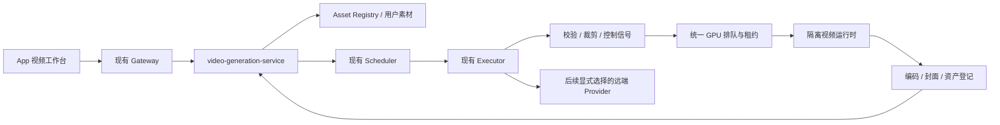

# MyTools 视频生成技术调研与实施方案

日期：2026-09-14。状态：已完成 Ubuntu 只读盘点、官方资料检索及版本元数据核验；**同日完成 P0 受控验证**——
隔离运行时与白名单权重（SHA-256 已校验）、调度层 GPU 准入、多图参考独立适配，以及文生（49/81 帧）、
单图首帧、两图与三图主体参考、首尾帧、灰度控制重绘、静态蒙版局部修改、灰度与边缘控制对比，
分镜 3 镜串行生成与拼接，按两个固定种子（42、932）的复跑，以及全黑缺陷的诊断与单变量验证，
控制强度扫描、候选档的 3 主体 × 2 种子网格，以及用已知塌陷种子对其他模式的探测，
以及为剩余模式补第二个种子，共 36 次推理（1 次因输入素材损坏作废），
覆盖设计要求的"六类输入冒烟"。原始产物、耗时与资源记录见
[P0 验证报告](../../verification/2026-09-14-video-generation/report.md)。**画质与主体保持的人工评分尚未完成，
没有任何模式标记为"已验证"；生产服务未做功能性修改（仅窗口内暂停派发并逐项恢复）。
另外按第二个固定种子复跑后，单图首帧模式在 seed 932 下出现真全黑帧，该模式已降级为"有限/不可用"。**
下文的资源限额与工期是实施起点；已实测的修订见 §5 与 runbook A 节。

## 1. 结论与实施顺序

建议采用 **独立 video-generation-service + 现有 Scheduler/Executor + 全局 GPU 协调 + 可替换视频推理后端**。在当前 RTX 5060 Ti 16GB / 32GB 内存的 Ubuntu 上，先交付短视频实验能力，按模式逐项验收后开放。

1. **P0：VACE 1.3B 功能基线**。统一验证文生、单图/多主体参考、首尾帧、视频结构重绘与蒙版编辑。先 480P、约 3 秒，再约 5 秒。优先隔离 ComfyUI 原生工作流，官方 Python CLI 用于结果对照。
2. **P1：产品闭环**。三种创作入口、素材上传、模式约束、排队/取消、结果播放、原片对比、历史再创作；不能用“输入任意文件”冒充模式支持。
3. **P2：质量与速度竞争测试**。比较 Wan2.1-T2V-1.3B、LTX-Video 2B distilled；在有足够内存余量时试 LightWan2.2 NVFP4 与 HunyuanVideo 1.5。视频指令编辑单独评估 Kiwi-Edit。
4. **P3：较重或外部后端**。LTX-2.5、MiniMax-H3、较大 VACE/编辑模型按预算和实测结果接入；默认不把素材发送到云端，也不因本地失败自动转付费 API。

**VACE 基线不是最终画质承诺**。若它只能生成但不能稳定保留动作/主体，该模式保持实验状态；切换已验证后端，不能以任务成功替代效果验收。

相关文档：[执行手册](runbook.md)、[验收矩阵](acceptance.md)、[Ubuntu 快照](host-snapshot.json)、[源码及权重版本](sources-lock.json)。

## 2. 当前 Ubuntu 的实测约束

快照时间为 2026-09-14 11:55 中国标准时间；详情保存在 host-snapshot.json。

| 项目 | 实测 | 对方案的影响 |
|---|---|---|
| 系统 | Ubuntu 26.04 LTS，Linux 7.0.0-29 | 独立运行时，不照搬旧项目的 CUDA 安装命令 |
| GPU | RTX 5060 Ti，16311 MiB，驱动 595.84 | 单卡 16GB，所有 GPU 消费者总并发为 1 |
| GPU 占用 | 474 MiB，Comfy 队列 0/0 | 检查时空闲，不代表已预留资源 |
| CPU | i5-14600KF，14 核/20 线程 | CPU 预处理可用；不依赖核显编码，先用 FFmpeg CPU H.264 |
| RAM | 总量约 30.6 GiB，可用约 14.6 GiB | 大编码器和 CPU offload 必须纳入 RAM 预算 |
| Swap | 8 GiB 基本用满 | 不能作为推理容量；短时 vmstat 的 si/so 为 0，PSI 为 0，不能据此宣称当前正在换页抖动 |
| 磁盘 | NVMe，可用约 636 GiB | 空间不是首要障碍；分阶段下载，预留输出配额 |
| 已有推理栈 | Torch 2.14.0+cu130，CUDA runtime 13.0，架构列表含 sm_120 | 现有图片链路可用，不等于所有视频插件/量化内核兼容 |
| FFmpeg | 8.0.1 | 可复用工具，不重复安装系统版本 |
| 图片 Comfy | commit 02d39c8cd7828566f48ccf783c1c75b8336044f5 | 固定生产版本，视频在独立目录与进程试验 |
| 图片 Comfy cgroup | MemoryCurrent 约 13.0 GiB，MemoryMax 18 GiB | 此数包含缓存等，不等同进程私有 RSS；显存卸载不等于主机内存全释放 |
| 服务 | 图片、网关、Scheduler、Executor、Comfy、Reader 均 active | 不能为了视频任意停业务服务 |

已核验图片运行目录只含 Krea2、Qwen 文本编码器和 VAE；Ollama 有视觉/文本模型。**这些不能当作视频权重复用**。本次未遍历整盘，不能断言其他目录完全没有视频模型。

容量策略：首先在受控空闲窗口回收本应用已知推理缓存，复测 MemAvailable；无法得到安全余量时不启动推理。可考虑把 RAM 升至 64GB 改善卸载空间，但这不会增加 16GB 显存，也不能保证大模型实时运行。

## 3. 将用户需求拆成明确能力

| 用户入口 | 具体含义 | 输入语义与首期路由 |
|---|---|---|
| 文字生成视频 | 由描述生成一个镜头 | prompt 必填；VACE 基线，后续与专用 T2V 比较 |
| 单图动起来 | 原图作为开场构图 | FIRST_FRAME：1 张图＋动作/运镜提示词；VACE 帧约束 |
| 多图主体参考 | 人物/物体/场景共同参与同一镜头 | SUBJECT_REFERENCES：1–3 张，每张说明用途；VACE R2V，图片不是时间顺序 |
| 首尾帧过渡 | 从图 A 过渡到图 B | FIRST_LAST_FRAMES：恰好 2 张，分别放到首/末帧 |
| 多图分镜 | 每张图对应一个镜头 | STORYBOARD：2–6 张、可排序、每镜头提示词；分镜串行生成后拼接，不假装是一次多图条件推理 |
| 视频改编 | 保留原视频动作/构图，改变外观 | STRUCTURE_RESTYLE：视频片段＋目标描述；边缘/深度控制后交给 VACE |
| 局部修改 | 保留选区以外区域 | MASKED_EDIT：视频＋蒙版/跟踪选区＋目标描述，独立验收 |
| 视频参考重创作 | 参考原视频概念或动作生成新片 | REFERENCE_RECREATE：后续 MiniMax-H3 等能力；不承诺帧级保留 |
| 纯指令编辑 | “移除某物”“换成某种服装” | INSTRUCTION_EDIT：Kiwi-Edit 等专门后端；基线阶段不冒充已有 |

VACE 官方区分生成、编辑、组合任务；它需要模型可理解的控制视频、蒙版和参考图，提示词通常应描述**目标画面**。多参考组合预处理建议不超过三图。[VACE 使用指南](https://github.com/ali-vilab/VACE/blob/main/UserGuide.md)

图片/视频模式允许用户只上传素材，但此时先进入“补充动作描述”或“从素材生成建议提示词”，展示给用户确认后提交。保留原输入与确认后的目标描述；不要默默把“换背景”扩写成改变人物动作的内容。

## 4. 最新候选对比

检索来源以官方 GitHub、Hugging Face 模型卡和项目文档为准。下表的本机适配判断是结合硬件的工程推断；没有本机视频速度数字。

| 候选 | 官方能力/证据 | 本机定位 |
|---|---|---|
| Wan2.1 VACE 1.3B | 文本、参考图、控制视频、蒙版；有 480P 小模型 | 首选功能基线；需测参考图数量与 VAE 峰值 |
| Wan2.1 T2V 1.3B | 专用文生视频；官方给出 8.19GB 显存指标 | 可比较文生质量；该数字不可套给 VACE、多图或本机耗时 |
| LTX-Video 2B 0.9.8 distilled | 小型蒸馏模型；支持图/时间条件工作流 | 快速预览与关键帧候选；编码器、放大器仍占内存 |
| Wan2.2 TI2V 5B | 文生＋图生，官方 720P CLI 标注至少 24GB 显存 | 标准配置不适合直接上线到本机；低显存改造须单测 |
| LightWan2.2 A14B NVFP4 | T2V/I2V、4 步、Blackwell 优化 | 最值得试验的升级候选；高/低噪声两个专家不能简单同时常驻 |
| HunyuanVideo 1.5 | 8.3B，卸载模式最低 14GB；有 480P I2V 蒸馏 | 显存边缘可试，RAM 与原生内核兼容是门槛 |
| LTX-2.5 | 新一代视听生成、关键帧/IC-LoRA 等流水线 | 已有官方 16GB 桌面路径，但共享 32GB 主机的全本地编码仍须实测；不是首期默认 |
| MiniMax-H3 | 文字/首尾帧及多模态参考，原生音视频 | 功能全面，但官方服务范例用多卡；本机重卸载风险高，列远期/外部后端 |
| Kiwi-Edit 5B | 自然语言视频编辑、参考图＋指令编辑 | 更贴近“改编指令”；未找到可作为本机保证的峰值指标，列独立 P2 实验 |
| NovaEdit | 单/多帧参考控制的视频编辑 | 官方建议至少 80GB 显存，不列本机首期 |
| Helios | 自回归长视频；有分组卸载路径 | 低显存不等于低 RAM 或实时；长视频后续评估 |

对应来源：[Wan2.1](https://github.com/Wan-Video/Wan2.1)、[VACE](https://github.com/ali-vilab/VACE)、[LTX-Video](https://github.com/Lightricks/LTX-Video)、[Wan2.2](https://github.com/Wan-Video/Wan2.2)、[HunyuanVideo 1.5](https://github.com/Tencent-Hunyuan/HunyuanVideo-1.5)、[Kiwi-Edit](https://github.com/showlab/Kiwi-Edit)、[NovaEdit](https://github.com/WeChatCV/NovaEdit)、[Helios](https://github.com/PKU-YuanGroup/Helios)。

### 最新技术对决策的实际影响

- **LightWan2.2**：官方权重面向 RTX 50 系列/Blackwell。公布的 480P T2V 9.1 秒、720P 22.5 秒来自 RTX 5090，不能宣传成 5060 Ti 的速度。HF 文件清单中每个 NVFP4 专家约 8.38GB，仅一组 high/low 就超过 16GB 十进制容量，还没计 T5/VAE/激活，需要分阶段卸载。[模型卡](https://huggingface.co/lightx2v/LightWan2.2-A14B)
- **LightX2V**：近期已集成 MiniMax-H3，2026-08-27 发布 H3 8 步 LoRA；本次 API 快照的代码提交日期为 09-11。它是推理框架和加速路线，不能当作所有输入模式都已支持的统一模型。[官方仓库](https://github.com/ModelTC/LightX2V)
- **LTX-2.5**：主仓库已以 2.5 为推荐版本，基础 BF16 下载组合约 66GiB；主模型、文本编码器、VAE、LoRA 必须版本配套。[官方主仓库](https://github.com/Lightricks/LTX-2)
- 官方 **LTX Desktop** 支持 Linux 16GB GPU 本地生成，同时区分云端文本编码与本地编码；其 2.5 Fast 暂无本地 Retake/Extend，2.3 Fast 才提供该桌面功能集合。因此不能把底层流水线的存在等同桌面或当前后端全部已支持。[桌面实现](https://github.com/Lightricks/LTX-Desktop)
- **MiniMax-H3** 的 Ref2VA 支持文字、图片、视频、音频；完整 2K 流程还涉及 Context-IR 和再生成服务。不能把“基础权重开放”写成整套高画质流程无需外部 API。[官方模型卡](https://huggingface.co/MiniMaxAI/MiniMax-H3)
- **ChronoEdit** 虽然使用视频模型做时间推理，但主要任务是图片编辑，不能因为名字/架构与视频有关就当作用户视频改编的直接实现。[NVIDIA 项目说明](https://research.nvidia.com/labs/toronto-ai/chronoedit/)

### 许可证与版本

Wan/VACE 代码及相应官方权重采用 Apache-2.0；LTX-Video 代码许可不代表所有历史权重同许可，应逐个确认。LTX-2.5 为社区许可并有访问门槛；其正式条款规定年收入至少 1000 万美元的实体通常需要另行取得商业许可（条款中的非商业例外另计）。Hunyuan、MiniMax 也不能标成 Apache/MIT 的无条件商用权重。接入具体模型时保存 LICENSE、NOTICE、源 URL、revision 和下载文件 SHA-256。

依据：[VACE 模型许可表](https://github.com/ali-vilab/VACE#-models)、[LTX-2.x 条款](https://github.com/Lightricks/LTX-2/blob/main/LICENSE-2_x)、[Hunyuan 条款](https://github.com/Tencent-Hunyuan/HunyuanVideo-1.5/blob/main/LICENSE)、[MiniMax 模型许可](https://huggingface.co/MiniMaxAI/MiniMax-H3#license)。本轮没有代用户接受 gated 模型条款。

## 5. 首期配置与资源预算

这些是**拟定准入值**，需要 P0 压测后调整，不能写入已验证能力目录。**2026-09-14 实测修订**见本节表格下方。

| 配置 | 起始值 |
|---|---|
| 默认尺寸 | 横屏 832×480、竖屏 480×832，batch=1 |
| 帧数/FPS | 冒烟 49 帧，正式短片 81 帧；Wan 16fps，遵守 4n+1 |
| 时长展示 | 49/16=3.0625 秒、81/16=5.0625 秒；UI 可写“约 3/5 秒”，保存实际时长 |
| 采样 | VACE 官方基线 50 步、shift 16、CFG 5；降低步数只作为独立变体对比 |
| 输入图片 | 1–3 张主体参考；首尾帧恰好 2 张；每张最大 20MB/解码 16MP |
| 输入视频 | 初期选取最长 5 秒片段；上传最大 200MB/60 秒；先探测再解码 |
| 并发 | 全机 GPU 1；视频每用户最多 1 个运行、2 个排队 |
| 主机余量 | 启动前拟要求 MemAvailable ≥20GiB，运行中至少保留 6GiB；不足即排队/拒绝启动 |
| GPU 余量 | 清空本应用既有模型后拟要求可用 ≥14GiB；仍须做模型峰值实测 |
| Worker 限额 | 初始 MemoryHigh=16G、MemoryMax=18G、MemorySwapMax=0；达到上限即失败，不能无限加限额 |
| CPU/磁盘 | 预处理 CPUQuota=400%；试验目录预算 80GiB，单任务中间文件 5GiB；磁盘剩余 <100GiB 暂停新任务 |
| 超时 | 初始 GPU 任务 30 分钟；心跳每 10 秒；加载/预处理/编码分别有界；这是保护上限，不是预计耗时 |

**实测修订**：启动门槛改为 **18GiB**（停 image Comfy 与该服务后实测上限约 18.5GiB；原 20GiB 不可达，
因为 image Comfy 的 cgroup 数字几乎全是可回收页缓存），worker 改为
**MemoryHigh=10G / MemoryMax=12G / MemorySwapMax=0**（= 门槛 − 6GiB 保留），"运行中保留 ≥6GiB"不变。
十四个窗口共 36 轮推理实测：worker 累计峰值最高 9397MiB、显存峰值最高 15436MiB、
主机可用内存最低 14653MiB、PSI ≤0.02。49 帧约 8–11 分钟，**81 帧 17.3 分钟且峰值显存 15436MiB
（16GB 卡仅剩 875MiB 余量）——832×480/81 帧已接近本机实际上限，`--reserve-vram 2` 在 DynamicVRAM 下
不构成硬约束**。注意 systemd `MemoryPeak` 是单元生命周期内的累计值，同一窗口内单调不减，
应看窗口最大值而非每次运行的独立峰值。**多主体多样例与稳定性补测尚未执行，不能报告 P50/P95。**

若内存准入无法满足，先评估可安全释放的模型缓存与进程，不能直接 swapoff、清空全机缓存或终止其他用户任务。RAM 升级或远端后端是明确分支，不隐瞒本机限制。

权重预算：官方 VACE 1.3B 文件清单约 19.03GB，其中 T5 约 11.36GB、主权重约 7.15GB；T2V 1.3B 清单约 17.56GB。是下载字节数，不是峰值 RAM/VRAM。优先 Comfy 官方重打包与 FP8 T5 降低驻留；转换后必须另存哈希和效果记录。本轮额外核验的 Comfy 官方三件套约 11.30GB（VACE 4.31GB、FP8 T5 6.74GB、VAE 0.25GB），精确文件路径与哈希见 [comfy-models-lock.json](comfy-models-lock.json)。[官方权重](https://huggingface.co/Wan-AI/Wan2.1-VACE-1.3B)、[Comfy VACE 模型说明](https://docs.comfy.org/tutorials/video/wan/vace)

## 6. 与 MyTools 的接入设计



### 服务与任务包

- 新建 `service/video-generation-service`，负责账户授权、能力目录、请求快照、幂等、业务状态、作品关系；不让 App 直连 Comfy/Ollama。
- Gateway 新增 `/api/video-generation/**`；继续用现有身份与授权策略，不把 ownerId 交由客户端决定。
- 任务包 `video_generate/1.0.0`；第一版串行阶段：VALIDATE → PREPROCESS → WAITING_RESOURCE → LOADING → GENERATING → ENCODING → PUBLISHING。后期拆 CPU/GPU 步骤也必须维持同一作业状态机。
- 输出 MP4/H.264/yuv420p/faststart、封面、probe 元数据；播放/下载使用现有资产授权，支持 Range。Worker 生成成功后必须资产落库才标记 SUCCEEDED。
- 表：video_job、video_input、video_output、video_job_event；字段包含 originalPrompt/effectivePrompt、输入哈希/角色/裁剪、modelRevision、workflowRevision、seed、实际帧率/帧数、parentJobId、错误码、阶段时间与峰值资源。
- 错误码放新服务 `common/ErrorCode.java`；例如 VIDEO_001 输入无效、VIDEO_002 能力不支持、VIDEO_003 资源不足、VIDEO_004 推理失败、VIDEO_005 超时、VIDEO_006 资产保存失败。用户文案走 App i18n。

### GPU 协调是前置工作

当前 `image_generate/1.1.2/scripts/gpu_lease.py` 使用共享 flock，等待锁上限 120 秒、只检查一个 Comfy 地址。长视频加入后，**不能只新建另一个锁或给视频设并发 1**，否则既有图片/标签可能 120 秒超时，或取消后视频进程仍占显存。

必须统一登记图片 Comfy、视频运行时、Ollama 与视频控制信号提取器：

1. Scheduler 层先做 FIFO＋短任务公平性准入；WAITING_RESOURCE 不消耗推理重试次数。分镜每镜结束释放，允许图片/标签插队，禁止无限视频连跑。
2. 全局租约覆盖 GPU 预处理、编码器、采样、VAE 解码及卸载；CPU FFmpeg 不必持有 GPU。视觉提示词建议单独申请同一资源，完成后卸载再生成。
3. 所有队列空闲且已知模型卸载成功后，核验显存/RAM。Comfy `/free` 返回成功不等于内存已经回收；必要时在协调器控制下回收**自己的空闲**推理进程。
4. 取消请求先置 CANCELLING；向对应任务发送中断，等待进程/队列/显存确认结束才释放租约。进程失联进入 UNCONFIRMED，不让第二个任务抢跑。
5. Worker 失联恢复必须核对 providerJobId/promptId 和资产幂等键；禁止超时后自动重复生成。无效租约不能单靠 TTL 认定 GPU 已空闲。

本轮只审阅代码，没有改动协调协议。

**P0 的实际做法**：仍未改动 flock 协议（禁止在 GPU 忙碌时切换）。改为在调度层做准入——按
`script_package` 反查全部含 GPU 步骤的任务定义（图片 1 个 + 标签 7 个，标签推理嵌在下载任务里），
先 `max_concurrency=0` 阻止新任务领取，再等待在途任务排空，然后取得共享锁并把 Comfy 交给视频运行时。
结果是视频持锁期间没有任何短任务在等锁，既有 120 秒上限不会导致图片/标签失败；窗口结束在
`finally` 中逐项恢复并用数据库核对。上面 5 条统一登记要求中，第 2–4 条已由该准入与证据记录覆盖，
第 1 条的 FIFO/短任务公平性准入仍属于 P1a 的 Scheduler 改造。

### 后端 API 草案

- `GET /api/video-generation/capabilities`：按资源/模式返回允许尺寸、帧数、图片角色/数量、音频策略、validationStatus。未通过模式不可提交。
- `POST /api/video-generation/jobs`：异步创建，幂等键限定到用户＋请求摘要；同键异参返回冲突。
- `GET /api/video-generation/jobs/{id}`、`GET /jobs`：本人状态和作品。
- `POST /jobs/{id}/cancel`：可重放；未取得 GPU 时直接取消，运行中确认终止后完成。
- `POST /jobs/{id}/recreate`：使用历史不可变快照；模型下线时提示不可复现，不默换模型。

示例（拟定契约，不是当前可调用接口）：

```json
{
  "idempotencyKey": "client-generated-uuid",
  "resourceId": "wan-vace-1.3b-local",
  "mode": "REFERENCE_TO_VIDEO",
  "prompt": "A red teapot pours tea into the white cup on a wooden table. The camera slowly moves closer.",
  "inputs": [
    {"assetId": "owned-image-a", "role": "SUBJECT", "description": "teapot"},
    {"assetId": "owned-image-b", "role": "SUBJECT", "description": "cup"}
  ],
  "output": {"width": 832, "height": 480, "frames": 81, "fps": 16},
  "seed": 42,
  "audioPolicy": "SILENT"
}
```

视频改编额外携带 `sourceVideoAssetId`、`trim.startMs/endMs`、`editType`、可选 maskAssetId 和参考图；裁剪不能默默选取任意 5 秒。服务端按实际解码元数据校验旋转、帧率、时长与模式冲突。

### App 操作流程

工具 → 视频生成 → 文字 / 图片 / 视频三个入口。图片入口先选“动起来/主体参考/首尾帧/分镜”，再上传；视频入口选片段、选择“整体重绘/局部修改”等已验证能力、输入目标效果。

生成前显示模型、约时长、尺寸、原声策略和上传状态；等待时显示真实阶段，不编造百分比/倒计时。结果页支持播放、下载、原片对比、复制提示词和再次创作。断网/退出 App 不取消服务端任务。

提示词建议结构：主体与保持项＋动作变化＋场景＋运镜＋风格＋避免的变化。例：“保持人物动作和镜头位置，将街道改为雪夜，灯光温暖，人物面部与服装不变。”对 VACE 路由，转换成目标场景描述并让用户预览，不能声称它天然理解所有编辑指令。

### 音频与多镜头

首期 T2V/I2V 静音；视频编辑可选择 SILENT 或 KEEP_SOURCE_AUDIO。保留音频必须对齐所选片段、实际输出长度和帧率，默认不进行语音克隆。没有音轨时明确返回静音。

分镜任务每镜约 3/5 秒，合成是视频剪辑，不是无限长度生成；需要统一画幅、FPS 与色彩空间，转场长度计入最终时长。同一参考图可以提高连续性，但不保证跨镜人物完全一致。语音/配乐后续作为独立能力，不混入本机首期性能承诺。

## 7. 实施阶段与交付门槛

以下为单人顺序开发的粗估工作日，不包含模型下载等待、硬件采购或失败模型的研究时间。

| 阶段 | 工作 | 出口条件 | 估算 |
|---|---|---|---|
| P0a | GPU 协调设计、内存回收验证、独立环境、权重白名单 | 现有图片/标签无回归；资源不足可阻止启动 | 1–2 天 |
| P0b | VACE 六类输入冒烟、精度/内核/预处理验证 | 全部原始结果与峰值留档；逐模式给出可用/有限/不可用 | 2–3 天 |
| P1a | 服务、任务包、存储、幂等、取消、资产播放 | API 和故障恢复验收通过 | 2–3 天 |
| P1b | App 三入口、素材角色、裁剪、历史与对比 | 真机端到端，支持退出后查看结果 | 2–3 天 |
| P2 | LTX/Wan/LightWan/Hunyuan/Kiwi 定向比较 | 达到矩阵门槛的模式才替换默认 | 2–4 天起 |

首期闭环约 7–11 个工作日作为计划基线。若 VACE 关键模式画质不达标，必须在 P0 出口转候选测试，不能按原工期硬上线。

**2026-09-14 进度**：P0a 的独立环境、权重白名单、内存回收验证与调度层准入已完成，资源不足可阻止启动；
P0b 的**六类输入冒烟已全部跑出真实产物**（文生 49/81 帧、单图首帧、两图/三图主体参考、首尾帧、
灰度控制重绘、静态蒙版局部修改），并额外完成了**分镜 3 镜串行生成与可核对拼接**（顺序、帧数、
总时长三项均通过）。**出口条件仍未满足**——移动跟踪蒙版、边缘/深度控制的正式对比、指令编辑未跑，
人工评分未做，多样例多种子补测未做，因此 P0b 仍在进行中，不能进入 P1。

## 8. 发布与回退

独立运行目录建议 `/opt/yuyutian/mytools/runtime/video-generation/`，模型与输出分目录；视频 Comfy 候选端口 `127.0.0.1:8190`，实施前检查占用。与生产图片 8189 保持版本隔离。

按后端 → 协调器兼容包 → 少量验收账号 → App 能力开放的顺序发布。服务端能力开关决定是否可提交，灰度期间普通用户不可看到未验证模型。发布包记录 JAR/任务包/工作流/权重 SHA-256。

回退先关视频新任务准入，再排空/确认取消运行任务，恢复先前运行时和协调器兼容版本；保留已有作品及数据库新增表，不删除用户资产。回退后必须重测图片生成与标签任务。禁止在 GPU 忙碌时直接切换锁协议。

## 9. 本轮结论边界

已证实：目标硬件与环境、公开模型/代码存在、主要能力与官方限制、源码提交和部分权重 revision。

**2026-09-14 新增已证实**：三个白名单权重可下载并通过 SHA-256 校验；隔离运行时（复用固定 Comfy 提交
`02d39c8`、独立 venv、Python 3.12 / torch 2.14.0+cu130 含 sm_120）可加载 VACE 1.3B 并完成 49 帧与
81 帧推理；六类输入各自跑通并留下产物与资源峰值（worker 峰值 ≤9397MiB、显存 ≤15436MiB、
主机可用内存 ≥14653MiB、PSI ≤0.02，其中一次非零值由窗口内并发 CPU 任务造成，已如实标注）；原生节点 `reference_image[:1]` 只取第一张图，多图必须走独立适配，
且**换第二张参考图后输出差异达 0.351（0–1 空间），证明第二张图确实参与生成**；首帧与首尾帧的锚定
检查通过（首帧对首图 0.0135、末帧对尾图 0.0360，对调后高一个数量级），"尾图被忽略"不成立；
局部修改的掩码外差异 0.0113、掩码内 0.1136（约 1:10），"蒙版反转"与"蒙版外明显漂移"不成立；
官方 frameref 的掩码约定（参考帧 0、其余 255）与灰度语义已按源码核对并用实测数值确认；
调度层准入可阻止窗口内新增 GPU 任务且异常路径能恢复。

**一次真实的生产中断事故**：窗口 runner 曾作为 SSH 会话的子进程运行，连接中断时被 SIGHUP 杀死，
`finally` 里的恢复逻辑没有执行，生产图片调度停在暂停状态约 10 分钟。根因是把恢复寄托在
`finally` 上——它不是崩溃恢复机制。已改为把窗口放进独立 systemd 瞬态单元
（`p0_trial.py run <workflows>` → `systemd-run --no-block --collect`），并用一个完整窗口验证
单元能自行恢复生产。残留风险：主机在窗口期间重启时仍需人工执行 `restore`。

**两个种子暴露出的关键事实**：单图首帧模式在 seed 42 正常、在 seed 932 下第 3–4 帧为真全黑
（YMAX=18/255，已用 ffprobe signalstats 独立复核），触发 acceptance.md 的"全黑"严重失败判据，
因此该模式不能标记为可用。同时测得换种子的输出差异（0.3620）**大于**换第二张参考图的差异（0.3511）——
"第二张参考图确实生效"是成立的二元事实，但参考图对结果的控制强度并不明显强于种子噪声。
反过来，结构约束（首帧锚定 0.0136/0.0103）在两个种子下都稳定。

进一步诊断（4 个种子）：全黑是**确定性**的（同工作流重跑 SHA-256 逐位相同），发生率 1/4；
而且**正常种子也把源图亮度从 0.714 压到 0.34–0.50，首末帧漂移达 0.67**。
单变量验证确认弱内容先验是原因。随后做了控制强度扫描（灰与参考图之间线性插值，掩码逐位不变）：
**从 α=0.25 起全黑即消失、亮度回到 0.67–0.72**，但运动随控制强度单调下降。
**α=0.25 已通过两个固定种子复测**：均 0 全黑、亮度 0.667/0.677、跨种子运动差异仅 7%
（灰填充基线是 79%），是目前唯一同时满足"不塌陷、保亮度、跨种子一致"的配置，
代价是运动幅度约为灰填充的 1/6。灰填充那种"大运动"其实是不受控漂移，不是可用性优势。
**α=0.25 随后铺满 acceptance.md 要求的 3 主体 × 2 种子网格：6/6 格无全黑、0 极暗，亮度 0.617–0.723，
跨种子运动差异 3.5–16%**（灰填充基线是 79%）。因此单图首帧从"不可用"改判为
**"有限（修复候选已通过 3×2 网格）"**；仍未定的是首末帧差异 0.07–0.12 是否算"动起来"、以及连续稳定性补测。

**两条实测约束**：81 帧峰值显存 15436MiB，16GB 卡只剩 875MiB 余量，5 秒档已接近本机上限；
`--lowvram` 在默认 DynamicVRAM 下是空操作，`--reserve-vram 2` 也不构成硬约束。

**一次真实的素材缺陷**：第一轮两图实验的第二张参考图在分发时被截断（261120 / 1129402 字节），
ComfyUI 未拒绝并报 success，因此该轮多图结论作废。已改用归档分发 + 逐文件 SHA-256 核对，并在窗口预检
中加入"输入素材必须真正解码一次"的检查，防止同类问题再次进入 GPU 窗口。

**一次指标误报**：按"平均亮度 < 0.02"统计时把带高光的暗场帧报成"全黑帧"。已拆分为
`blankFrames`（平均亮度低且峰值像素也极低）与 `veryDarkFrames`（只是偏暗）；分镜镜头 2 的
第 10–11 帧属于后者（峰值仍有 0.91），不是严重失败判据，两帧已导出供人工确认。

**跨模式探测的两个新结论**：用已知必然塌陷的 seed 932 去跑其他五个模式，**只有单图首帧出现全黑**——
说明塌陷需要"弱内容先验"**且**"只有一个锚点"两个条件同时成立；首尾帧两端都锚定，在同一个种子上完全正常。
由此得到一条可用于产品设计的规律：**约束越强、输出越不受种子影响**（无约束文生跨种子差 68.4%、
单锚点 44.4%、双锚点仅 1.9%），想让结果可复现应该加结构约束而不是只固定种子。
另外发现灰度重绘在**暗且低纹理**的素材上会把背景压成黑（帧均值 0.011–0.029），换纹理源片则正常，
属素材相关问题，需要决定是限制输入还是加约束。

**第二个种子补测的结论**：分镜镜头 2 的暗场在 seed 932 上**没有复现**，证明它是种子相关而非结构性问题；
但出现方向与单图首帧相反（单图首帧是 seed 932 塌、seed 42 正常），因此**无法靠固定种子规避**。
81 帧文生档在两个种子上都干净；三图参考两种子都不塌陷但亮度相差 3.4 倍，质量稳定性需人工判断。

**B06/B07 已用真实任务验证**：直接调用生产实际部署的标签工作脚本（它不做数据库访问，
标签落库由执行器负责），用临时文件驱动即可验证而不写用户数据。结果：**互斥成立**
（另一进程持锁 10 秒期间显存停在 242 MiB、推理不开始；释放后成功返回真实标签）；
**视频后恢复成立**（显存 242 MiB → 7493 MiB，5.79 GB 标签模型加载并推理成功）。
只读核对生产任务历史：今天没有任何 GPU 协调类错误码（无 GPU_BUSY / GPU_COORDINATION_REQUIRED /
GPU_COMFY_BUSY / GPU_MEMORY_UNAVAILABLE）。仅剩"经调度器派发并落库的真实用户任务"未走一遍。
另有既存问题（非本次造成）：`pikpak_watch_scan` 每分钟失败一次，最近 3 小时 180 次全失败。

**仍未证实**：画质、指令遵循与主体保持（需人工评分）；移动跟踪蒙版、边缘与深度控制的正式对比、
指令编辑、原声策略、提示词建议未完成；视频结束后图片/标签真实任务回归未执行；
第三方深度/姿态模型的本机兼容性与许可未评估。
`sources-lock.json` 中三个补充项目的 GitHub API 元数据查询失败，保留错误记录；其能力仅根据本轮打开的
官方 README，不虚构固定提交。

下一项可执行工作是把全部产物交人工评分、补移动跟踪蒙版与边缘/深度对比、执行 B06/B07 回归；
P0 报告已明确列出所有未完成项，未把资料调研或"推理成功"写成已通过验收。
