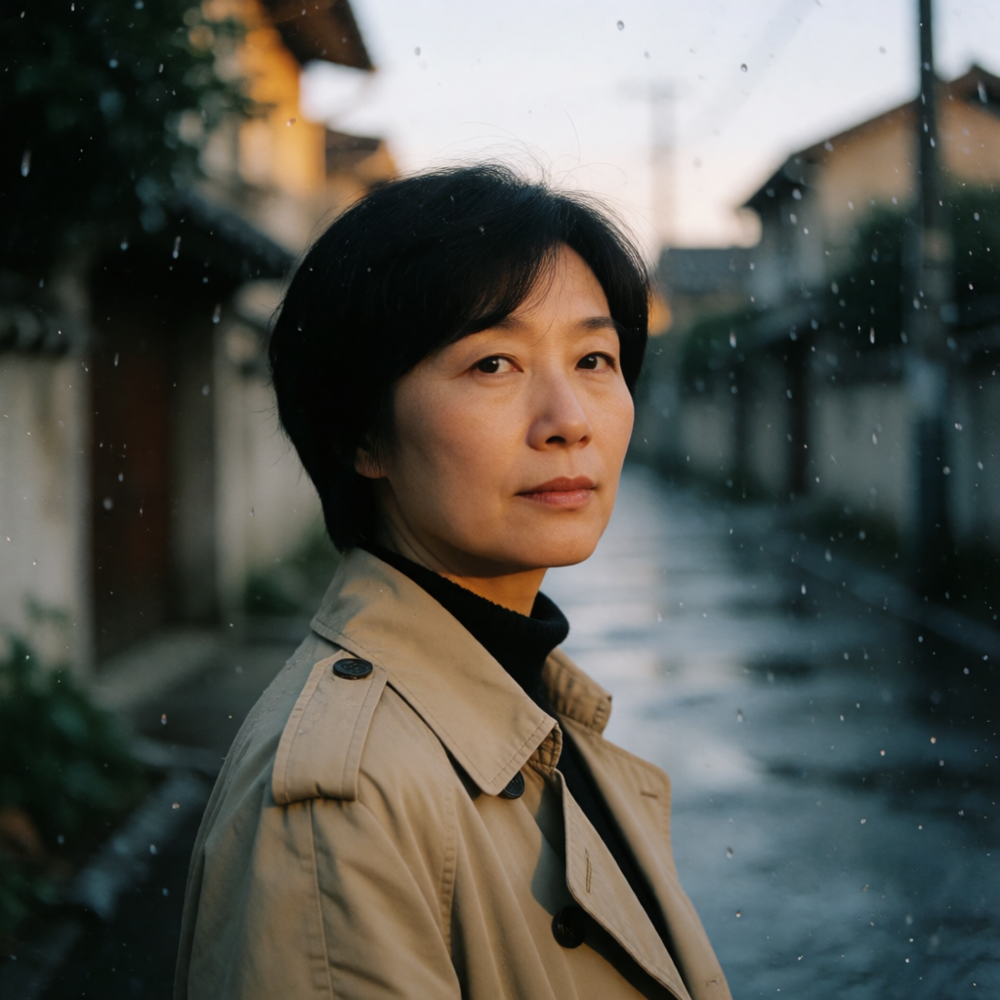

# 图片生成首版实现与验证记录

日期：2026-09-13。范围：MyApp 原生页面、独立图片服务、Gateway、Scheduler、Executor、不可变标签包升级，以及 Ubuntu 隔离实例的 Krea 2 Turbo 文生图实测。

## 交付状态

代码和安装包已完成。**尚未部署生产，尚未通过 App → Scheduler → ComfyUI → Asset Registry → 历史下载的生产端到端验收。** 所有生成能力和 Gateway 路由默认关闭。风格参考和远端均保持待验证。本记录区分组件测试、真实模型测试和生产发布验收，不以模型成功替代业务链路验收。

- App「工具 → 图片生成」：文字、模型切换、能力驱动尺寸/数量、种子、可选底稿、历史作品、取消、下载保存、参数复用、成品转底稿。
- 服务：用户隔离、稳定幂等键、持久任务、重启对账、部分结果保留、未知提交结果 `UNCONFIRMED`、资产登记。
- 本地执行：固定 Comfy API graph 与文件摘要、逐张生成、受管目录、取消自身 prompt、不重复提交未知请求。
- 标签 1.4.0：保留 1.3.0 人物优先提示词，新增与图片任务共享的 GPU 租约。协调关闭时保持原行为。
- 远端：预留 Images 协议适配器；仅显式验收后才能启用，不自动切换、不自动付费重试。此前指定端点返回 Cloudflare 403，本轮没有重试。

## Ubuntu 实测

通过当前 SSH 配置的 `home-ubuntu` 连接，先验证身份及现有 MyTools 服务。独立目录：`/opt/yuyutian/mytools/runtime/krea2-evaluation-20260913`。只增加该试跑目录与临时 systemd 实例，没有替换生产服务、任务包或环境配置。

| 项目 | 结果 |
|---|---|
| GPU | NVIDIA RTX 5060 Ti，16 GB |
| RAM | 31,364 MiB，总体约 32 GB |
| 初始 RAM 可用 | 19,426 MiB |
| 初始 Swap | 8,191 MiB 总量，7,649 MiB 已用；不是本次推理新增量 |
| 模型 | Krea 2 Turbo NVFP4，CPU 文本编码器、CPU VAE |
| 工作流 | 1024×1024，8 steps，batch=1，关闭扩写、LoRA、自定义及云端节点 |
| Comfy 版本 | 固定 commit `02d39c8cd7828566f48ccf783c1c75b8336044f5` |
| 运行环境 | Python 3.12.14、Torch 2.14.0+cu130 |
| 进程限制 | MemoryMax=18G、MemorySwapMax=512M、CPUQuota=600% |
| GPU 协调 | 同一文件锁；图片前卸载受管 Ollama 8B，标签前释放 Comfy 权重 |

三个官方模型文件已核对大小及 SHA-256，详见 [模型锁定清单](../../../service/image-generation-service/workflows/krea2-models.lock.json)。Krea 的 Qwen3VL-4B 是独立文本编码器文件，与已删除的 Ollama 4B 标签模型不同。

| 测试 | 结果 |
|---|---|
| 首张人物图 | 成功，48.65 秒（执行器总时长） |
| 后续 19 张 | 全部成功：风景 6 张、商品 5 张、人物 8 张；包含中英文提示词 |
| 四张串行请求 | 187.45–195.41 秒；部分运行期间穿插标签任务 |
| 后续两张/单张 | 94.32 / 49.30 秒 |
| 采样 GPU 峰值 | 8,410 MiB，约 8.21 GiB；整卡占用，不是仅模型权重 |
| 采样 Comfy 进程组内存峰值 | 17,228,058,624 字节，约 16.04 GiB；包含 cgroup 缓存 |
| systemd MemoryPeak | 17,286,434,816 字节，约 16.10 GiB |
| 标签共存 | 8B 标签请求成功，35.31 秒，含锁等待；人物特征仍产出 |
| 取消 | 当前执行器收到 SIGTERM，退出 143；只取消所属 prompt |
| 取消后新任务 | 1 张成功，47.30 秒 |
| 实例重启后 | 1 张成功，48.26 秒 |
| 已完成任务重放 | 退出 0，复用原图片，没有再次提交 |

初始 20 张加取消恢复、重启恢复，共确认 22 张成功输出。随机样图已人工查看人物、风景、商品各一张：图像完整、主体与提示基本一致；这不是对全部 20 张进行盲评，也不代表身份一致性或复杂手部稳定性达标。

内存限制故障注入已尝试，但日志未确认发生 OOM kill，因此**不将其记为 OOM 恢复通过**。普通实例重启与取消恢复已通过。未测显存 OOM、长期高负载、竖版/横版质量、风格参考和生产标签全链路。锁避免 GPU 并行，不能消除 CPU/RAM 竞争。试跑结束停止临时 Comfy 实例，保留下载模型以供后续部署。停止后 Executor 与 Ollama 均 active；GPU 使用 106 MiB，RAM 可用 19,870 MiB。主机 Swap 已用 8,182 / 8,191 MiB，较初始增加 533 MiB，不能将整机增长全部归因于 Comfy；生产启用前必须复查交换压力，本轮没有清空主机 Swap。

机器可支持当前 1 MP 文生图试跑，但 RAM 余量比 VRAM 更紧张。生产需保留上述进程限制，继续观察 Swap、其他业务内存和标签超时预算，并完成业务链路验收后才启用。

原始结果：[runtime-results.json](runtime-results.json)。

## 构建与自动化验证

- 图片服务：13 项测试通过，包含用户隔离、幂等冲突、重复对账、取消派发竞态、部分成功、未知提交结果；JAR 打包成功。
- 图片执行包：11 项测试通过，包含提交/轮询/落盘、重放不重提、未知响应、路径与输出限制。
- 标签 1.4.0：28 项测试通过。
- Gateway：图片控制器 4 项、App Catalog 1 项、请求过滤器 14 项测试通过；打包成功。
- Scheduler：图片权限 2 项、实际迁移结果协议 1 项测试通过；打包成功。
- Executor：打包成功。
- 部署工具：74 项测试通过；最终组装 132 个不可变包。
- HarmonyOS：`assembleHap` 成功，最终构建日志无 WARN/ERROR；未安装到真机进行页面操作验收。
- `git diff --check` 通过。

产物：`app/entry/build/default/outputs/default/entry-default-signed.hap`；各 Java 服务 `target/*.jar`；完整执行包目录 `/private/tmp/mytools-image-packages-20260913-final2`。临时包目录不是长期制品仓库，部署时按现有 release 流程归档。

## 上线前剩余步骤

按 [服务部署说明](../../../service/image-generation-service/README.md) 增量配置独立凭据、数据库和共享目录，先安装标签 1.4.0 及图片包，再应用任务定义迁移。通过 Scheduler 管理 API 启用单并发集群，不直接修改调度数据库。

必须完成登录 App 发起任务、合法业务身份访问 Scheduler、真实执行、资产入库、两账户隔离及历史下载验证；补齐 OOM 故障恢复和目标尺寸验证。默认关闭的开关不能因为这份隔离报告就批量置为 true。风格参考与远端单独验收后开放。

## 样图

### 人物

### 风景

### 商品

