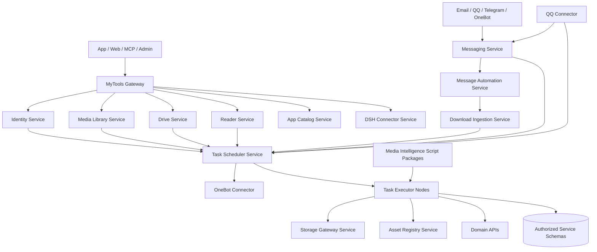

# 总体服务化架构设计

## 1. 目标

将当前 MyTools 大型单体、DownloadBot 下载与渠道混合服务、MsgService 邮件服务重构为多层服务架构，统一重复能力，并把所有耗时的非直接查询操作转化为可观测、可取消、可重试的任务。

## 2. 架构分层



### 接入层

- MyTools Gateway：客户端统一入口和响应聚合。
- Messaging Service：外部消息渠道统一入口。

### 领域层

- Identity、Download Ingestion、Media Library、Drive、Reader。
- 各领域拥有业务规则、业务状态和数据库。

### 编排层

- Message Automation：把入站消息解释为业务动作。
- Task Scheduler：管理任务定义、实例、步骤、集群和状态机。

### 执行与原子能力层

- Task Executor：执行版本化脚本。
- Storage Gateway：统一存储操作。
- Asset Registry：统一内容资产身份。
- Media Intelligence：以脚本包形式提供媒体计算能力。

## 3. 同步与异步边界

同步操作包括登录、配置 CRUD、数据库列表查询、单记录查询、读取已生成结果和创建任务。以下操作必须任务化：

- HTTP、X、Telegram、QQ、PikPak、magnet 下载。
- 文件扫描、哈希、跨存储复制、大目录操作。
- 媒体探测、标签、缩略图、视频截图、简介。
- 多书源搜索、书源发现、电子书导入、索引和预缓存。
- 邮件及大附件投递、批量消息投递。
- 数据迁移、批量修复和需要执行 DML 的管理操作。

## 4. 核心数据所有权

| 数据 | 权威服务 |
| --- | --- |
| 用户、角色、会话、验证码 | Identity Service |
| 消息、投递、渠道账户 | Messaging Service |
| 自动化规则和执行记录 | Message Automation Service |
| 任务定义、实例、节点执行 | Task Scheduler Service |
| 节点、脚本缓存、运行日志索引 | Task Executor / Scheduler |
| 下载请求和下载业务状态 | Download Ingestion Service |
| 内容资产、来源、哈希、位置引用 | Asset Registry Service |
| 媒体目录、标签关系、播放进度 | Media Library Service |
| 网盘账户和远端索引 | Drive Service |
| 书架、书源、搜索缓存、阅读数据 | Reader Service |
| 应用、版本、发布文件元数据 | App Catalog Service |
| DSH 外部会话绑定和事件检查点 | DSH Connector Service |

### 独立 Schema 策略

每个服务从建立之初使用独立数据库 schema 和独立数据库账号，不在新服务中继续扩展现有 `my_tools` 或 `downloadbot` schema：

```text
mytools_identity
mytools_messaging
mytools_automation
mytools_task
mytools_download
mytools_asset
mytools_storage
mytools_media
mytools_drive
mytools_reader
mytools_app_catalog
mytools_dsh_connector
```

同一 MySQL 实例可以承载多个 schema，但账号只获得所属 schema 的最小权限。跨服务查询通过 API、事件或离线迁移任务完成，禁止在在线业务 SQL 中跨 schema Join。

数据按以下顺序处理：

1. 用户、权限、业务资产关系、书架、进度等不可再生数据必须迁移并对账。
2. 下载历史、媒体目录、消息历史等可迁移数据优先迁移；迁移成本过高时保留旧库只读查询窗口。
3. 缩略图、标签、截图、搜索缓存、远端索引、章节缓存等可再生数据允许在新 schema 中重新生成。
4. 无法可靠映射且可再生的数据不得做猜测性迁移，记录迁移报告后由任务重新生成。
5. 不可再生数据迁移必须支持幂等重跑和数量校验；可再生数据允许直接重建。

## 5. 任务调用标准

领域服务创建任务时提交 `taskName`、业务关联、参数、优先级和幂等键。任务脚本通过短期执行令牌获得以下能力：

- 创建子任务并指定父实例。
- 查询本任务、父任务和已授权子任务状态。
- 请求取消子任务或当前任务。
- 上报进度、日志、检查点和结构化结果。
- 调用领域服务内部 API。
- 使用受控数据库连接执行允许的 DML。

任务完成事件只说明技术执行结果；领域服务仍需将其转换为业务状态。

## 6. 一致性设计

- 创建业务记录和任务请求使用本地事务 + Outbox。
- Scheduler 使用 Inbox 去重，按幂等键返回已有实例。
- 脚本写业务库必须携带 `task_instance_id` 和幂等键。
- 直接 DML 不允许跨多个服务数据库开启分布式事务。
- 跨服务操作使用 Saga：正向步骤加失败、超时、取消补偿脚本。
- 大文件只传资产 ID、存储引用和哈希，不进入消息总线。

## 7. 部署拓扑

初期部署：Gateway、Messaging、Task Scheduler、通用 Executor、下载 Executor、媒体 Executor、Reader Runtime、现有 MyTools 领域模块。随后依次拆出 Media Library、Drive、Reader、Identity 和 Asset Registry。

Executor 使用同一程序镜像，通过脚本包、能力标签和集群成员关系区分用途。节点与集群为多对多。

## 8. 总迁移路线

### 阶段一：建立任务底座

- 建立 Scheduler、Executor、脚本包规范和任务 SDK。
- 先接入媒体标签任务，验证创建、执行、超时、取消和结果回写。

### 阶段二：迁移重任务

- 迁移下载、视频分析、目录扫描、书源搜索和电子书导入。
- 新任务链路验证通过后关闭对应旧定时器；旧数据库和原始文件保留到数据验收完成。

### 阶段三：统一重复能力

- MsgService 接管所有渠道收发。
- Media Intelligence 接管 MyTools、DownloadBot 的标签和缩略图。
- Storage Gateway 接管通用文件和远端存储操作。

### 阶段四：拆领域服务

- 按 Media、Drive、Reader、Identity 顺序拆库、拆进程。
- MyTools 收缩为 Gateway/BFF。

## 9. 验收标准

- 所有耗时操作均可通过任务 ID 查询、取消和审计。
- 同一幂等键不会重复下载、重复打标签或重复导入。
- Executor 离线不会丢任务，租约到期可重新分配。
- 业务数据库、任务数据库和脚本权限边界清晰。
- 关闭旧 Job 后功能和数据结果保持一致。
